# MobileHackingLab - Captain Nohook

This is an iOS mobile challenge from [MobileHackingLabs](https://www.mobilehackinglab.com/course/lab-captain-nohook).

Captain No Hook employs mechanisms to prevent dynamic analysis tools to hook and manipulate the app. It also checks if the device is compliant (e.g., not jailbroken).

**Objective**: Your task is to bypass these protections and retrieve the hidden flag within the app.

The app presents itself as follows:

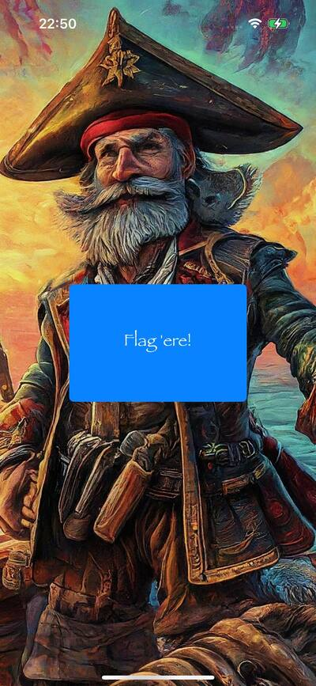

When clicking on "Flag'ere!" the following error message is returned since I'm using a jailbroken device with a running `frida-server` instance:

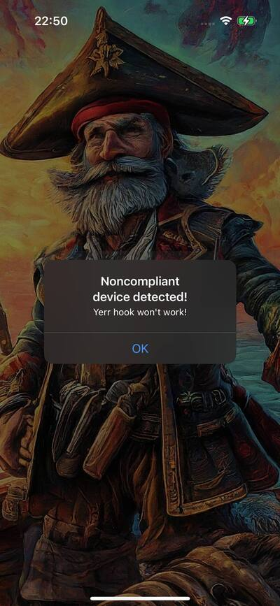

## Static Analysis

The first step has been to reverse engineer the application to understand what protection mechanisms were in place.

First, obtain the classes definition with `ipsw`:

```shell
ipsw swift-dump --demangle Payload/Captain\ Nohook.app/Captain\ Nohook > classes.swift
```


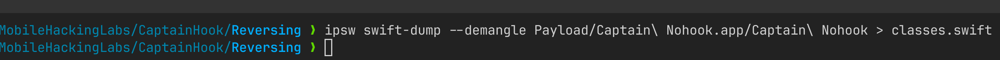

Class `Captain_Nohook.ViewController` has some interesting methods:

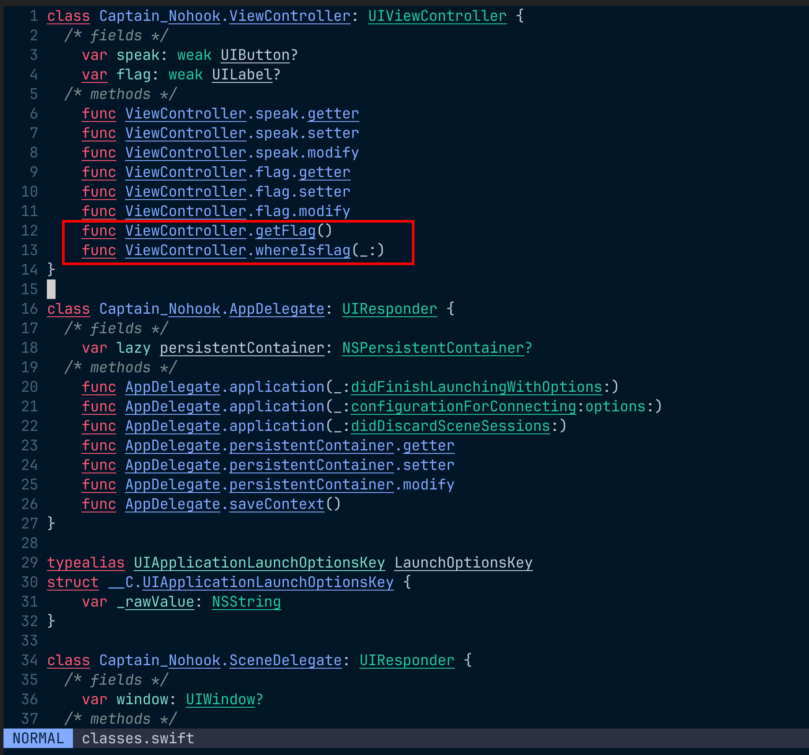

Function `getFlag` has been reverse using `Ghidra`, resulting in the following code:

```c
String \_\_thiscall Captain_Nohook::ViewController::getFlag(ViewController \*this)

{
uint uVar1;
StaticString SVar2;
char *pcVar3;
long lVar4;
code *pcVar5;
bool bVar6;
UIAlertController *this_00;
UIAlertAction *this_01;
undefined *puVar7;
Encoding EVar8;
Encoding EVar9;
Encoding EVar10;
char *pcVar11;
AES *pAVar12;
Data DVar13;
undefined *puVar14;
undefined8 uVar15;
ulong uVar16;
void *pvVar17;
DefaultStringInterpolation DVar18;
String SVar19;
tuple2.conflict12 tVar20;
undefined local_440 [8];
long local_438;
long local_430;
String local_428;
char *local_418;
undefined *local_410;
char *local_408;
undefined *local_400;
char *local_3f8;
undefined *local_3f0;
undefined *local_3e8;
Encoding local_3e0;
undefined *local_3d8;
char *local_3d0;
undefined *local_3c8;
AES *local_3c0;
undefined *local_3b8;
undefined *local_3b0;
long local_3a8;
void *local_3a0;
Data local_398;
AES *local_390;
CBC local_388;
undefined *local_378;
undefined4 local_36c;
undefined \*\*local_368;
undefined *local_360;
long local_358;
AES *local_350;
long local_348;
undefined *local_340;
void *local_338;
ulong local_330;
Data local_328;
undefined *local_320;
void *local_318;
undefined *local_310;
ulong local_308;
ulong local_300;
Data local_2f8;
undefined *local_2f0;
String *local_2e8;
ulong local_2e0;
undefined *local_2d8;
ulong local_2d0;
undefined \*\*local_2c8;
void *local_2c0;
undefined **local_2b8;
undefined8 local_2b0;
DefaultStringInterpolation local_2a8;
undefined *local_2a0;
undefined *local_298;
code *local_290;
String *local_288;
ulong local_280;
undefined *local_278;
undefined *local_270;
undefined8 local_268;
undefined *local_260;
code *local_258;
Encoding local_250;
undefined *local_248;
undefined *local_240;
undefined *local_238;
String encrypted_flag;
undefined1 *local_220;
long local_218;
undefined8 local_210;
undefined *local_208;
ulong local_200;
long local_1f8;
undefined *local_1f0;
long local_1e8;
code *local_1e0;
String local_1d8;
undefined8 local_1c8;
UIAlertAction *local_1c0;
uint local_1b4;
UIAlertController *local_1b0;
ViewController *local_1a8;
code *local_1a0;
undefined *local_198;
Encoding local_190;
StaticString local_188;
char *local_180;
char *local_178;
long local_170;
undefined *local_168;
long local_160;
ulong local_158;
Encoding local_150;
UIAlertController *local_148;
char *local_140;
undefined *local_138;
undefined *local_130;
undefined *local_128;
undefined *local_120;
undefined *local_118;
AES *local_110;
long local_108;
undefined *local_100 [3];
undefined \*local_e8;
undefined **local_e0;
undefined *local_d8;
void *local_d0;
undefined *local_c8;
ulong local_c0;
String aes_key;
undefined *local_a8;
ulong local_a0;
String local_98;
undefined *local_88;
undefined *local_80;
code *local_78;
undefined *local_70;
undefined8 local_68;
code *local_60;
undefined8 local_58;
undefined8 local_50;
String local_48;
ViewController *local_38;

local_1a0 =

$$
closure_#1_(__C.UIAlertAction)_->_()_in_Captain_Nohook.ViewController.getFlag()_->_Swift.String;
local_198 = PTR_$$type_metadata_for_Swift.UInt8_10016d040;
local_190.unknown = PTR_$$type_metadata_for_Swift.String_10016c750;
local_188.unknown = "Fatal error";
local_180 = "Unexpectedly found nil while unwrapping an Optional value";
local_178 = "Captain_Nohook/ViewController.swift";
local_38 = (ViewController *)0x0;
local_48 = (String)ZEXT816(0);
local_50 = 0;
local_170 = 0;
local_60 = (code *)0x0;
local_a8 = (undefined *)0x0;
local_a0 = 0;
local_c8 = (undefined *)0x0;
local_c0 = 0;
local_d8 = (undefined *)0x0;
local_d0 = (void *)0x0;
local_108 = 0;
local_110 = (AES *)0x0;
local_118 = (undefined *)0x0;
local_130 = (undefined *)0x0;
local_128 = (undefined *)0x0;
local_140 = (char *)0x0;
local_138 = (undefined *)0x0;
local_148 = (UIAlertController *)0x0;
local_1a8 = this;
local_168 = (undefined *)Encoding::$typeMetadataAccessor();
local_160 = *(long *)(local_168 + -8);
local_158 = *(long *)(local_160 + 0x40) + 0xfU & 0xfffffffffffffff0;
(*(code *)PTR____chkstk_darwin_10016c2b0)();
puVar7 = local_440 + -local_158;
local_150.unknown = puVar7;
local_38 = this;
bVar6 = is_noncompliant_device();
if (bVar6) {
  local_1c8 = 0;
  this_00 = __C::UIAlertController::typeMetadataAccessor();
  local_1b4 = 1;
  local_1d8 = Swift::String::init("Noncompliant device detected!",0x1d,1);
  Swift::String::init("Yerr hook won\'t work!",0x15,(byte)local_1b4 & 1);
  local_1b0 = __C::UIAlertController::$__allocating_init
                        (this_00,(UIAlertControllerStyle)local_1d8.str);
  local_148 = local_1b0;
  this_01 = __C::UIAlertAction::typeMetadataAccessor();
  SVar19 = Swift::String::init("OK",2,(byte)local_1b4 & 1);
  local_1c0 = __C::UIAlertAction::$__allocating_init(this_01,(UIAlertActionStyle)SVar19.str);
  _objc_msgSend(local_1b0,"addAction:");
  _objc_release(local_1c0);
  _objc_msgSend(local_1a8,"presentViewController:animated:completion:",local_1b0,local_1b4 & 1,0);
  _objc_release(local_1b0);
}
lVar4 = local_170;
encrypted_flag = Swift::String::init("HhRVZ1fdevIW2GfW42oy9J4XrAz330o5amXtNc/t8+s=",0x2c,1);
local_48 = encrypted_flag;
tVar20 = Swift::$_allocateUninitializedArray(0x1f);
local_220 = (undefined1 *)tVar20.1;
uVar15 = tVar20._0_8_;
*local_220 = 0x31;
local_220[1] = 0x22;
local_220[2] = 0x31;
local_220[3] = 0x26;
local_220[4] = 0x2d;
local_220[5] = 0x37;
local_220[6] = 0x3b;
local_220[7] = 0x39;
local_220[8] = 0x39;
local_220[9] = 0x3b;
local_220[10] = 0x30;
local_220[0xb] = 0x3b;
local_220[0xc] = 0x26;
local_220[0xd] = 0x31;
local_220[0xe] = 0x62;
local_218 = 0xf;
local_220[0xf] = 0x60;
local_220[0x10] = 0x37;
local_220[0x11] = 0x35;
local_220[0x12] = 0x3a;
local_220[0x13] = 0x3c;
local_220[0x14] = 0x35;
local_220[0x15] = 0x37;
local_220[0x16] = 0x3f;
local_220[0x17] = 0x3d;
local_220[0x18] = 0x3a;
local_220[0x19] = 0x20;
local_220[0x1a] = 0x3b;
local_220[0x1b] = 0x3a;
local_220[0x1c] = 0x35;
local_220[0x1d] = 0x27;
local_220[0x1e] = 0x35;
Swift::$_finalizeUninitializedArray(uVar15,local_198);
local_200 = local_218 + 0x11U & 0xfffffffffffffff0;
local_210 = uVar15;
local_208 = puVar7;
local_58 = uVar15;
local_50 = uVar15;
(*(code *)PTR____chkstk_darwin_10016c2b0)();
local_1f8 = (long)puVar7 - local_200;
*(undefined1 *)(local_1f8 + 0x10) = 0x54;
puVar7 = &$$demangling_cache_variable_for_type_metadata_for_[Swift.UInt8];
___swift_instantiateConcreteTypeFromMangledName();
local_1f0 = puVar7;
Swift::Array<__int8>::$lazy_protocol_witness_table_accessor();
pcVar5 =
$$partial_apply_forwarder_for_closure_#2_(Swift.UInt8)_->_Swift.UInt8_in_Captain_Nohook.ViewContro ller.getFlag()_->_Swift.String
;
(extension_Swift)::Swift::Collection::$map();
puVar7 = local_208;
local_1e8 = lVar4;
local_1e0 = pcVar5;
if (lVar4 != 0) {
                  /* WARNING: Does not return */
  pcVar5 = (code *)SoftwareBreakpoint(1,0x10000965c);
  (*pcVar5)();
}
uVar15 = 1;
local_268 = 1;
local_258 = pcVar5;
local_60 = pcVar5;
local_70 = (undefined *)Swift::DefaultStringInterpolation::init(1,1);
DVar18.unknown = (undefined *)0x1;
local_68 = uVar15;
SVar19 = Swift::String::init("!",(__int16)local_268,1);
local_260 = (undefined *)SVar19.bridgeObject;
Swift::DefaultStringInterpolation::appendLiteral(SVar19,DVar18);
EVar8.unknown = local_260;
_swift_bridgeObjectRelease();
local_250.unknown = (undefined *)&local_78;
local_78 = local_258;
EVar9 = Encoding::$get_utf8(EVar8);
Swift::Array<__int8>::$lazy_protocol_witness_table_accessor();
EVar8.unknown = local_250.unknown;
EVar10.unknown = local_150.unknown;
local_248 = EVar9.unknown;
(extension_Foundation)::Swift::String::$init(local_250);
pcVar3 = local_180;
SVar2.unknown = local_188.unknown;
local_240 = EVar8.unknown;
local_238 = EVar10.unknown;
if (EVar10.unknown == (undefined *)0x0) {
  puVar7[-0x20] = 2;
  *(undefined8 *)(puVar7 + -0x18) = 0x1f;
  *(undefined4 *)(puVar7 + -0x10) = 0;
  Swift::_assertionFailure(SVar2,(StaticString)0xb,(StaticString)0x2,(__uint64)pcVar3,0x39);
                  /* WARNING: Does not return */
  pcVar5 = (code *)SoftwareBreakpoint(1,0x100008fa0);
  (*pcVar5)();
}
local_2c8 = &local_88;
local_2b8 = &local_70;
local_278 = EVar8.unknown;
local_270 = EVar10.unknown;
local_88 = EVar8.unknown;
local_80 = EVar10.unknown;
Swift::DefaultStringInterpolation::$appendInterpolation
          (local_2c8,local_190.unknown,
           PTR_$$protocol_witness_table_for_Swift.String_:_Swift.CustomStringConvertible_in_Swift_ 10016d0a8
           ,
           PTR_$$protocol_witness_table_for_Swift.String_:_Swift.TextOutputStreamable_in_Swift_100 16d5b0
          );
$$outlined_destroy_of_Swift.String(local_2c8);
DVar18.unknown = (undefined *)0x1;
SVar19 = Swift::String::init("",0,1);
local_2c0 = SVar19.bridgeObject;
Swift::DefaultStringInterpolation::appendLiteral(SVar19,DVar18);
_swift_bridgeObjectRelease(local_2c0);
local_2a8.unknown = local_70;
local_2b0 = local_68;
_swift_bridgeObjectRetain();
$$outlined_destroy_of_Swift.DefaultStringInterpolation(local_2b8);
local_98 = Swift::String::init(local_2a8);
local_288 = &local_98;
EVar10 = Encoding::$get_utf8((Encoding)local_98.str);
Swift::String::$lazy_protocol_witness_table_accessor();
EVar8.unknown = local_190.unknown;
local_2a0 = EVar10.unknown;
(extension_Foundation)::Swift::StringProtocol::$data(local_190,SUB81(EVar10.unknown,0));
uVar1 = (uint)EVar8.unknown & 1;
uVar16 = (ulong)uVar1;
EVar8.unknown = local_150.unknown;
(extension_Foundation)::Swift::StringProtocol::$data(local_150,SUB41(uVar1,0));
local_290 = *(code **)(local_160 + 8);
local_298 = EVar8.unknown;
local_280 = uVar16;
(*local_290)(local_150.unknown,local_168);
$$outlined_destroy_of_Swift.String(local_288);
pcVar3 = local_180;
SVar2.unknown = local_188.unknown;
if ((local_280 & 0xf000000000000000) == 0xf000000000000000) {
  puVar7[-0x20] = 2;
  *(undefined8 *)(puVar7 + -0x18) = 0x1f;
  *(undefined4 *)(puVar7 + -0x10) = 0;
  Swift::_assertionFailure(SVar2,(StaticString)0xb,(StaticString)0x2,(__uint64)pcVar3,0x39);
                  /* WARNING: Does not return */
  pcVar5 = (code *)SoftwareBreakpoint(1,0x10000912c);
  (*pcVar5)();
}
local_2d8 = local_298;
local_2d0 = local_280;
local_300 = local_280;
local_2f8.unknown = local_298;
local_a8 = local_298;
local_a0 = local_280;
aes_key = Swift::String::init("hackallthethings",0x10,1);
local_2e8 = &aes_key;
Encoding::$get_utf8((Encoding)aes_key.str);
EVar8.unknown = local_190.unknown;
(extension_Foundation)::Swift::StringProtocol::$data(local_190,SUB81(local_2a0,0));
uVar1 = (uint)EVar8.unknown & 1;
uVar16 = (ulong)uVar1;
EVar8.unknown = local_150.unknown;
puVar14 = local_2a0;
(extension_Foundation)::Swift::StringProtocol::$data(local_150,SUB41(uVar1,0));
local_36c = SUB84(puVar14,0);
local_2f0 = EVar8.unknown;
local_2e0 = uVar16;
(*local_290)(local_150.unknown,local_168);
$$outlined_destroy_of_Swift.String(local_2e8);
pcVar3 = local_180;
SVar2.unknown = local_188.unknown;
if ((local_2e0 & 0xf000000000000000) == 0xf000000000000000) {
  puVar7[-0x20] = 2;
  *(undefined8 *)(puVar7 + -0x18) = 0x20;
  *(undefined4 *)(puVar7 + -0x10) = 0;
  Swift::_assertionFailure(SVar2,(StaticString)0xb,(StaticString)0x2,(__uint64)pcVar3,0x39);
                  /* WARNING: Does not return */
  pcVar5 = (code *)SoftwareBreakpoint(1,0x100009248);
  (*pcVar5)();
}
local_310 = local_2f0;
local_308 = local_2e0;
local_330 = local_2e0;
local_328.unknown = local_2f0;
local_c8 = local_2f0;
local_c0 = local_2e0;
$$default_argument_1_of_Foundation.Data.init(base64Encoded:___shared_Swift.String,options:___C.NSD ataBase64DecodingOptions)_->_Foundation.Data?
          ();
pcVar11 = encrypted_flag.str;
pvVar17 = encrypted_flag.bridgeObject;
Foundation::Data::$init((NSDataBase64DecodingOptions)encrypted_flag.str);
pcVar3 = local_180;
SVar2.unknown = local_188.unknown;
local_438 = local_1e8;
local_320 = pcVar11;
local_318 = pvVar17;
if (((ulong)pvVar17 & 0xf000000000000000) == 0xf000000000000000) {
  puVar7[-0x20] = 2;
  *(undefined8 *)(puVar7 + -0x18) = 0x21;
  *(undefined4 *)(puVar7 + -0x10) = 0;
  Swift::_assertionFailure(SVar2,(StaticString)0xb,(StaticString)0x2,(__uint64)pcVar3,0x39);
                  /* WARNING: Does not return */
  pcVar5 = (code *)SoftwareBreakpoint(1,0x1000092fc);
  (*pcVar5)();
}
local_3a0 = pvVar17;
local_398.unknown = pcVar11;
local_340 = pcVar11;
local_338 = pvVar17;
local_d8 = pcVar11;
local_d0 = pvVar17;
pAVar12 = CryptoSwift::AES::typeMetadataAccessor();
DVar13.unknown = local_2f8.unknown;
local_390 = pAVar12;
(extension_CryptoSwift)::Foundation::Data::get_bytes(local_2f8);
local_360 = DVar13.unknown;
(extension_CryptoSwift)::Foundation::Data::get_bytes(local_328);
local_388 = CryptoSwift::CBC::init();
local_368 = local_100;
local_e8 = &$$type_metadata_for_CryptoSwift.CBC;
local_e0 = &$$protocol_witness_table_for_CryptoSwift.CBC_:_CryptoSwift.BlockMode_in_CryptoSwift;
puVar14 = &DAT_10016d648;
local_378 = DVar13.unknown;
_swift_allocObject(&DAT_10016d648,0x29,7);
*(undefined8 *)(puVar14 + 0x10) = local_388._0_8_;
*(__int64 *)(puVar14 + 0x18) = local_388.customBlockSize;
*(undefined **)(puVar14 + 0x20) = local_378;
puVar14[0x28] = (byte)local_36c & 1;
local_100[0] = puVar14;
local_3c0 = CryptoSwift::AES::$__allocating_init(pAVar12,puVar14,local_368,2);
local_358 = local_438;
local_348 = local_438;
local_350 = local_3c0;
if (local_438 == 0) {
  DVar13.unknown = local_398.unknown;
  local_110 = local_3c0;
  (extension_CryptoSwift)::Foundation::Data::get_bytes(local_398);
  local_3b8 = DVar13.unknown;
  (extension_CryptoSwift)::CryptoSwift::Cipher::$decrypt();
  local_3a8 = local_438;
  local_3e8 = DVar13.unknown;
  local_3b0 = DVar13.unknown;
  _swift_bridgeObjectRelease(local_3b8);
  local_118 = local_3e8;
  _swift_bridgeObjectRetain();
  local_120 = local_3e8;
  puVar14 = local_1f0;
  local_3e0.unknown = (undefined *)Foundation::Data::$init(DVar13.unknown,local_1f0,local_248);
  local_3d8 = puVar14;
  local_130 = local_3e0.unknown;
  local_128 = puVar14;
  Encoding::$get_utf8(local_3e0);
  EVar8.unknown = local_3e0.unknown;
  puVar14 = local_3d8;
  (extension_Foundation)::Swift::String::$init(local_3e0);
  pcVar3 = local_180;
  SVar2.unknown = local_188.unknown;
  local_3d0 = EVar8.unknown;
  local_3c8 = puVar14;
  if (puVar14 == (undefined *)0x0) {
    puVar7[-0x20] = 2;
    *(undefined8 *)(puVar7 + -0x18) = 0x27;
    *(undefined4 *)(puVar7 + -0x10) = 0;
    Swift::_assertionFailure(SVar2,(StaticString)0xb,(StaticString)0x2,(__uint64)pcVar3,0x39);
                  /* WARNING: Does not return */
    pcVar5 = (code *)SoftwareBreakpoint(1,0x100009520);
    (*pcVar5)();
  }
  local_418 = EVar8.unknown;
  local_410 = puVar14;
  local_3f8 = EVar8.unknown;
  local_3f0 = puVar14;
  local_140 = EVar8.unknown;
  local_138 = puVar14;
  outlined_consume((_Representation)(__int8)local_3e0.unknown);
  _swift_bridgeObjectRelease(local_3e8);
  _swift_release(local_3c0);
  outlined_consume((_Representation)(__int8)local_398.unknown);
  outlined_consume((_Representation)(__int8)local_328.unknown);
  outlined_consume((_Representation)(__int8)local_2f8.unknown);
  _swift_bridgeObjectRelease(local_258);
  _swift_bridgeObjectRelease(local_210);
  _swift_bridgeObjectRelease(encrypted_flag.bridgeObject);
  local_408 = local_418;
  local_400 = local_410;
}
else {
  local_430 = local_438;
  _swift_errorRetain();
  local_108 = local_430;
  _swift_errorRelease();
  _swift_errorRelease(local_430);
  local_428 = Swift::String::init("",0,1);
  outlined_consume((_Representation)(__int8)local_398.unknown);
  outlined_consume((_Representation)(__int8)local_328.unknown);
  outlined_consume((_Representation)(__int8)local_2f8.unknown);
  _swift_bridgeObjectRelease(local_258);
  _swift_bridgeObjectRelease(local_210);
  _swift_bridgeObjectRelease(encrypted_flag.bridgeObject);
  local_408 = local_428.str;
  local_400 = (undefined *)local_428.bridgeObject;
}
SVar19.bridgeObject = local_400;
SVar19.str = local_408;
return SVar19;
}
```

The analysis of this code highlighted the following points:

- The flag is hardcoded and encrypted with AES-CBC using the library `CryptoSwift`: `HhRVZ1fdevIW2GfW42oy9J4XrAz330o5amXtNc/t8+s=`. Line 207.
- Encryption key is hardcoded: `hackallthethings`. Line 357.
- IV - **TODO - still not found** 
- The function at line 188 invokes a function `is_noncompliant_device` which performs a series of anti-reversing checks.


Encrypted hardcoded flag:

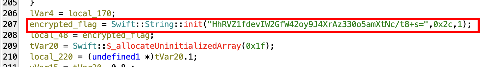

Hardcoded secret key:

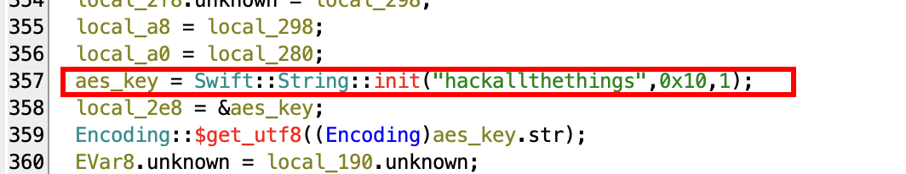

`is_noncompliant_device` method check. The application exits when the check returns `true`:

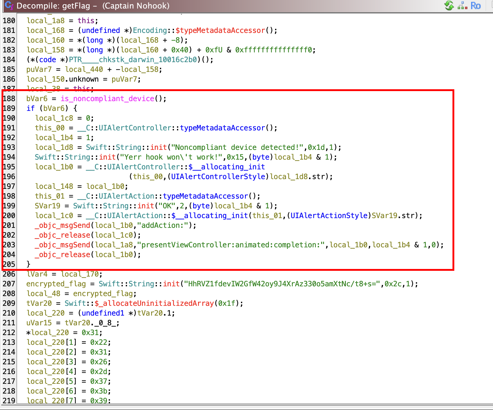

Following the `is_noncompliant_device` method implementation:

```c

/* Captain_Nohook.is_noncompliant_device() -> Swift.Bool */

bool Captain_Nohook::is_noncompliant_device(void)

{
  bool bVar1;
  ReverseEngineeringToolsChecker *this;
  
  this = ReverseEngineeringToolsChecker::typeMetadataAccessor();
  bVar1 = ReverseEngineeringToolsChecker::amIReverseEngineered(this);
  return bVar1;
}
```


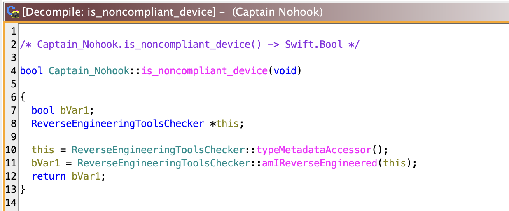

## Solution: Static Approach

TODO: must determine whether the IV is hardcoded or in calculated at runtime in order to statically solve the challenge.

I **need to improve my reverse engineering skills first :/**
## Solution: Dynamic Approach

In order to bypass the anti-reverse engineering checks, I'll hook the function `is_noncompliant_device` and force the return value to `false`.

Connect to  `frida-server`:

```
frida -U -n 'Captain Nohook'
```

Enumerate all modules by keyword `Captain`:

```frida
> Process.enumerateModulesSync().filter(x=>x.name.includes('Captain'))
```

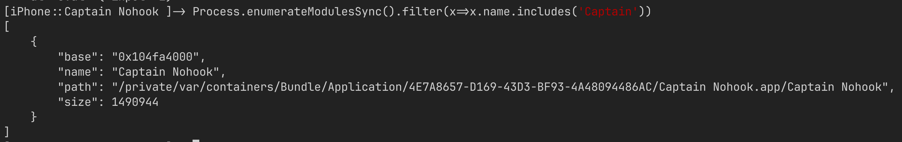

Enumerate all functions containing the keyword `compliant`:

```frida
> Process.getModuleByName('Captain Nohook').enumerateExports().filter(x=>x.name.includes('compliant'))
```

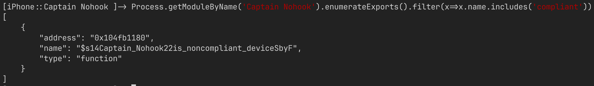

The following Frida script hooks the target function and forces its return value to `false`:

```javascript
const lib = "Captain Nohook";
const antiRevFunc = "$s14Captain_Nohook22is_noncompliant_deviceSbyF";

Interceptor.attach(Module.findExportByName(lib, antiRevFunc), {
    onEnter: function (args) {        
        console.log("[!] Anti reversing function entered...");
    },
    onLeave: function (retval) {
        console.log("[>] Changing retval to false...");
        retval.replace(0) // Replace return value
    }
});
```

Load the script into `frida`:

```frida
> %load ../bypass.js
```

Click on  "Flag'ere!"; note that the no error message is returned, indicating that anti-reversing checks have been successfully bypassed, but the flag isn't still shown:

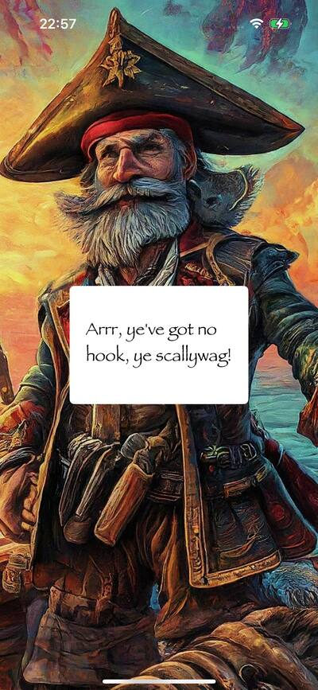


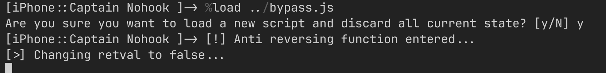

Analysing the reversed code, after clicking the "Flag'ere!" button, the flag value should be set into a `Captain_Nohook.ViewController` member field. The simplest way to get the flag is to ask the ViewController to return it (kindness always helps).

Enumerate `Captain_Nohook.ViewController` current instance's methods signatures and fields:

```frida
> ObjC.choose(ObjC.classes['Captain_Nohook.ViewController'],{onMatch:(instance)=>{console.log(instance.$ownMethods)}, onComplete: ()=>{}})

> ObjC.choose(ObjC.classes['Captain_Nohook.ViewController'],{onMatch:(instance)=>{console.log(instance['- flag']())}, onComplete: ()=>{}})
```

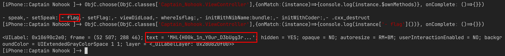

Flags is therefore stored in the UILabel returned by invoking `flag()` on `Captain_Nohook.ViewController`. 

The following `frida` script solves the challenge, bypassing anti-reversing checks and retrieving the flag:

```javascript
const lib = "Captain Nohook";
const antiRevFunc = "$s14Captain_Nohook22is_noncompliant_deviceSbyF";
const flagClass = 'Captain_Nohook.ViewController';

Interceptor.attach(Module.findExportByName(lib, antiRevFunc), {
    onEnter: function (args) {        
        console.log("[!] Anti reversing function entered...");
    },
    onLeave: function (retval) {
        console.log("[>] Changing retval to false...");
        retval.replace(0) // Replace return value
    }
});

function getFlag(){
    ObjC.choose(ObjC.classes['Captain_Nohook.ViewController'],{
        onMatch: (instance) => {
            console.log("[!]Flag is: " + instance['- flag']().text())
        }, 
        onComplete: () => {
            // Do nothing
        }
    })
}
```

Retrieve the flag:

```frida
> getFlag()
```

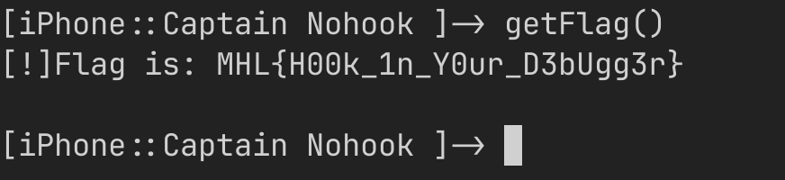
**Note**: "Flag'ere!" button must be clicked before executing `getFlag()` in order to the flag being actually loaded into `Captain_Nohook.ViewController`.

## Extended Analysis

Function `is_noncompliant_device` invokes the method `ReverseEngineeringToolsChecker::amIReverseEngineered` which implements a series of checks in order to determine if debug/dynamic instrumentation is being used:

**The challenge could have been solved with a more complex solution, punctually bypassing all the checks instead of hook the container function `is_noncompliant_device`.**  

- In the future I plan to produce a new writeup with this solution. 

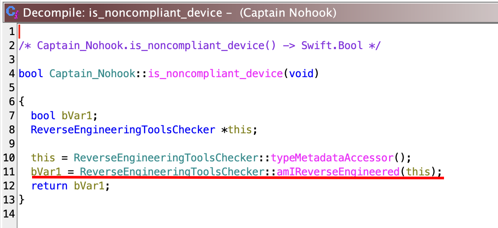

Following the complete reversed code of this function:

```c
/* static Captain_Nohook.ReverseEngineeringToolsChecker.amIReverseEngineered() -> Swift.Bool */

bool __thiscall
Captain_Nohook::ReverseEngineeringToolsChecker::amIReverseEngineered
          (ReverseEngineeringToolsChecker *this)

{
  byte in_w0;
  undefined8 in_x1;
  
  $$static_Captain_Nohook.ReverseEngineeringToolsChecker.(performChecks_in__75B14952DDFE2A78282659A6 E004BB4A)()_->_Captain_Nohook.ReverseEngineeringToolsChecker.ReverseEngineeringToolsStatus
            ();
  _swift_bridgeObjectRelease(in_x1);
  return (bool)((in_w0 ^ 1) & 1);
}
```

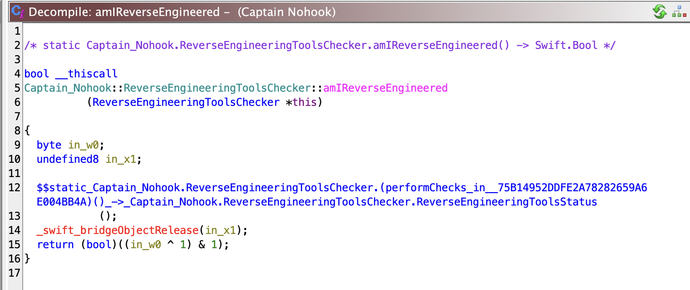

```c
undefined1  [16]
$$static_Captain_Nohook.ReverseEngineeringToolsChecker.(performChecks_in__75B14952DDFE2A78282659A6E0 04BB4A)()_->_Captain_Nohook.ReverseEngineeringToolsChecker.ReverseEngineeringToolsStatus
          (void)

{
  char cVar1;
  void *pvVar2;
  byte bVar3;
  ReverseEngineeringToolsStatus reverseToolsStatus;
  undefined8 uVar4;
  char *pcVar5;
  IndexingIterator IVar6;
  void *pvVar7;
  tuple2.conflict12 tVar8;
  undefined1 auVar9 [16];
  char local_88 [8];
  char *local_80;
  void *local_78;
  char local_70;
  char local_69;
  undefined8 local_68;
  undefined8 local_60;
  undefined8 local_58;
  undefined8 local_50;
  byte local_48 [8];
  String local_40;
  byte local_29;
  
  local_50 = 0;
  local_60 = 0;
  local_58 = 0;
  local_70 = '\0';
  local_29 = 1;
  local_48[0] = 1;
  pvVar7 = (void *)0x1;
  local_40 = Swift::String::init("",0,1);
  ___swift_instantiateConcreteTypeFromMangledName
            (&
             $$demangling_cache_variable_for_type_metadata_for_(check:_Captain_Nohook.FailedCheck,fa ilMessage:_Swift.String)
            );
  tVar8 = Swift::$_allocateUninitializedArray(0);
  uVar4 = tVar8._0_8_;
  local_50 = uVar4;
  Captain_Nohook::FailedCheck::get_allCases((FailedCheck)tVar8.0);
  pcVar5 = &$$demangling_cache_variable_for_type_metadata_for_[Captain_Nohook.FailedCheck];
  local_68 = uVar4;
  ___swift_instantiateConcreteTypeFromMangledName();
  Swift::Array<>::$lazy_protocol_witness_table_accessor();
  (extension_Swift)::Swift::Collection::$makeIterator();
PerformAntiReversingChecks:
  do {
    IVar6.unknown =
         &
         $$demangling_cache_variable_for_type_metadata_for_Swift.IndexingIterator<[Captain_Nohook.Fa iledCheck]>
    ;
    ___swift_instantiateConcreteTypeFromMangledName();
    Swift::IndexingIterator::$next(IVar6);
    cVar1 = local_69;
    bVar3 = (byte)IVar6.unknown;
    if (local_69 == '\n') {
      $$outlined_destroy_of_Swift.IndexingIterator<>(&local_60);
      bVar3 = local_29;
      uVar4 = local_50;
      _swift_bridgeObjectRetain();
      reverseToolsStatus =
           Captain_Nohook::ReverseEngineeringToolsChecker::ReverseEngineeringToolsStatus::init
                     (bVar3 & 1);
      $$outlined_destroy_of_[(check:_Captain_Nohook.FailedCheck,failMessage:_Swift.String)]
                (&local_50);
      $$outlined_destroy_of_(passed:_Swift.Bool,failMessage:_Swift.String)(local_48);
      auVar9._4_4_ = 0;
      auVar9._0_4_ = (ushort)reverseToolsStatus & 1;
      auVar9._8_8_ = uVar4;
      return auVar9;
    }
    local_70 = local_69;
    switch(local_69) {
    case '\x01':
                    /* Check if suspicious files exist */
      $$static_Captain_Nohook.ReverseEngineeringToolsChecker.(checkExistenceOfSuspiciousFiles_in__75 B14952DDFE2A78282659A6E004BB4A)()_->_(passed:_Swift.Bool,failMessage:_Swift.String)
                ();
      local_48[0] = bVar3 & 1;
      pvVar2 = local_40.bridgeObject;
      local_40.bridgeObject = pvVar7;
      local_40.str = pcVar5;
      _swift_bridgeObjectRelease(pvVar2);
      break;
    default:
      goto switchD_10000d7dc_caseD_2;
    case '\x06':
                    /* Check dynamic libraries */
      $$static_Captain_Nohook.ReverseEngineeringToolsChecker.(checkDYLD_in__75B14952DDFE2A78282659A6 E004BB4A)()_->_(passed:_Swift.Bool,failMessage:_Swift.String)
                ();
      local_48[0] = bVar3 & 1;
      pvVar2 = local_40.bridgeObject;
      local_40.bridgeObject = pvVar7;
      local_40.str = pcVar5;
      _swift_bridgeObjectRelease(pvVar2);
      break;
    case '\a':
                    /* Check for opened ports */
      $$static_Captain_Nohook.ReverseEngineeringToolsChecker.(checkOpenedPorts_in__75B14952DDFE2A782 82659A6E004BB4A)()_->_(passed:_Swift.Bool,failMessage:_Swift.String)
                ();
      local_48[0] = bVar3 & 1;
      pvVar2 = local_40.bridgeObject;
      local_40.bridgeObject = pvVar7;
      local_40.str = pcVar5;
      _swift_bridgeObjectRelease(pvVar2);
      break;
    case '\b':
                    /* Check process permissions */
      $$static_Captain_Nohook.RejavascriptverseEngineeringToolsChecker.(checkPSelectFlag_in__75B14952DDFE2A782 82659A6E004BB4A)()_->_(passed:_Swift.Bool,failMessage:_Swift.String)
                ();
      local_48[0] = bVar3 & 1;
      pvVar2 = local_40.bridgeObject;
      local_40.bridgeObject = pvVar7;
      local_40.str = pcVar5;
      _swift_bridgeObjectRelease(pvVar2);
    }
    bVar3 = local_48[0];
    if ((local_29 & 1) == 0) {
      bVar3 = 0;
    }
    local_29 = bVar3 & 1;
    if ((local_48[0] & 1) == 0) {
      pcVar5 = local_40.str;
      pvVar2 = local_40.bridgeObject;
      _swift_bridgeObjectRetain();
      local_88[0] = cVar1;
      local_80 = pcVar5;
      local_78 = pvVar2;
      pcVar5 = &
               $$demangling_cache_variable_for_type_metadata_for_[(check:_Captain_Nohook.FailedCheck ,failMessage:_Swift.String)]
      ;
      ___swift_instantiateConcreteTypeFromMangledName();
      Swift::Array<undefined>::append(local_88);
    }
  } while( true );
switchD_10000d7dc_caseD_2:
  goto PerformAntiReversingChecks;
}
```

Anti-reversing checks implemented are the following.

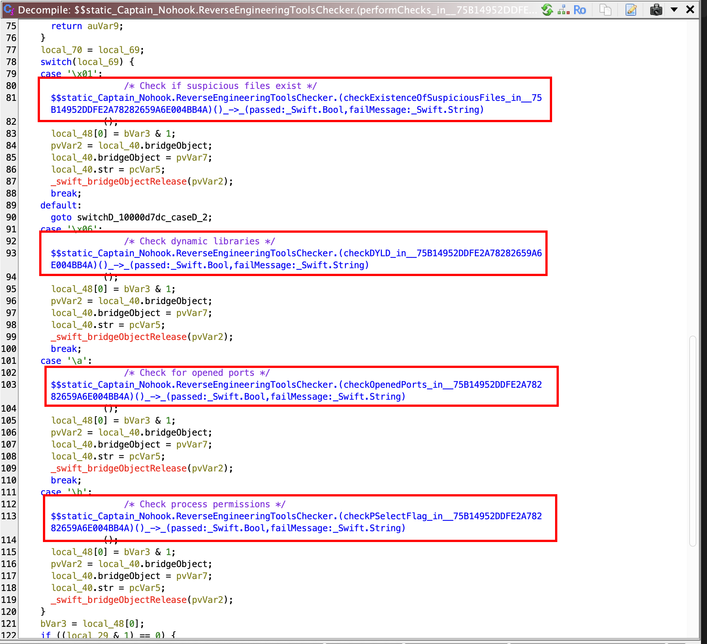
### Suspicious files


```c
undefined4
$$static_Captain_Nohook.ReverseEngineeringToolsChecker.(checkExistenceOfSuspiciousFiles_in__75B14952 DDFE2A78282659A6E004BB4A)()_->_(passed:_Swift.Bool,failMessage:_Swift.String)
          (void)

{
  undefined *puVar1;
  undefined8 uVar2;
  long lVar3;
  undefined8 uVar4;
  IndexingIterator IVar5;
  undefined *puVar6;
  NSString *pNVar7;
  undefined *puVar8;
  undefined8 uVar9;
  DefaultStringInterpolation DVar10;
  tuple2.conflict12 tVar11;
  String SVar12;
  undefined8 local_88;
  long local_80;
  DefaultStringInterpolation local_78;
  undefined8 local_70;
  undefined8 local_68;
  long local_60;
  undefined8 local_58;
  long local_50;
  undefined8 local_48;
  undefined8 local_40;
  undefined8 local_38;
  undefined8 local_30;
  
  puVar1 = PTR_$$type_metadata_for_Swift.String_10016c750;
  local_30 = 0;
  local_40 = 0;
  local_38 = 0;
  local_68 = 0;
  local_60 = 0;
  tVar11 = Swift::$_allocateUninitializedArray(1);
  uVar4 = tVar11._0_8_;
  SVar12 = Swift::String::init("/usr/sbin/frida-server",0x16,1);
  *(String *)tVar11.1 = SVar12;
  Swift::$_finalizeUninitializedArray(uVar4,puVar1);
  local_30 = uVar4;
  _swift_bridgeObjectRetain();
  local_48 = uVar4;
  ___swift_instantiateConcreteTypeFromMangledName();
  Swift::Array<String>::$lazy_protocol_witness_table_accessor();
  (extension_Swift)::Swift::Collection::$makeIterator();
  while( true ) {
    IVar5.unknown =
         &$$demangling_cache_variable_for_type_metadata_for_Swift.IndexingIterator<[Swift.String]>;
    ___swift_instantiateConcreteTypeFromMangledName();
    Swift::IndexingIterator::$next(IVar5);
    lVar3 = local_50;
    uVar2 = local_58;
    if (local_50 == 0) {
      $$outlined_destroy_of_Swift.IndexingIterator<>(&local_40);
      Swift::String::init("",0,1);
      _swift_bridgeObjectRelease(uVar4);
      return 1;
    }
    local_68 = local_58;
    local_60 = local_50;
    puVar6 = &_OBJC_CLASS_$_NSFileManager;
    _objc_opt_self();
    _objc_msgSend();
    _objc_retainAutoreleasedReturnValue();
    _swift_bridgeObjectRetain(lVar3);
    pNVar7 = (extension_Foundation)::Swift::String::_bridgeToObjectiveC();
    _swift_bridgeObjectRelease(lVar3);
    puVar8 = puVar6;
    _objc_msgSend(puVar6,"fileExistsAtPath:",pNVar7);
    _objc_release(pNVar7);
    _objc_release(puVar6);
    if (((ulong)puVar8 & 1) != 0) break;
    _swift_bridgeObjectRelease(lVar3);
  }
  uVar9 = 1;
  local_78 = Swift::DefaultStringInterpolation::init(0x17,1);
  DVar10.unknown = (undefined *)0x1;
  local_70 = uVar9;
  SVar12 = Swift::String::init("Suspicious file found: ",0x17,1);
  Swift::DefaultStringInterpolation::appendLiteral(SVar12,DVar10);
  _swift_bridgeObjectRelease(SVar12.bridgeObject);
  local_88 = uVar2;
  local_80 = lVar3;
  Swift::DefaultStringInterpolation::$appendInterpolation
            (&local_88,puVar1,
             PTR_$$protocol_witness_table_for_Swift.String_:_Swift.CustomStringConvertible_in_Swift_ 10016d0a8
             ,
             PTR_$$protocol_witness_table_for_Swift.String_:_Swift.TextOutputStreamable_in_Swift_100 16d5b0
            );
  DVar10.unknown = (undefined *)0x1;
  SVar12 = Swift::String::init("",0,1);
  Swift::DefaultStringInterpolation::appendLiteral(SVar12,DVar10);
  _swift_bridgeObjectRelease(SVar12.bridgeObject);
  DVar10.unknown = local_78.unknown;
  _swift_bridgeObjectRetain();
  $$outlined_destroy_of_Swift.DefaultStringInterpolation(&local_78);
  Swift::String::init(DVar10);
  _swift_bridgeObjectRelease(lVar3);
  $$outlined_destroy_of_Swift.IndexingIterator<>(&local_40);
  _swift_bridgeObjectRelease(uVar4);
  return 0;
}

```

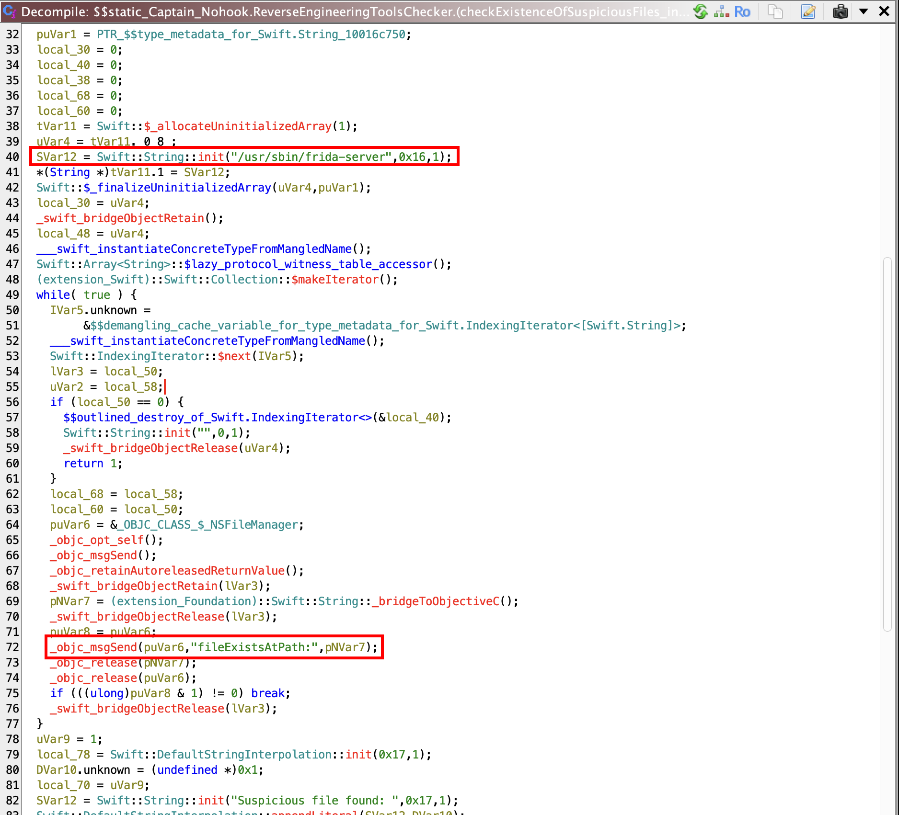

This code checks if the `frida-server` binary is present on the file system at the path `/user/sbin/frida-server`.

**Possible bypass solution**: rename the binary to a different name or hook the file open function.
### Dynamic Debug Libraries


```c

/* WARNING: Heritage AFTER dead removal. Example location: x0 : 0x00010000df2c */
/* WARNING: Restarted to delay deadcode elimination for space: register */

undefined4
$$static_Captain_Nohook.ReverseEngineeringToolsChecker.(checkDYLD_in__75B14952DDFE2A78282659A6E004BB 4A)()_->_(passed:_Swift.Bool,failMessage:_Swift.String)
          (void)

{
  undefined *puVar1;
  long lVar2;
  code *pcVar3;
  bool bVar4;
  Set<undefined> SVar5;
  Set<undefined> SVar6;
  IndexingIterator IVar7;
  UnsafePointer<__int8> cString;
  Iterator IVar8;
  String *pSVar9;
  undefined8 uVar10;
  DefaultStringInterpolation DVar11;
  tuple2.conflict12 tVar12;
  String SVar13;
  char *local_1a8;
  void *local_1a0;
  char *local_128;
  void *local_120;
  DefaultStringInterpolation local_118;
  undefined8 local_110;
  undefined8 local_108;
  long local_100;
  char *local_f8;
  void *local_f0;
  undefined8 local_e8;
  long local_e0;
  undefined8 local_d8;
  long local_d0;
  undefined1 auStack_c8 [40];
  String local_a0;
  uint local_90;
  uint local_88;
  byte local_84;
  undefined4 local_80;
  undefined4 local_7c;
  undefined4 local_78;
  undefined4 local_74;
  undefined4 local_70;
  undefined4 local_6c;
  undefined8 local_68;
  undefined4 local_60;
  undefined *local_58;
  undefined1 auStack_48 [40];
  
  puVar1 = PTR_$$type_metadata_for_Swift.String_10016c750;
  local_58 = (undefined *)0x0;
  local_68 = 0;
  local_60 = 0;
  local_90 = 0;
  local_a0 = (String)ZEXT816(0);
  _memset(auStack_c8,0,0x28);
  local_e8 = 0;
  local_e0 = 0;
  tVar12 = Swift::$_allocateUninitializedArray(4);
  pSVar9 = (String *)tVar12.1;
  SVar13 = Swift::String::init("FridaGadget",0xb,1);
  *pSVar9 = SVar13;
  SVar13 = Swift::String::init("frida",5,1);
  pSVar9[1] = SVar13;
  SVar13 = Swift::String::init("cynject",7,1);
  pSVar9[2] = SVar13;
  SVar13 = Swift::String::init("libcycript",10,1);
  pSVar9[3] = SVar13;
  Swift::$_finalizeUninitializedArray(tVar12._0_8_,puVar1);
  SVar5 = Swift::Set::$init(tVar12._0_8_,puVar1,
                            PTR_$$protocol_witness_table_for_Swift.String_:_Swift.Hashable_in_Swift_ 10016d038
                           );
  SVar6 = SVar5;
  local_58 = SVar5.unknown;
  __dyld_image_count();
  local_74 = 0;
  local_78 = SUB84(SVar6.unknown,0);
  Swift::Range::init();
  local_80 = local_70;
  local_7c = local_6c;
  ___swift_instantiateConcreteTypeFromMangledName();
  Swift::Range<__int32>::$lazy_protocol_witness_table_accessor();
  (extension_Swift)::Swift::Collection::$makeIterator();
  while( true ) {
    IVar7.unknown =
         &
         $$demangling_cache_variable_for_type_metadata_for_Swift.IndexingIterator<Swift.Range<Swift. UInt32>>
    ;
    ___swift_instantiateConcreteTypeFromMangledName();
    Swift::IndexingIterator::$next(IVar7);
    if ((local_84 & 1) != 0) {
      Swift::String::init("",0,1);
      _swift_bridgeObjectRelease(SVar5.unknown);
      return 1;
    }
    cString.unknown = (undefined *)(ulong)local_88;
    local_90 = local_88;
    __dyld_get_image_name();
    if (cString.unknown == (undefined *)0x0) break;
    SVar13 = Swift::String::init(cString);
    local_a0 = SVar13;
    _swift_bridgeObjectRetain(SVar5.unknown);
    Swift::Set::$makeIterator((Set)SVar5.unknown);
    _memcpy(auStack_c8,auStack_48,0x28);
    while( true ) {
      IVar8.unknown =
           &$$demangling_cache_variable_for_type_metadata_for_Swift.Set<Swift.String>.Iterator;
      ___swift_instantiateConcreteTypeFromMangledName();
      Swift::Set::Iterator::$next(IVar8);
      lVar2 = local_d0;
      local_1a0 = SVar13.bridgeObject;
      if (local_d0 == 0) break;
      local_1a8 = SVar13.str;
      local_e8 = local_d8;
      local_e0 = local_d0;
      local_f8 = local_1a8;
      local_f0 = local_1a0;
      local_108 = local_d8;
      local_100 = local_d0;
      Swift::String::$lazy_protocol_witness_table_accessor();
      bVar4 = (extension_Foundation)::Swift::StringProtocol::$localizedCaseInsensitiveContains
                        (&local_108,puVar1,puVar1,IVar8.unknown);
      if (bVar4) {
        uVar10 = 1;
        local_118 = Swift::DefaultStringInterpolation::init(0x1b,1);
        DVar11.unknown = (undefined *)0x1;
        local_110 = uVar10;
        SVar13 = Swift::String::init("Suspicious library loaded: ",0x1b,1);
        Swift::DefaultStringInterpolation::appendLiteral(SVar13,DVar11);
        _swift_bridgeObjectRelease(SVar13.bridgeObject);
        local_128 = local_1a8;
        local_120 = local_1a0;
        Swift::DefaultStringInterpolation::$appendInterpolation
                  (&local_128,puVar1,
                   PTR_$$protocol_witness_table_for_Swift.String_:_Swift.CustomStringConvertible_in_ Swift_10016d0a8
                   ,
                   PTR_$$protocol_witness_table_for_Swift.String_:_Swift.TextOutputStreamable_in_Swi ft_10016d5b0
                  );
        DVar11.unknown = (undefined *)0x1;
        SVar13 = Swift::String::init("",0,1);
        Swift::DefaultStringInterpolation::appendLiteral(SVar13,DVar11);
        _swift_bridgeObjectRelease(SVar13.bridgeObject);
        DVar11.unknown = local_118.unknown;
        _swift_bridgeObjectRetain();
        $$outlined_destroy_of_Swift.DefaultStringInterpolation(&local_118);
        Swift::String::init(DVar11);
        _swift_bridgeObjectRelease(lVar2);
        $$outlined_destroy_of_Swift.Set<>.Iterator(auStack_c8);
        _swift_bridgeObjectRelease(local_1a0);
        _swift_bridgeObjectRelease(SVar5.unknown);
        return 0;
      }
      _swift_bridgeObjectRelease(lVar2);
    }
    $$outlined_destroy_of_Swift.Set<>.Iterator(auStack_c8);
    _swift_bridgeObjectRelease(local_1a0);
  }
  Swift::_assertionFailure
            ((StaticString)0x10015770a,(StaticString)0xb,(StaticString)0x2,0x100156270,0x44);
                    /* WARNING: Does not return */
  pcVar3 = (code *)SoftwareBreakpoint(1,0x10000e054);
  (*pcVar3)();
}


```

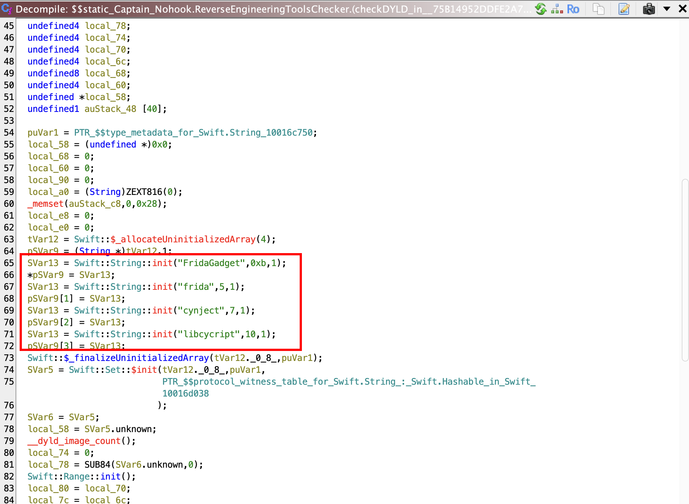

This code checks if the following dynamic libraries are loaded:

- FridaGadget
- firda
- cynject
- libcycrypt

**Possible bypasses**: inject the frida's agent with a random name.

### Local Ports Open

```c
undefined4
$$static_Captain_Nohook.ReverseEngineeringToolsChecker.(checkOpenedPorts_in__75B14952DDFE2A78282659A 6E004BB4A)()_->_(passed:_Swift.Bool,failMessage:_Swift.String)
          (void)

{
  undefined *puVar1;
  ulong uVar2;
  undefined8 uVar3;
  IndexingIterator IVar4;
  ulong uVar5;
  undefined8 *puVar6;
  undefined8 uVar7;
  DefaultStringInterpolation DVar8;
  tuple2.conflict12 tVar9;
  String SVar10;
  ulong local_78;
  DefaultStringInterpolation local_70;
  undefined8 local_68;
  ulong local_60;
  ulong local_58;
  byte local_50;
  undefined8 local_48;
  undefined8 local_40;
  undefined8 local_38;
  undefined8 local_30;
  
  puVar1 = PTR_$$type_metadata_for_Swift.Int_10016cdf8;
  local_30 = 0;
  local_40 = 0;
  local_38 = 0;
  local_60 = 0;
  tVar9 = Swift::$_allocateUninitializedArray(4);
  puVar6 = (undefined8 *)tVar9.1;
  uVar3 = tVar9._0_8_;
  *puVar6 = 0x69a2;
  puVar6[1] = 4444;
  puVar6[2] = 22;
  puVar6[3] = 44;
  Swift::$_finalizeUninitializedArray(uVar3,puVar1);
  local_30 = uVar3;
  _swift_bridgeObjectRetain();
  local_48 = uVar3;
  ___swift_instantiateConcreteTypeFromMangledName();
  Swift::Array<__int64>::$lazy_protocol_witness_table_accessor();
  (extension_Swift)::Swift::Collection::$makeIterator();
  do {
    IVar4.unknown =
         &$$demangling_cache_variable_for_type_metadata_for_Swift.IndexingIterator<[Swift.Int]>;
    ___swift_instantiateConcreteTypeFromMangledName();
    Swift::IndexingIterator::$next(IVar4);
    uVar2 = local_58;
    if ((local_50 & 1) != 0) {
      $$outlined_destroy_of_Swift.IndexingIterator<>(&local_40);
      Swift::String::init("",0,1);
      _swift_bridgeObjectRelease(uVar3);
      return 1;
    }
    local_60 = local_58;
    uVar5 = local_58;
    $$static_Captain_Nohook.ReverseEngineeringToolsChecker.(canOpenLocalConnection_in__75B14952DDFE2 A78282659A6E004BB4A)(port:_Swift.Int)_->_Swift.Bool
              ();
  } while ((uVar5 & 1) == 0);
  uVar7 = 1;
  local_70 = Swift::DefaultStringInterpolation::init(0xd,1);
  DVar8.unknown = (undefined *)0x1;
  local_68 = uVar7;
  SVar10 = Swift::String::init("Port ",5,1);
  Swift::DefaultStringInterpolation::appendLiteral(SVar10,DVar8);
  _swift_bridgeObjectRelease(SVar10.bridgeObject);
  local_78 = uVar2;
  Swift::DefaultStringInterpolation::$appendInterpolation
            (&local_78,puVar1,
             PTR_$$protocol_witness_table_for_Swift.Int_:_Swift.CustomStringConvertible_in_Swift_100 16cd78
            );
  DVar8.unknown = (undefined *)0x1;
  SVar10 = Swift::String::init(" is open",8,1);
  Swift::DefaultStringInterpolation::appendLiteral(SVar10,DVar8);
  _swift_bridgeObjectRelease(SVar10.bridgeObject);
  DVar8.unknown = local_70.unknown;
  _swift_bridgeObjectRetain();
  $$outlined_destroy_of_Swift.DefaultStringInterpolation(&local_70);
  Swift::String::init(DVar8);
  $$outlined_destroy_of_Swift.IndexingIterator<>(&local_40);
  _swift_bridgeObjectRelease(uVar3);
  return 0;
}
```

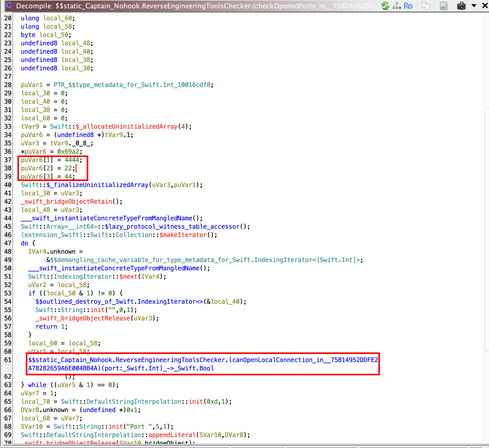

This code checks if following local ports are opened and reachable:

- 4444
- 22
- 44

**Possible bypasses**: setup the frida's server or agent listening on a different port. Temporarily close port 22 and 44.

### Process Permissions

```c

/* WARNING: Removing unreachable block (ram,0x00010000f0c8) */
/* WARNING: Removing unreachable block (ram,0x00010000ec50) */
/* WARNING: Heritage AFTER dead removal. Example location: x0 : 0x00010000e9d4 */
/* WARNING: Restarted to delay deadcode elimination for space: register */

bool $$static_Captain_Nohook.ReverseEngineeringToolsChecker.(checkPSelectFlag_in__75B14952DDFE2A7828 2659A6E004BB4A)()_->_(passed:_Swift.Bool,failMessage:_Swift.String)
               (void)

{
  undefined *puVar1;
  code *pcVar2;
  bool bVar3;
  pid_t pVar4;
  uint uVar5;
  uint uVar6;
  uint uVar7;
  int *piVar8;
  __int64 _Var9;
  int *piVar10;
  ulong uVar11;
  undefined *puVar12;
  undefined *puVar13;
  ContiguousArray<undefined> CVar14;
  char *pcVar15;
  char *pcVar16;
  __int64 _Var17;
  __int64 _Var18;
  undefined4 *puVar19;
  char *pcVar20;
  char *pcVar22;
  size_t *psVar23;
  tuple2.conflict12 tVar24;
  String SVar25;
  String SVar26;
  String SVar27;
  String separator;
  String separator_00;
  String separator_01;
  int *local_3f0;
  int *local_3e8;
  int *local_308;
  __int64 local_2e0;
  u_int local_2d4;
  size_t local_2d0;
  int *local_2c8;
  undefined8 local_2b0;
  undefined8 uStack_2a8;
  undefined8 local_2a0;
  undefined8 local_298;
  uint local_290;
  <TRUNCATED>
  long local_28;
  char *pcVar21;
  
  puVar1 = PTR_$$type_metadata_for_Swift.Int32_10016ce50;
  pcVar20 = PTR_$$type_metadata_for_Any_10016d4d8 + 8;
  local_28 = *(long *)PTR____stack_chk_guard_10016c338;
  _bzero(&local_2b0,0x288);
  local_2c8 = (int *)0x0;
  local_2d0 = 0;
  uStack_2a8 = 0;
  <TRUNCATED>
  tVar24 = Swift::$_allocateUninitializedArray(4);
  puVar19 = (undefined4 *)tVar24.1;
  piVar8 = tVar24._0_8_;
  *puVar19 = 1;
  puVar19[1] = 0xe;
  puVar19[2] = 1;
  pVar4 = _getpid();
  puVar19[3] = pVar4;
  Swift::$_finalizeUninitializedArray(piVar8,puVar1);
  _swift_bridgeObjectRetain();
  local_2d0 = 0x288;
  local_2c8 = piVar8;
  _Var9 = Swift::Array<undefined>::get_count(piVar8,puVar1);
  _swift_bridgeObjectRelease(piVar8);
  local_2e0 = _Var9;
  __int32::$lazy_protocol_witness_table_accessor();
  _Var17 = _Var9;
  __int32::$lazy_protocol_witness_table_accessor();
  _Var18 = _Var17;
  __int64::$lazy_protocol_witness_table_accessor();
  (extension_Swift)::Swift::UnsignedInteger::$init
            (&local_2d4,&local_2e0,PTR_$$type_metadata_for_Swift.UInt32_10016ce88,
             PTR_$$type_metadata_for_Swift.Int_10016cdf8,_Var9,_Var17,_Var18);
  ___swift_instantiateConcreteTypeFromMangledName();
  Swift::Array<undefined>::reserveCapacity(0);
  piVar10 = local_2c8;
  Swift::Array<undefined>::$get__baseAddressIfContiguous(local_2c8,puVar1);
  piVar8 = local_2c8;
  if (piVar10 == (int *)0x0) {
    _swift_bridgeObjectRetain();
    Swift::Array<__int32>::$lazy_protocol_witness_table_accessor();
    bVar3 = (extension_Swift)::Swift::Collection::get_isEmpty();
    _swift_bridgeObjectRelease(piVar8);
    if (!bVar3) {
      Swift::_fatalErrorMessage
                ((StaticString)0x10015770a,(StaticString)0xb,(StaticString)0x2,0x100157090,0);
                    /* WARNING: Does not return */
      pcVar2 = (code *)SoftwareBreakpoint(1,0x10000ed80);
      (*pcVar2)();
    }
  }
  local_3f0 = local_2c8;
  local_3e8 = local_2c8;
  Swift::Array<undefined>::$get__baseAddressIfContiguous(local_2c8,puVar1);
  if (local_3e8 == (int *)0x0) {
    _swift_bridgeObjectRetain(local_3f0);
    Swift::Array<__int32>::$lazy_protocol_witness_table_accessor();
    bVar3 = (extension_Swift)::Swift::Collection::get_isEmpty();
    _swift_bridgeObjectRelease(local_3f0);
    if (!bVar3) {
      _swift_bridgeObjectRetain(local_3f0);
      puVar12 = &$$demangling_cache_variable_for_type_metadata_for_Swift._ArrayBuffer<Swift.Int32>;
      ___swift_instantiateConcreteTypeFromMangledName();
      puVar13 = puVar12;
      Swift::_ArrayBuffer<__int32>::$lazy_protocol_witness_table_accessor();
      CVar14 = Swift::ContiguousArray::$init(puVar13,puVar1,puVar12,puVar13);
      _swift_retain();
      _swift_release(CVar14.unknown);
      local_3f0 = (int *)CVar14;
      Swift::_ContiguousArrayBuffer::$get_owner((_ContiguousArrayBuffer)CVar14.unknown);
      local_3e8 = (int *)Swift::_ContiguousArrayBuffer::get_firstElementAddress
                                   ((_ContiguousArrayBuffer)CVar14.unknown);
      _swift_release(CVar14.unknown);
      goto LAB_10000eb84;
    }
  }
  Swift::Array<undefined>::$get__owner(local_3f0,puVar1);
  if (local_3e8 == (int *)0x0) {
    local_3e8 = (int *)0x0;
  }
LAB_10000eb84:
  if (local_3e8 == (int *)0x0) {
    local_308 = (int *)0xfffffffffffffffc;
  }
  else {
    local_308 = local_3e8;
  }
  psVar23 = &local_2d0;
  uVar5 = _sysctl(local_308,local_2d4,&local_2b0,psVar23,(void *)0x0,0);
  _swift_unknownObjectRelease(local_3f0);
  uVar11 = (ulong)uVar5;
  _$sSZsE8isSignedSbvgZs5Int32V_Tgmq5();
  uVar6 = (uint)uVar11;
  _$sSZsE8isSignedSbvgZSi_Tgmq5();
  if ((uVar6 & 1) == ((uint)uVar11 & 1)) {
    pcVar15 = (char *)(extension_Swift)::Swift::FixedWidthInteger::get_bitWidth();
    (extension_Swift)::Swift::FixedWidthInteger::get_bitWidth();
  }
  else {
    _$sSZsE8isSignedSbvgZs5Int32V_Tgmq5();
    if ((uVar11 & 1) == 0) {
      pcVar15 = (char *)(extension_Swift)::Swift::FixedWidthInteger::get_bitWidth();
      (extension_Swift)::Swift::FixedWidthInteger::get_bitWidth();
    }
    else {
      (extension_Swift)::Swift::FixedWidthInteger::get_bitWidth();
      pcVar15 = (char *)(extension_Swift)::Swift::FixedWidthInteger::get_bitWidth();
    }
  }
  if (uVar5 != 0) {
    tVar24 = Swift::$_allocateUninitializedArray(1);
    pcVar15 = tVar24._0_8_;
    pcVar22 = (char *)0x1;
    SVar25 = Swift::String::init("Error occured when calling sysctl(). This check may not be reliabl e"
                                 ,0x43,1);
    ((String *)tVar24.1)[1].bridgeObject = PTR_$$type_metadata_for_Swift.String_10016c750;
    *(String *)tVar24.1 = SVar25;
    Swift::$_finalizeUninitializedArray();
    SVar25.bridgeObject = pcVar20;
    SVar25.str = pcVar15;
    separator.bridgeObject = psVar23;
    separator.str = pcVar22;
    pcVar16 = pcVar15;
    Swift::$print(SVar25,separator);
    SVar26.bridgeObject = pcVar20;
    SVar26.str = pcVar16;
    separator_00.bridgeObject = psVar23;
    separator_00.str = pcVar22;
    pcVar22 = pcVar16;
    pcVar21 = pcVar20;
    Swift::$print(SVar26,separator_00);
    SVar27.bridgeObject = pcVar16;
    SVar27.str = pcVar15;
    separator_01.bridgeObject = pcVar22;
    separator_01.str = pcVar20;
    Swift::$print(SVar27,separator_01);
    _swift_bridgeObjectRelease(pcVar21);
    _swift_bridgeObjectRelease(pcVar20);
    _swift_bridgeObjectRelease();
  }
  uVar6 = local_290;
  uVar5 = local_290 & 0x40;
  _$sSZsE8isSignedSbvgZs5Int32V_Tgmq5();
  uVar7 = (uint)pcVar15;
  _$sSZsE8isSignedSbvgZSi_Tgmq5();
  if ((uVar7 & 1) == ((uint)pcVar15 & 1)) {
    _Var17 = (extension_Swift)::Swift::FixedWidthInteger::get_bitWidth();
    _Var18 = (extension_Swift)::Swift::FixedWidthInteger::get_bitWidth();
    if (_Var17 < _Var18) {
      bVar3 = uVar5 == 0;
    }
    else {
      bVar3 = (uVar6 & 0x40) == 0;
    }
  }
  else {
    _$sSZsE8isSignedSbvgZs5Int32V_Tgmq5();
    if (((ulong)pcVar15 & 1) == 0) {
      _Var17 = (extension_Swift)::Swift::FixedWidthInteger::get_bitWidth();
      _Var18 = (extension_Swift)::Swift::FixedWidthInteger::get_bitWidth();
      if (_Var17 < _Var18) {
        bVar3 = uVar5 == 0;
      }
      else {
        bVar3 = (uVar6 & 0x40) == 0;
      }
    }
    else {
      _Var17 = (extension_Swift)::Swift::FixedWidthInteger::get_bitWidth();
      _Var18 = (extension_Swift)::Swift::FixedWidthInteger::get_bitWidth();
      if (_Var18 < _Var17) {
        bVar3 = (uVar6 & 0x40) == 0;
      }
      else {
        bVar3 = uVar5 == 0;
      }
    }
  }
  if (!bVar3) {
    Swift::String::init("Suspicious PFlag value",0x16,1);
    $$outlined_destroy_of_[Swift.Int32](&local_2c8);
  }
  else {
    Swift::String::init("",0,1);
    $$outlined_destroy_of_[Swift.Int32](&local_2c8);
  }
  if (*(long *)PTR____stack_chk_guard_10016c338 != local_28) {
                    /* WARNING: Subroutine does not return */
    ___stack_chk_fail();
  }
  return bVar3;
}
```


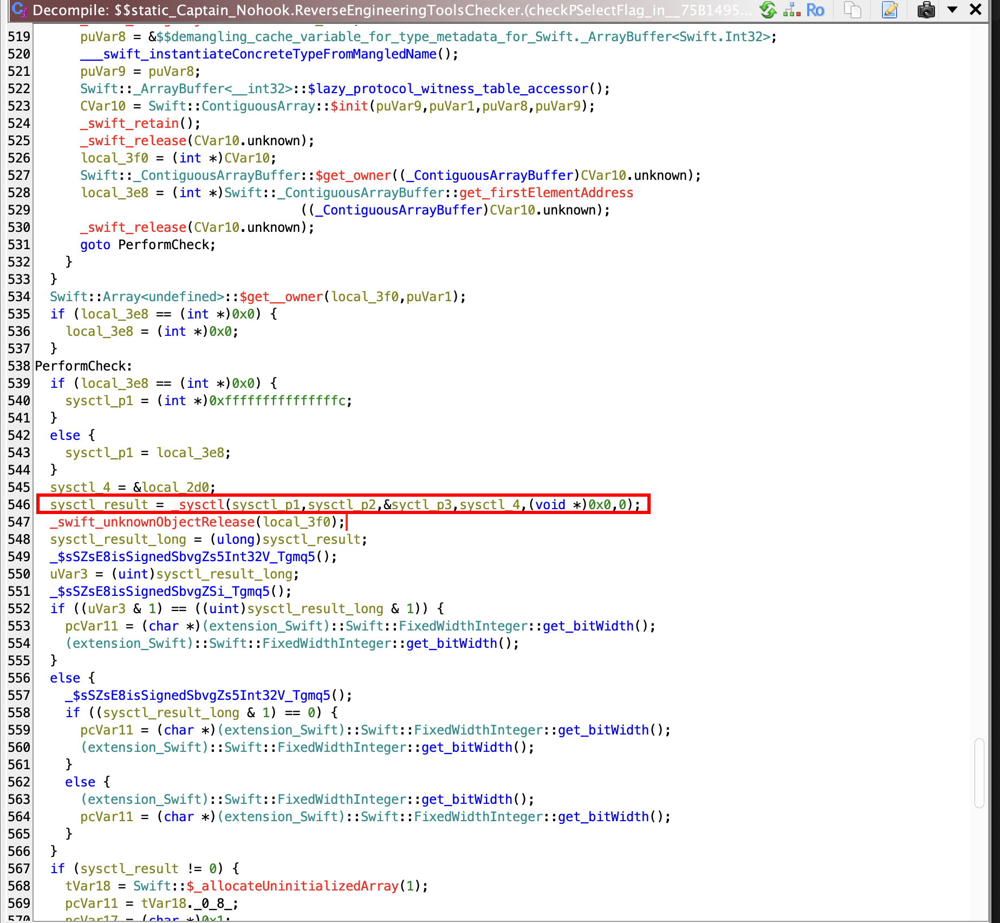

This code uses the `sysctl` system call to examine process flags, specifically looking for debugging/tracing capabilities.

**Possible bypasses**: hook the method. 


