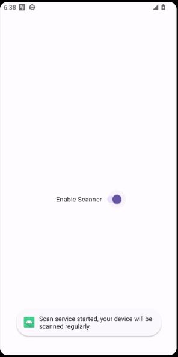
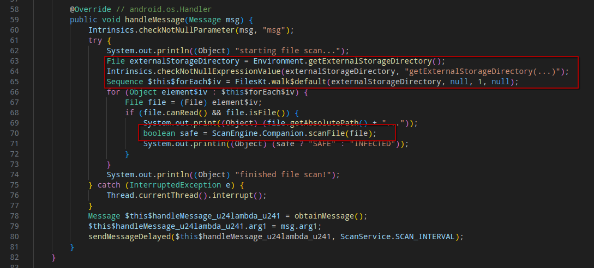
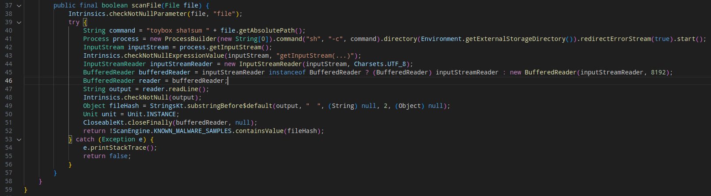
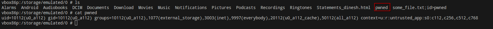
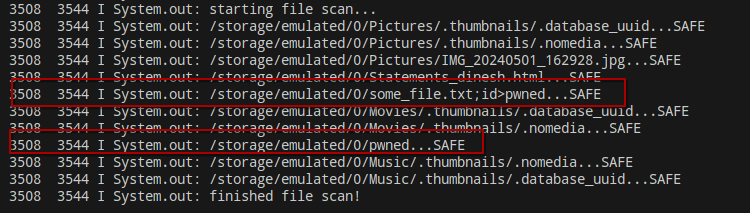

# MobileHackingLab - CyclicScanner

After starting the CyclicScanner application, the user is asked to give external file system full access. Then the following screen is presented:


By activating the switch, a toast message states that some sort of service is started and it's scanning the device regularly:


## Static Analysis

After decompiling the application APK and analyzing the class `com.mobilehackinglab.cyclicscanner.scanner.ScanService`, I discovered that the service is regularly looping, recursively iterating the external storage directory (**FilesKt.walk** - line 65):



For each file path, some checks are performed by invoking the `scanFile` method from  the class `com.mobilehackinglab.cyclicscanner.scanner.ScanEngine` (line 70). 

The method `scanFile` in the `ScanEngine` class is **unsafely** using the absolute path from the argument file in a string concatenation (line 40). The resulting string is then used to run a shell command (line 41).


## Exploitation

Since no sanitization or validation on the file name passed as argument to the `scanFile` function is performed, it's possible to achieve a command execution on the device by injecting shell command in the file name:

```shell
touch '/storage/emulated/0/some_file.txt;id>pwned'
```

When the service perform the checks on this file, the shell command in the file name will be executed:



Taking a look at the logs:


